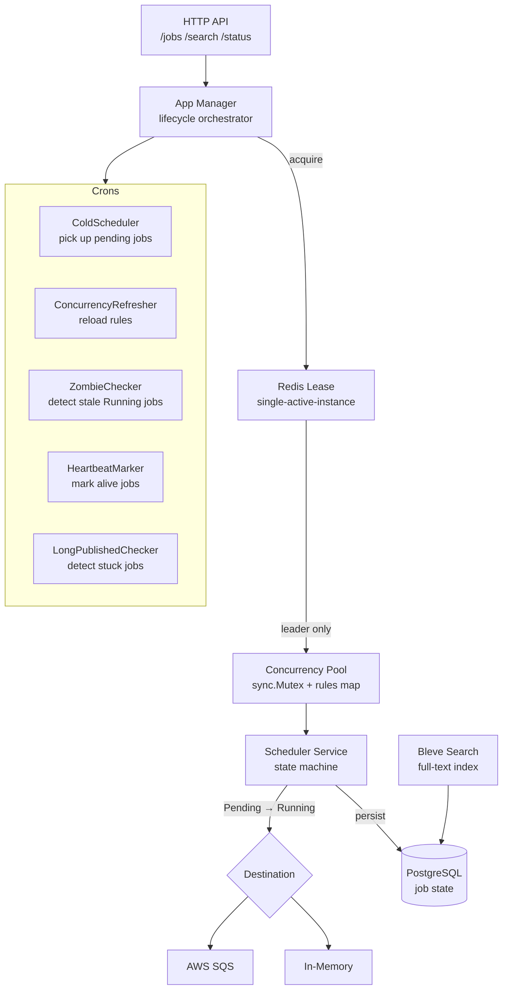
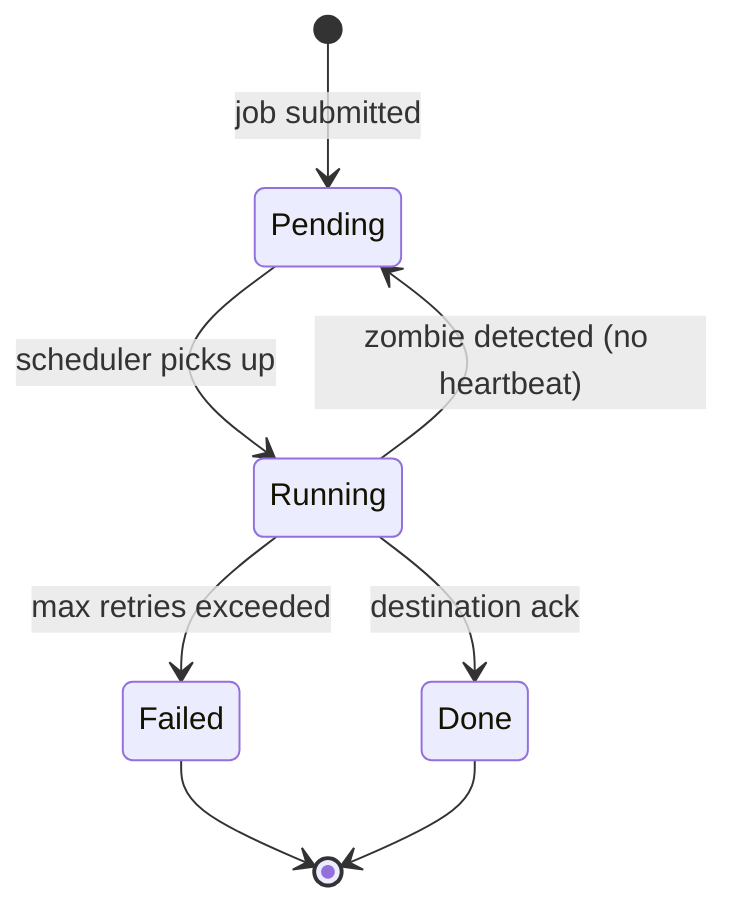

# distributed-scheduler

A production-grade distributed job scheduler with Redis-based leader election, a state machine, zombie detection, full-text search, and a hexagonal architecture.

---

## Architecture



## State Machine



## Key Concepts

- **Redis Lease** — only one scheduler instance runs at a time; others wait. On SIGTERM the lease is released so a standby can take over immediately.
- **Concurrency Pool** — per-job-name concurrency rules enforced in memory with `sync.Mutex`. Prevents a single job type from flooding the destination.
- **Zombie Detection** — a cron checks for `Running` jobs with no recent heartbeat and resets them to `Pending`.
- **Hexagonal Architecture** — `ports/` defines interfaces; `adapters/` has implementations (Redis, Postgres, SQS, in-memory). The domain never imports infrastructure.

## Quick Start

```bash
docker-compose up -d   # starts Postgres + Redis
make run
```

## Docs

- [`docs/deep-dive.md`](./docs/deep-dive.md)
- [`docs/adr/`](./docs/adr/) — ADRs: Go over Java, sync.Mutex over channels, sqlx over ORM
