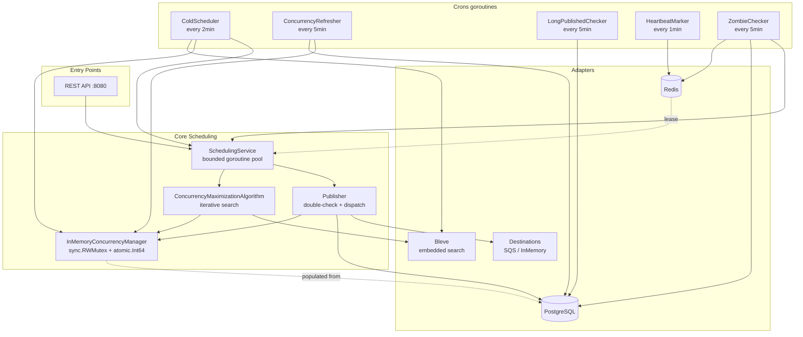
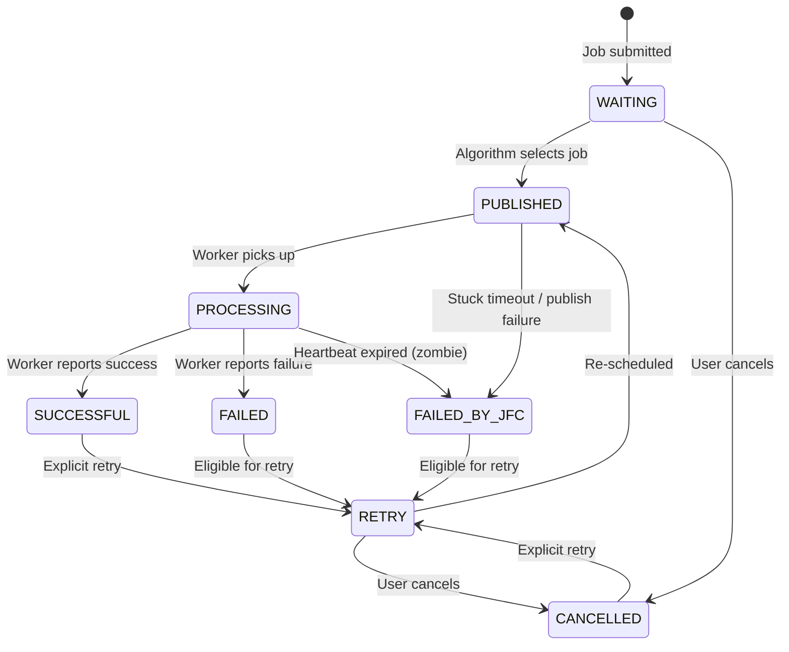
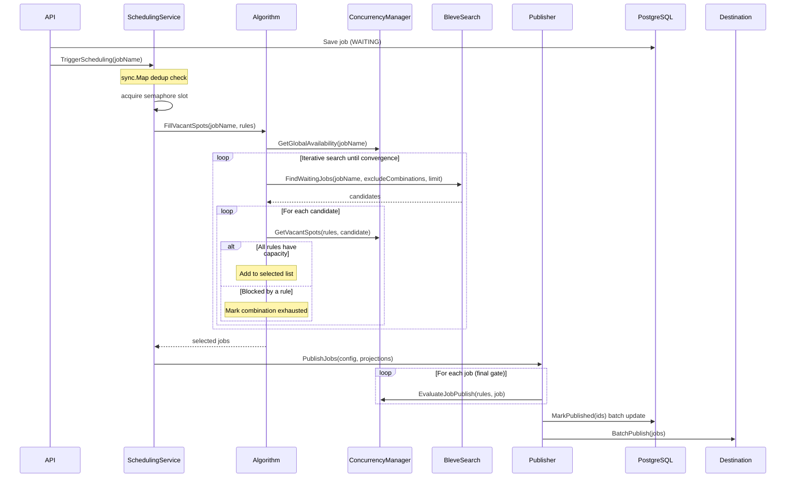

# Distributed Job Scheduler: Go Deep Dive

A production-grade distributed job scheduler ported from Java/Spring Boot to idiomatic Go.
See [ADR-001](./adr/001-go-over-java.md) for why Go.

---

## 1. High-Level Architecture



---

## 2. Job Lifecycle (State Machine)



**Schedulable statuses:** `WAITING`, `RETRY`  
**Active statuses (hold concurrency slot):** `PUBLISHED`, `PROCESSING`  
**Terminal statuses:** `SUCCESSFUL`, `FAILED`, `CANCELLED`, `FAILED_BY_JFC`

---

## 3. Scheduling Workflow



---

## 4. Concurrency Model

The `InMemoryConcurrencyManager` is the heart of the system.

### Key Generation

Rule templates are expanded using job properties:

```
Rule template: "$tenant_$env"
Job: {Tenant: 42, ConcurrencyControl: {"env": "prod"}}
Concrete key: "42_prod"
```

### The Double-Check Pattern

The algorithm pre-screens candidates (read lock), but `EvaluateJobPublish` is the authoritative gate (write lock):

```
Algorithm (read):  check vacant spots → select candidates
Publisher (write): EvaluateJobPublish → atomic check-and-increment
```

This prevents races between the algorithm's read and the actual publish.

### Why sync.RWMutex + atomic.Int64?

See [ADR-003](./adr/003-sync-mutex-over-channels.md).

---

## 5. Distributed Coordination

### Single-Active-Instance via Redis Lease

```
Startup:
  SET scheduler:global_lock <hostname> NX EX 120
  → acquired: continue startup
  → not acquired: exit (another instance running)

Background goroutine (every 60s):
  SET scheduler:global_lock <hostname> EX 120
  → refreshes TTL to prevent expiry

Shutdown:
  Lua script: if GET key == hostname then DEL key
  → atomic check-and-delete
```

See [ADR-005](./adr/005-redis-lease-over-etcd.md).

### Heartbeat-Based Zombie Detection

```
Worker starts job:
  HeartbeatService.StartHeartbeat(jobID)
  → adds to in-memory sync.Map

HeartbeatMarker cron (every 1min):
  For each jobID in sync.Map:
    SET scheduler:heartbeat:<jobID> true EX 120

ZombieChecker cron (every 5min):
  For each PROCESSING job in DB:
    if key scheduler:heartbeat:<jobID> does not exist:
      → heartbeat expired → mark FAILED_BY_JFC → trigger rescheduling
```

---

## 6. Java → Go Translation Guide

| Java Pattern | Go Equivalent | Rationale |
|---|---|---|
| `@Service` singleton | Struct + constructor in `main.go` | Explicit, no magic |
| `@Scheduled(fixedDelay=...)` | `time.Ticker` + goroutine | Context-aware cancellation |
| `ThreadPoolExecutor` | Buffered channel semaphore | Backpressure, bounded |
| `ConcurrentHashMap.newKeySet()` | `sync.Map` | Same semantics |
| `synchronized (pool) { ... }` | `mu.Lock(); defer mu.Unlock()` | Explicit scope |
| `AtomicInteger` | `atomic.Int64` | Lock-free counter |
| `Collections.synchronizedMap` | `sync.RWMutex` + plain map | Read-heavy optimization |
| `@PreDestroy` | `signal.Notify(SIGTERM)` + context cancel | Explicit lifecycle |
| Hibernate Search + Lucene | Bleve (embedded) | Same architecture, pure Go |
| Redisson `getBucket().setNX()` | `redis.SetNX()` | Direct, no client overhead |
| Spring DI container | Manual wiring in `main.go` | Compile-time errors |
| `JobProjectionDTO` | `JobProjection` struct | Lightweight DB projection |

---

## 7. Pillars of a Job Scheduling System (Go Edition)

### 1. Durable State Machine
Every job has a strict state machine (`JobStatus.CanTransitionTo()`). Invalid transitions return errors — no silent state corruption.

### 2. Concurrency Control
Multi-dimensional rules (`$jobName`, `$tenant_$env`) enforced atomically. The all-or-nothing `EvaluateJobPublish` prevents partial increments.

### 3. Decoupled Execution
The scheduler dispatches to `Destination` interface implementations. Workers consume independently. The `Destination` interface makes it trivial to add new backends.

### 4. Zombie Detection
Heartbeat TTL keys in Redis. If a worker dies, its key expires. The ZombieChecker detects absence and fails the job, freeing the concurrency slot.

### 5. Cold Scheduling
The `ColdScheduler` cron catches jobs that missed their event-driven trigger (e.g., scheduler restart, missed SQS message). It's the safety net.

### 6. Graceful Shutdown
`signal.Notify(SIGTERM)` → cancel context → all cron goroutines stop → HTTP server drains → lease released. No goroutine leaks.
