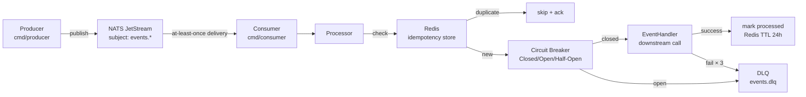
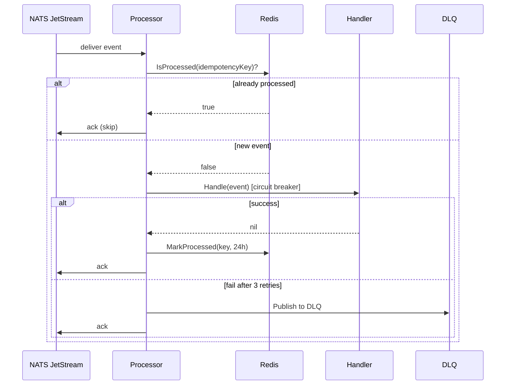

# event-driven-pipeline

An event processing pipeline with exactly-once semantics, circuit breaking, backpressure, retry with exponential backoff, and a dead letter queue — built on NATS JetStream.

---

## Architecture



## Processing Flow



## Key Concepts

- **Exactly-once** — Redis idempotency key prevents duplicate processing even if NATS redelivers.
- **Circuit Breaker** — 3-state (Closed/Open/Half-Open). Opens after 5 failures, retries after 30s.
- **Backpressure** — bounded `chan *Event` buffer. `Submit` returns an error if full — signals the consumer to slow down.
- **Exponential backoff** — 100ms → 200ms → 400ms between retries before DLQ.

## Quick Start

```bash
docker-compose up -d   # starts NATS + Redis
go run ./cmd/consumer &
go run ./cmd/producer
```

## Docs

- [`docs/adr/001-nats-over-kafka.md`](./docs/adr/001-nats-over-kafka.md)
- [`docs/adr/002-idempotency-design.md`](./docs/adr/002-idempotency-design.md)
