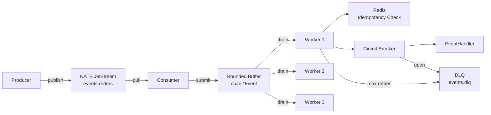
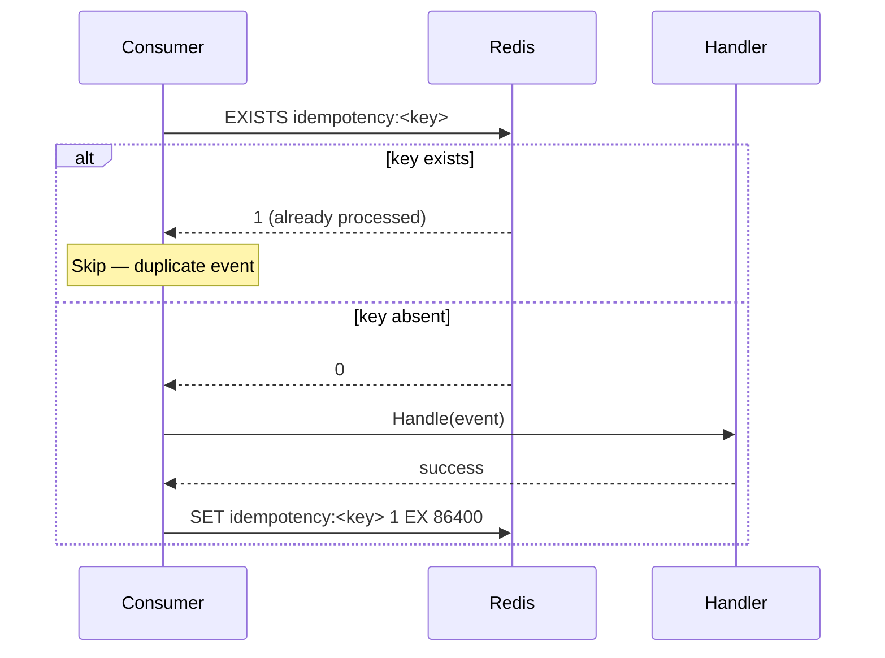
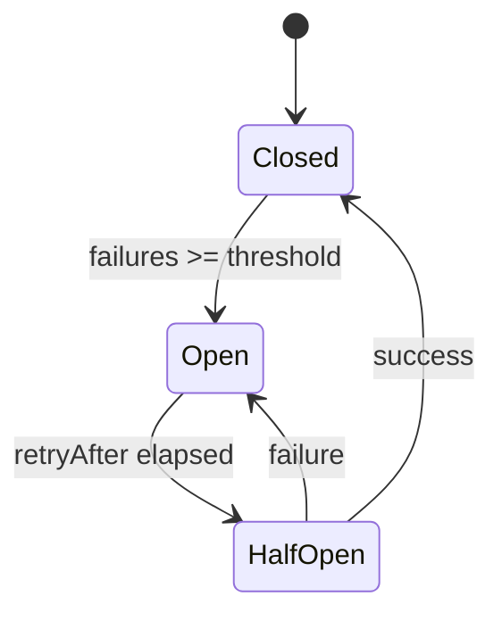

# Event-Driven Pipeline: Deep Dive

A NATS JetStream-based event processing pipeline with exactly-once semantics, circuit breaking, and dead letter queue handling.

---

## Architecture



---

## Exactly-Once Processing



The idempotency key is set by the **producer** (e.g., `order-42`). If the consumer crashes after processing but before ACKing, NATS redelivers the event. The idempotency check prevents double-processing.

---

## Circuit Breaker States



When the circuit is Open, events are immediately sent to the DLQ instead of waiting for timeouts.

---

## Backpressure

The bounded buffer channel (`chan *Event, bufferSize`) provides backpressure:
- If the buffer is full, `Submit()` returns an error
- The consumer NACKs the NATS message
- NATS redelivers after the NAK delay
- This prevents memory exhaustion under load

See [ADR-003](./adr/003-backpressure-design.md).

---

## OTel Trace Propagation

The trace ID travels through NATS message headers:

```
Producer:
  msg.Header.Set("traceparent", span.SpanContext().TraceID().String())

Consumer:
  traceID := msg.Headers().Get("traceparent")
  event.TraceID = traceID
  // Use traceID to continue the trace in the handler
```

This connects to the `projects/otel-tracing/` project — the same W3C TraceContext propagation pattern.
