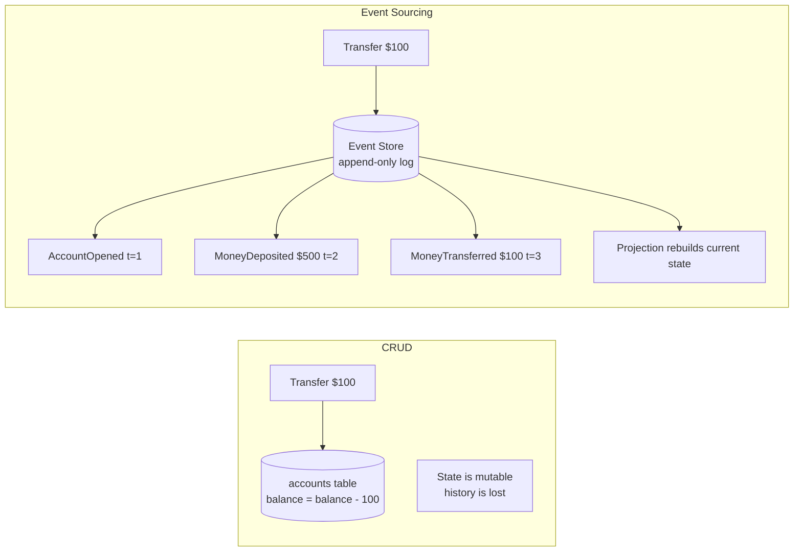
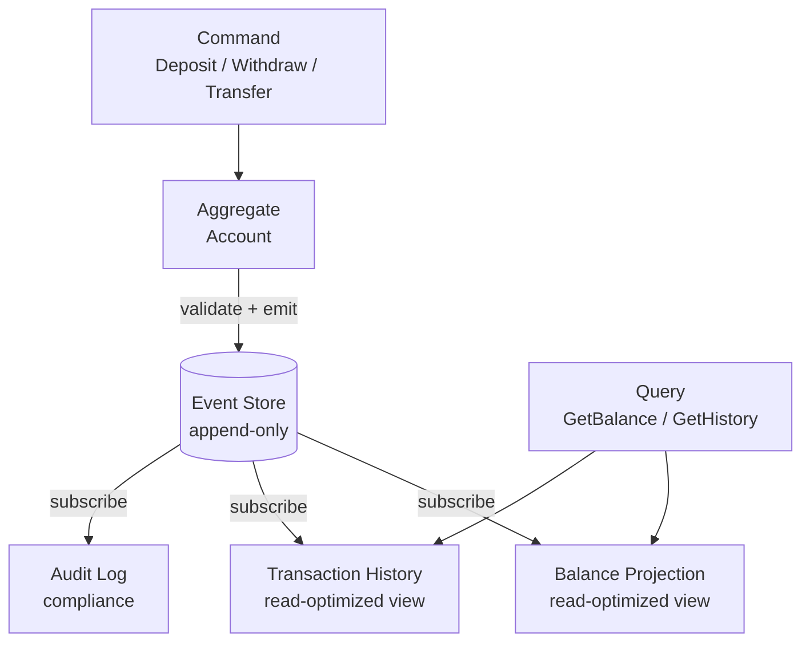
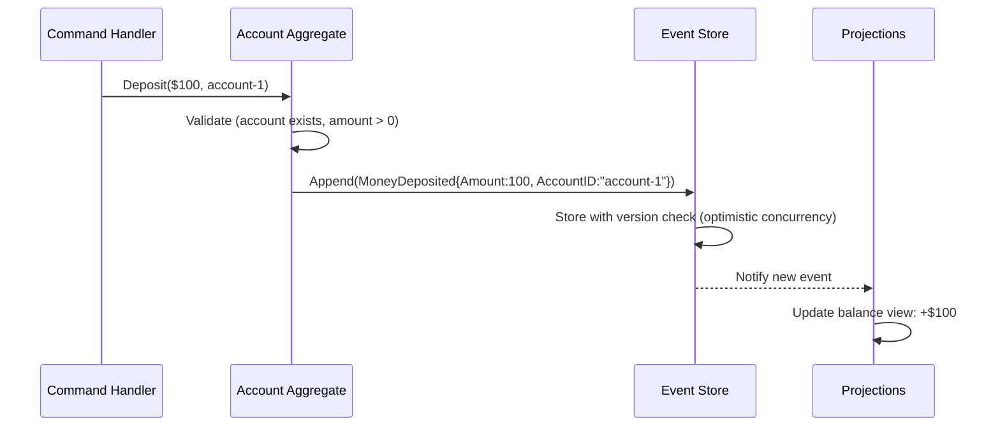
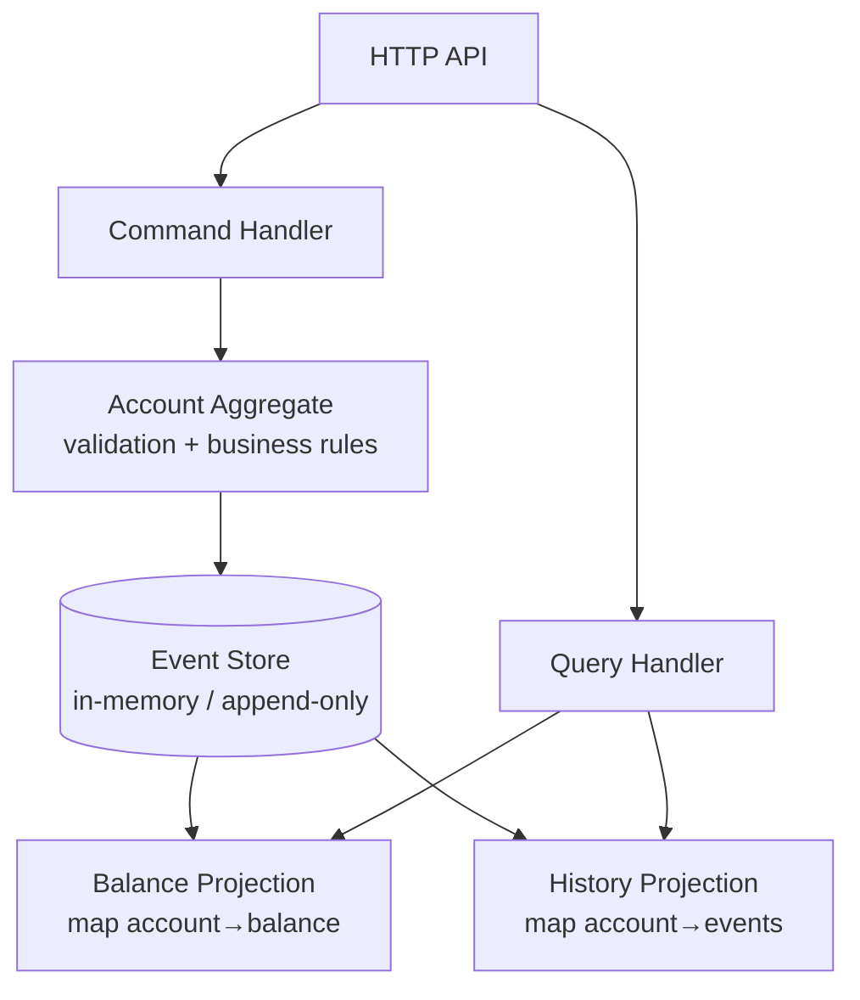

# Event-Sourced Ledger

A financial ledger built with Event Sourcing + CQRS — every state change is an immutable event, and read models are projections rebuilt from the event stream.

## Docs

- [`docs/deep-dive.md`](./docs/deep-dive.md) — hydration loop, optimistic concurrency with version checks, CQRS projection pattern, snapshot pattern, pitfalls, when to use event sourcing

---

## Event Sourcing vs Traditional CRUD



---

## CQRS (Command Query Responsibility Segregation)



| Side | Responsibility | Optimized for |
|------|---------------|---------------|
| Command | Validate + append events | Write consistency |
| Query | Read from projections | Read performance |

---

## Event Store Design



---

## Architecture



---

## Key Concepts

- **Event**: Immutable fact that happened (past tense: `MoneyDeposited`, `AccountOpened`)
- **Aggregate**: Domain object that validates commands and emits events
- **Event Store**: Append-only log with optimistic concurrency (version checks)
- **Projection**: Read model rebuilt by replaying events
- **Snapshot**: Periodic aggregate state capture to avoid replaying all events

---

## Running

```bash
make run
# Runs demo: opens accounts, deposits, transfers, shows projections
```
