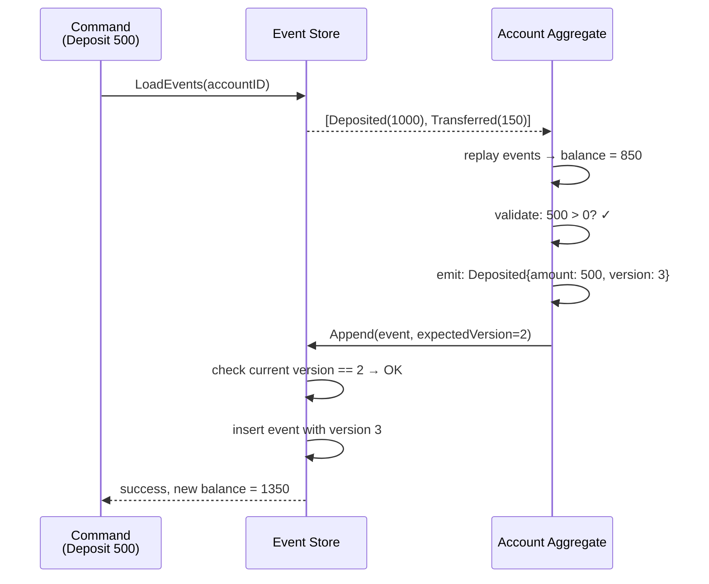
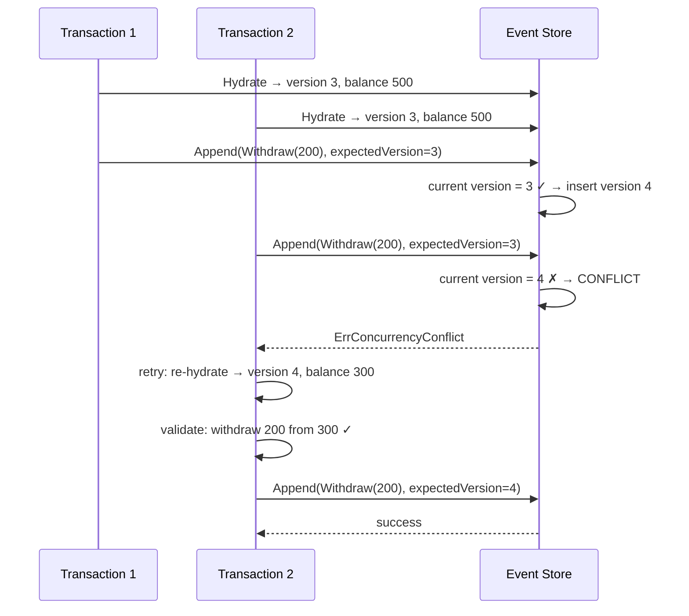
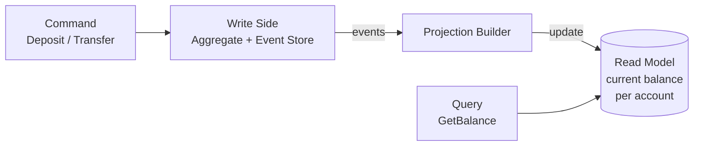
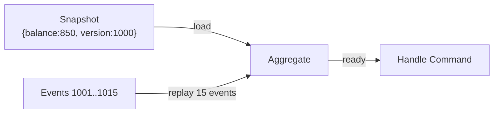

# event-sourced-ledger: Deep Dive

## What Event Sourcing Is (and Isn't)

**Regular CRUD:** Store the current state. Overwrite on update.
```
accounts table: {id: 1, balance: 850}
UPDATE accounts SET balance = 750 WHERE id = 1  ← history gone
```

**Event Sourcing:** Store every state change as an immutable event. Derive current state by replaying.
```
events table:
  {account: 1, type: Deposited,    amount: 1000, version: 1}
  {account: 1, type: Transferred,  amount: 150,  version: 2}
Current balance = 1000 - 150 = 850. History is permanent.
```

---

## The Aggregate: Hydration and Command Handling

The core loop is: **load events → replay → validate command → emit new event → append**.



```go
type Account struct {
    ID      string
    Balance int64
    Version int // optimistic concurrency
}

// Hydrate replays all events to build current state
func (a *Account) Hydrate(events []Event) {
    for _, e := range events {
        a.apply(e)
        a.Version = e.Version
    }
}

// apply is a pure function — no side effects, no DB calls
func (a *Account) apply(e Event) {
    switch e.Type {
    case "Deposited":
        a.Balance += e.Amount
    case "Withdrawn":
        a.Balance -= e.Amount
    }
}

// Deposit validates, then emits an event (does NOT mutate state directly)
func (a *Account) Deposit(amount int64) (Event, error) {
    if amount <= 0 {
        return Event{}, errors.New("amount must be positive")
    }
    return Event{
        AccountID: a.ID,
        Type:      "Deposited",
        Amount:    amount,
        Version:   a.Version + 1,
    }, nil
}
```

---

## Optimistic Concurrency — Preventing Conflicting Writes

Two goroutines both hydrate account 1 at version 3 and both try to write version 4:



```go
// Append only succeeds if currentVersion == expectedVersion
func (s *EventStore) Append(event Event, expectedVersion int) error {
    result, err := s.db.Exec(`
        INSERT INTO events (account_id, type, amount, version)
        SELECT ?, ?, ?, ?
        WHERE (
            SELECT COALESCE(MAX(version), 0) FROM events WHERE account_id = ?
        ) = ?
    `, event.AccountID, event.Type, event.Amount, event.Version,
       event.AccountID, expectedVersion)

    rows, _ := result.RowsAffected()
    if rows == 0 {
        return ErrConcurrencyConflict // caller should retry
    }
    return err
}
```

No locks. The database's atomic INSERT handles the race. This is **optimistic concurrency** — assume no conflict, handle it if it happens.

---

## CQRS: Separate Read and Write Models

Event sourcing pairs naturally with CQRS because rebuilding state from events on every read would be O(n) per query.



```go
// Projection: maintained read model — updated as events arrive
type BalanceProjection struct {
    mu       sync.RWMutex
    balances map[string]int64
}

func (p *BalanceProjection) Apply(e Event) {
    p.mu.Lock()
    defer p.mu.Unlock()
    switch e.Type {
    case "Deposited":
        p.balances[e.AccountID] += e.Amount
    case "Transferred":
        p.balances[e.SourceID] -= e.Amount
        p.balances[e.DestID] += e.Amount
    }
}

func (p *BalanceProjection) Balance(accountID string) int64 {
    p.mu.RLock()
    defer p.mu.RUnlock()
    return p.balances[accountID]
}
```

**Projections are disposable.** Delete the projection, replay all events from the store, rebuild it. This is the superpower of event sourcing: you can add new read models retroactively without any data migration.

---

## The Snapshot Pattern — Solving Slow Hydration

After 10,000 deposits to an account, hydrating requires loading 10,000 events. Snapshots solve this:



```go
// Save snapshot every N events
func (s *EventStore) MaybeSnapshot(account *Account, threshold int) error {
    if account.Version % threshold == 0 {
        snap := Snapshot{
            AccountID: account.ID,
            Version:   account.Version,
            Balance:   account.Balance,
        }
        return s.SaveSnapshot(snap)
    }
    return nil
}

// Load: start from snapshot if available, then replay only delta
func (s *EventStore) Hydrate(accountID string) (*Account, error) {
    snap, err := s.LoadSnapshot(accountID) // may return nil
    a := &Account{ID: accountID}
    startVersion := 0
    if snap != nil {
        a.Balance = snap.Balance
        a.Version = snap.Version
        startVersion = snap.Version
    }
    events, err := s.LoadEventsSince(accountID, startVersion)
    a.Hydrate(events)
    return a, err
}
```

**This project doesn't implement snapshots** — the demo runs with a small event count. In production, snapshot every 100–1000 events.

---

## Event Sourcing vs Regular CRUD: When to Use

| Use event sourcing when | Don't use event sourcing when |
|------------------------|-------------------------------|
| Audit trail required by law (finance, healthcare) | Simple CRUD with no audit needs |
| Temporal queries ("what was the balance on Jan 1?") | Data is naturally mutable (user profile) |
| Multiple read model shapes needed | Single well-defined read pattern |
| Debugging requires replay | Storage cost of event log is prohibitive |
| Integration with external systems via events | Team unfamiliar with ES — high learning curve |

**Financial ledgers are the canonical use case.** Every cent must be traceable. "What was this account's balance at 3pm on the 15th?" — trivially answered by replaying events up to that timestamp.

---

## Common Pitfalls

| Pitfall | Problem | Fix |
|---------|---------|-----|
| Mutable events | An immutable fact becomes incorrect | Never update events. Emit a correction event instead. |
| Business logic in projections | Projections become non-replayable | Projections are pure: apply event → update read model. No business rules. |
| Version-coupling event schema | Old events break new code | Version your event types: `Deposited_v1`, `Deposited_v2`. Handle both in apply(). |
| No snapshots in production | Hydration takes seconds at scale | Snapshot every 100-1000 events |
| Single event store for all aggregates | Noisy, hard to partition | Separate streams per aggregate type |
