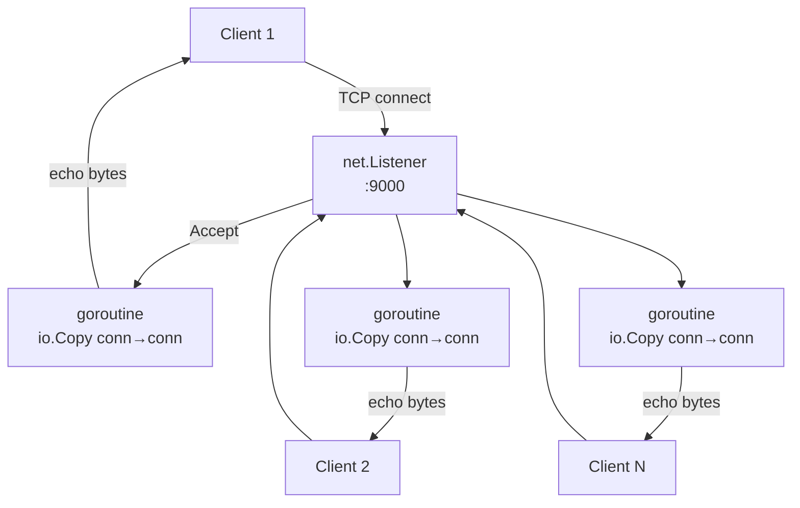

# 01-tcp-server

A raw TCP echo server built with Go's `net` package — no `net/http`, no frameworks.

## Architecture



## Key Concepts

- **`net.Listen("tcp", addr)`** — binds a port and returns a `net.Listener`
- **`ln.Accept()`** — blocks until a client connects, returns a `net.Conn`
- **Goroutine-per-connection** — each `net.Conn` is handled in its own goroutine (2KB stack vs 1MB OS thread)
- **`io.Copy(dst, src)`** — copies bytes from src to dst until EOF; on Linux uses `splice(2)` for zero-copy

## Quick Start

```bash
make run-server   # starts echo server on :9000
make run-client   # connects and sends "hello, tcp-server!"
make test         # runs tests with -race
```

## Docs

- [`docs/deep-dive.md`](./docs/deep-dive.md)
