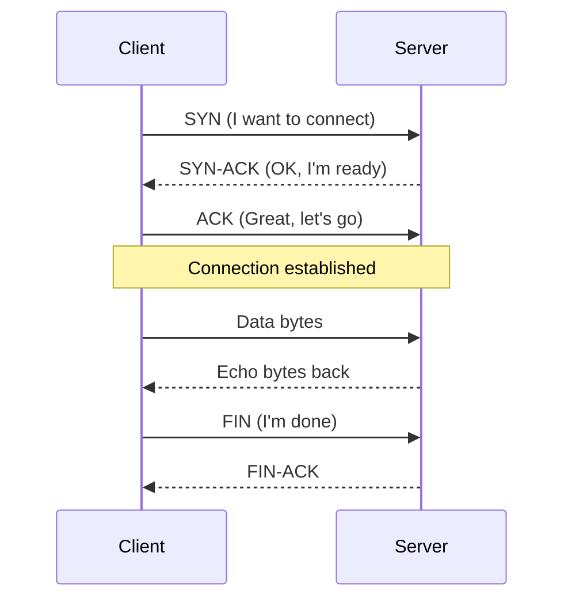
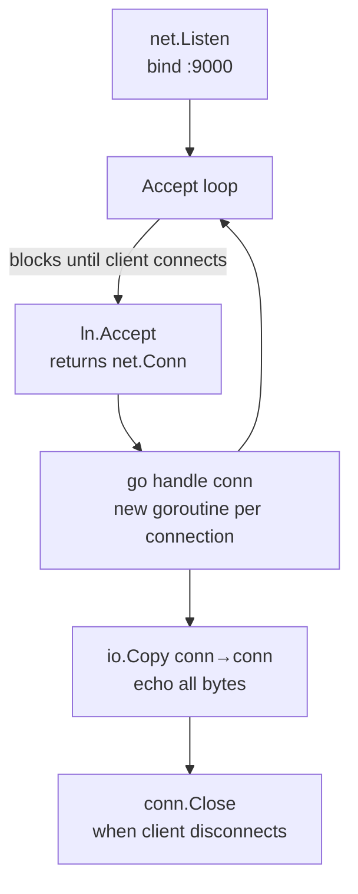
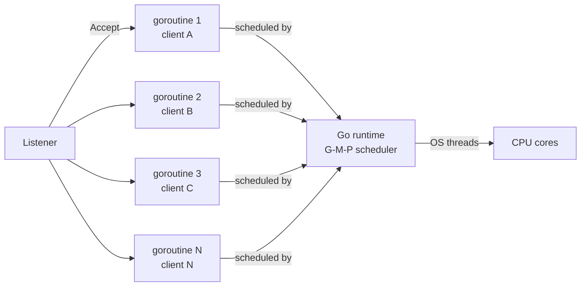
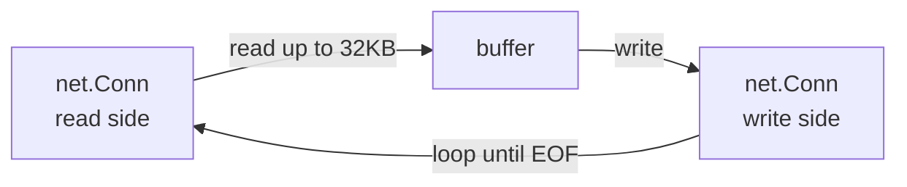
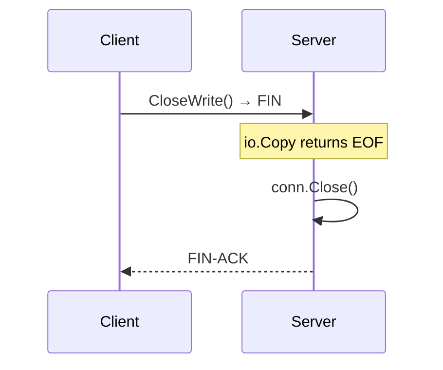

# 01-tcp-server: Deep Dive

## How TCP Works

TCP (Transmission Control Protocol) is a connection-oriented protocol. Before any data flows, a 3-way handshake establishes the connection:

## Accept Loop

The server's core is an infinite loop that blocks on `ln.Accept()` until a client connects, then hands the connection to a goroutine:

## Goroutine-per-Connection Model

Go goroutines start with a 2KB stack (vs 1MB for OS threads), making it practical to spawn one per connection:

Each goroutine blocks on `io.Copy` (a read syscall) while waiting for data. The Go runtime parks the goroutine and runs others — no OS thread is wasted.

## io.Copy Internals

`io.Copy(dst, src)` reads from `src` into a 32KB buffer and writes to `dst` in a loop:

On Linux, when both `src` and `dst` are TCP sockets, the kernel can use `splice(2)` to transfer data between file descriptors without copying through userspace — zero-copy.

## Graceful Close

When the client calls `CloseWrite()`, it sends a TCP FIN. The server's `io.Copy` returns `io.EOF`, and the server closes its side:

