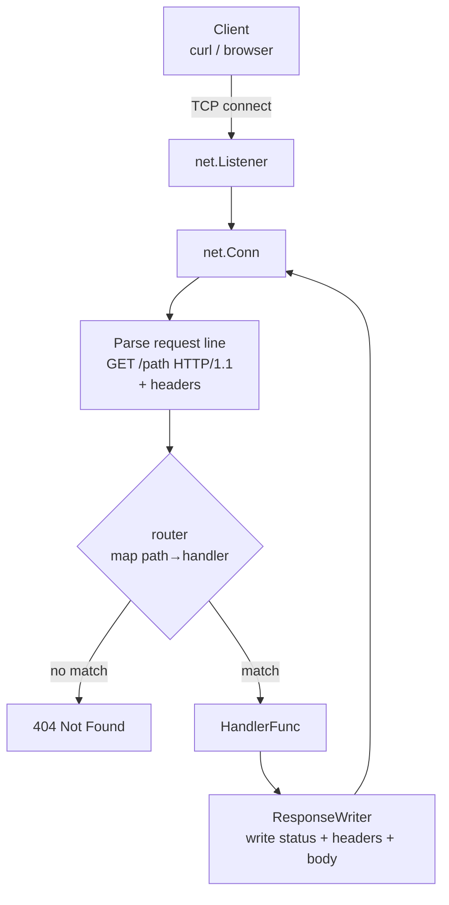

# 02-http-server

HTTP/1.1 built on top of a raw TCP connection — then the same routes with `net/http` for comparison.

## Architecture



## Key Concepts

- **Request line**: `METHOD /path HTTP/version\r\n`
- **Headers**: `Key: Value\r\n` until blank line `\r\n`
- **Response**: status line + headers + blank line + body
- **Comparison**: `internal/raw` vs `internal/stdlib` — same routes, different implementation

## Quick Start

```bash
make run-raw     # raw HTTP/1.1 on :8080
make run-stdlib  # net/http on :8081
curl http://localhost:8080/health
curl http://localhost:8081/health
```

## Docs

- [`docs/deep-dive.md`](./docs/deep-dive.md)
