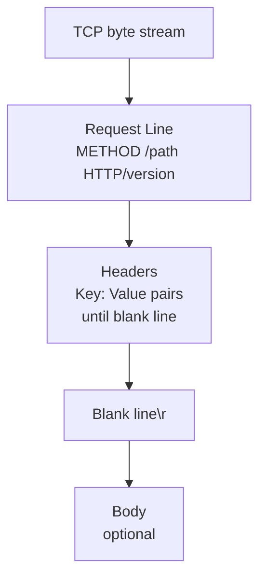
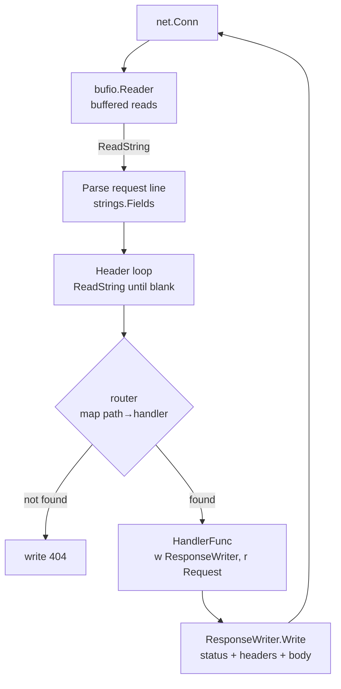
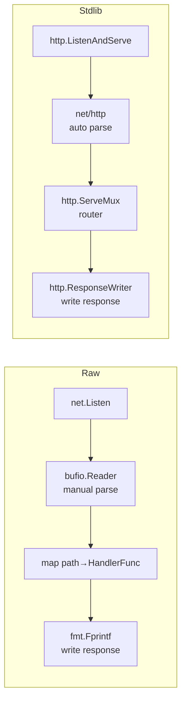
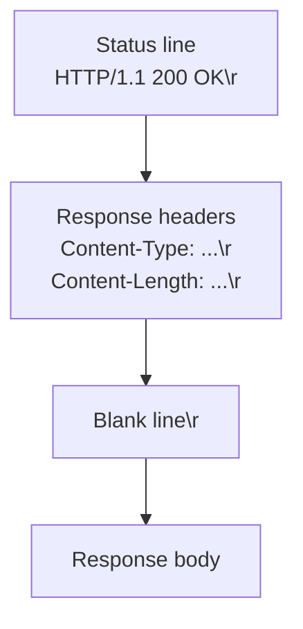
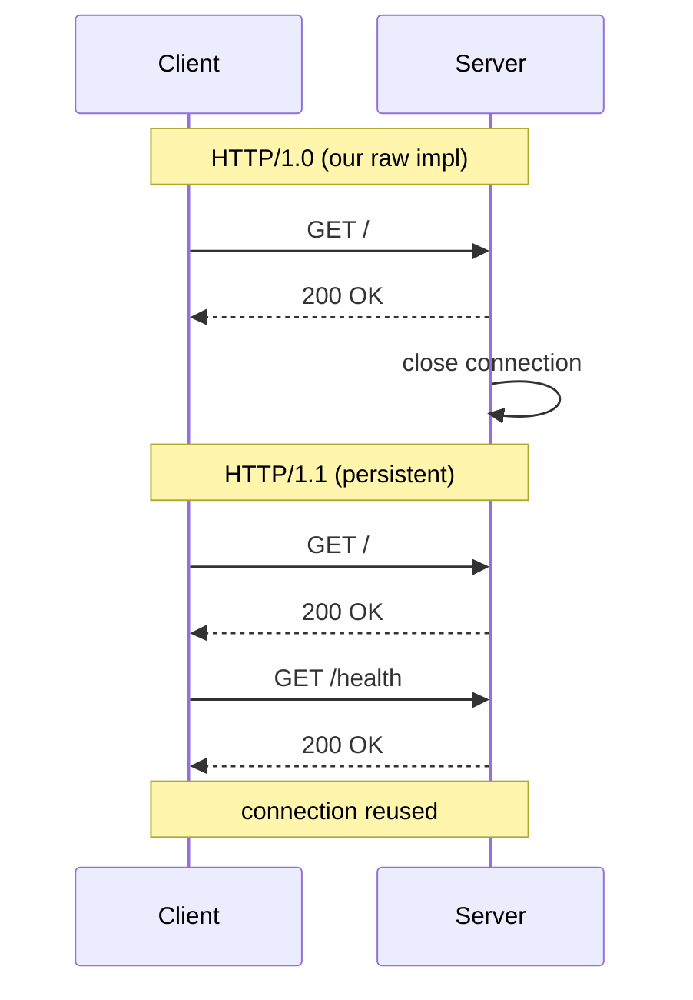

# 02-http-server: Deep Dive

## HTTP/1.1 Wire Format

HTTP is a text protocol layered on top of TCP. Every request and response follows a strict format:

```
GET /path HTTP/1.1\r\n
Host: localhost\r\n
Content-Type: text/plain\r\n
\r\n
<optional body>
```



## Raw Parser Flow



## Raw vs stdlib Comparison



The raw implementation teaches what `net/http` does internally. The stdlib version is what you'd use in production.

## Response Format



## Keep-Alive vs Connection-per-Request

Our raw implementation closes the connection after each request (HTTP/1.0 style). Real HTTP/1.1 uses persistent connections:


