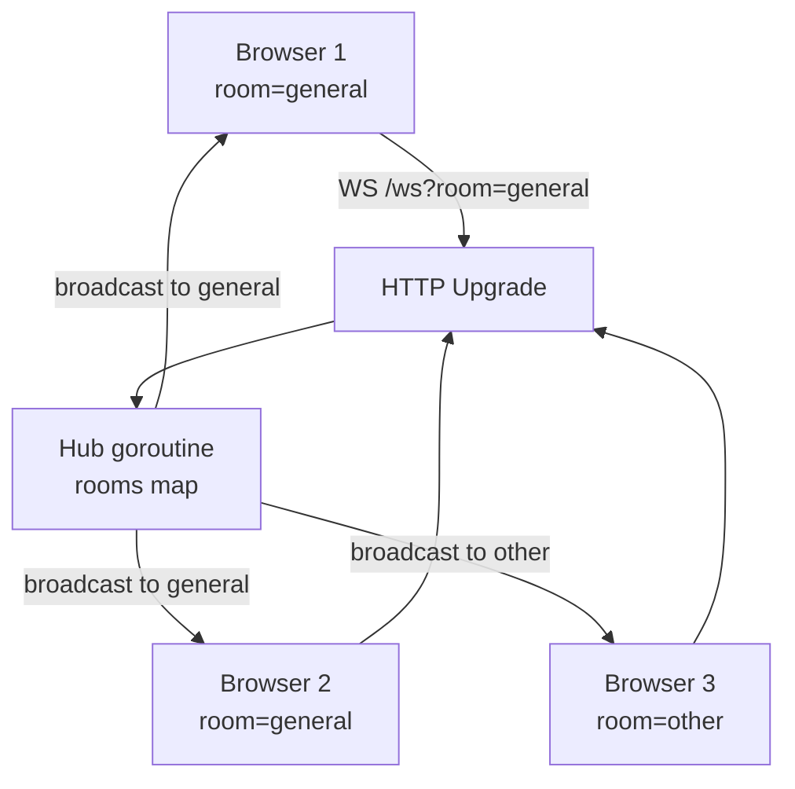

# 03-websocket-chat

A multi-room WebSocket chat server using the hub pattern.

## Architecture



## Key Concepts

- **Hub pattern**: one goroutine owns all client state — no locks on the hot path
- **Room isolation**: messages only go to clients in the same room
- **Gorilla WebSocket**: handles RFC 6455 handshake; we focus on the hub logic

## Quick Start

```bash
make run   # starts on :8082
# Open http://localhost:8082 in two tabs
```

## Docs

- [`docs/deep-dive.md`](./docs/deep-dive.md)
