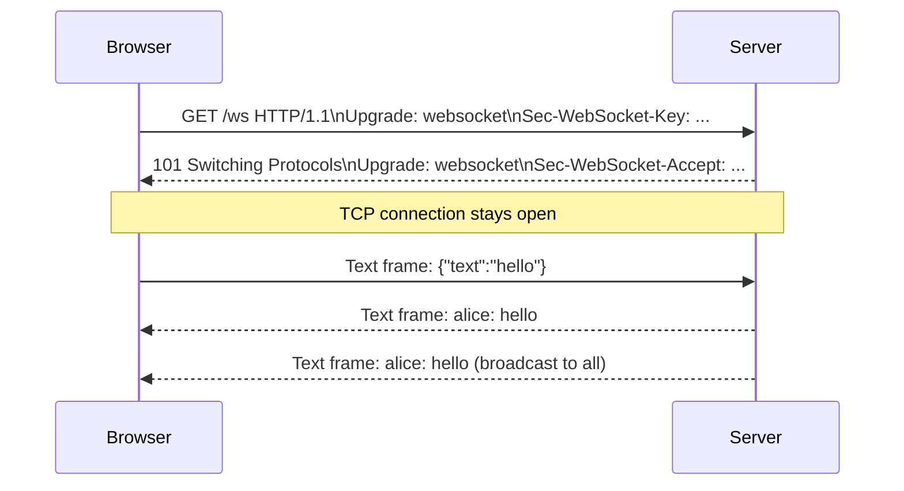
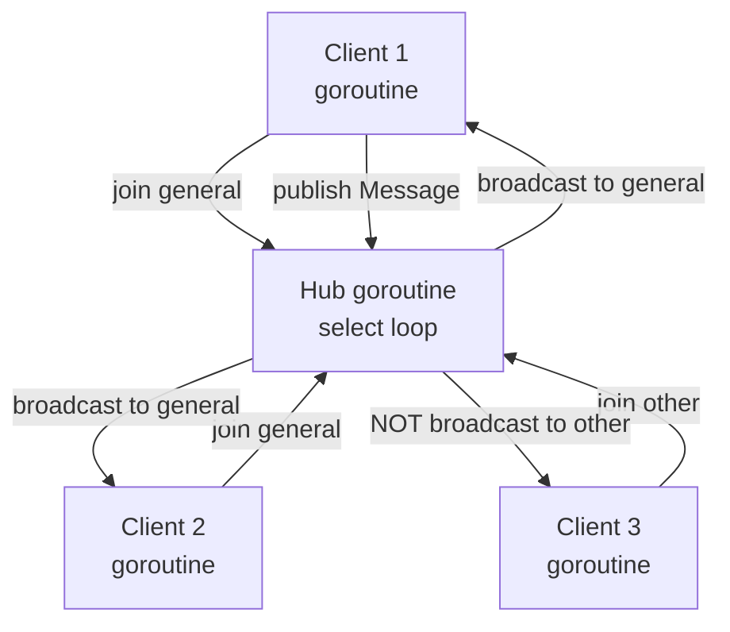
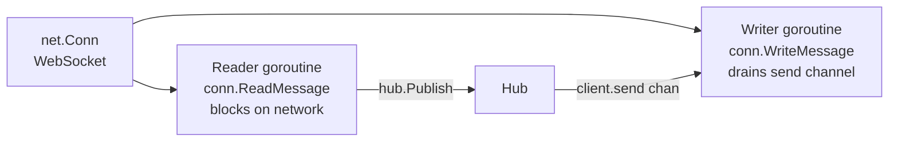
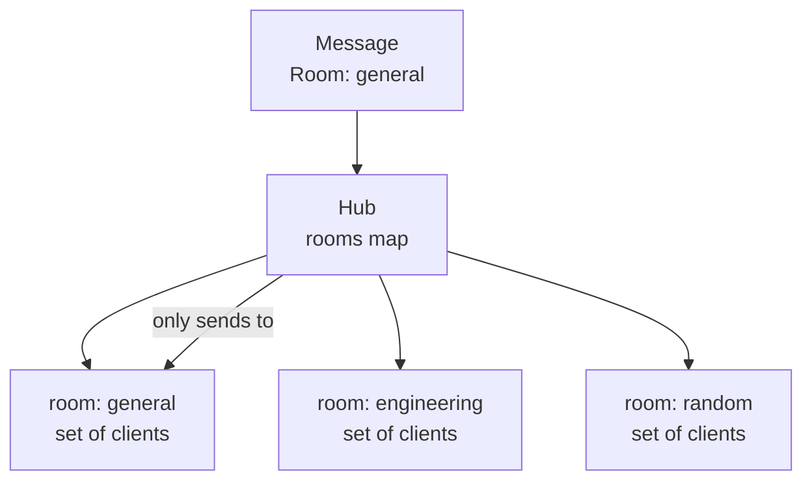
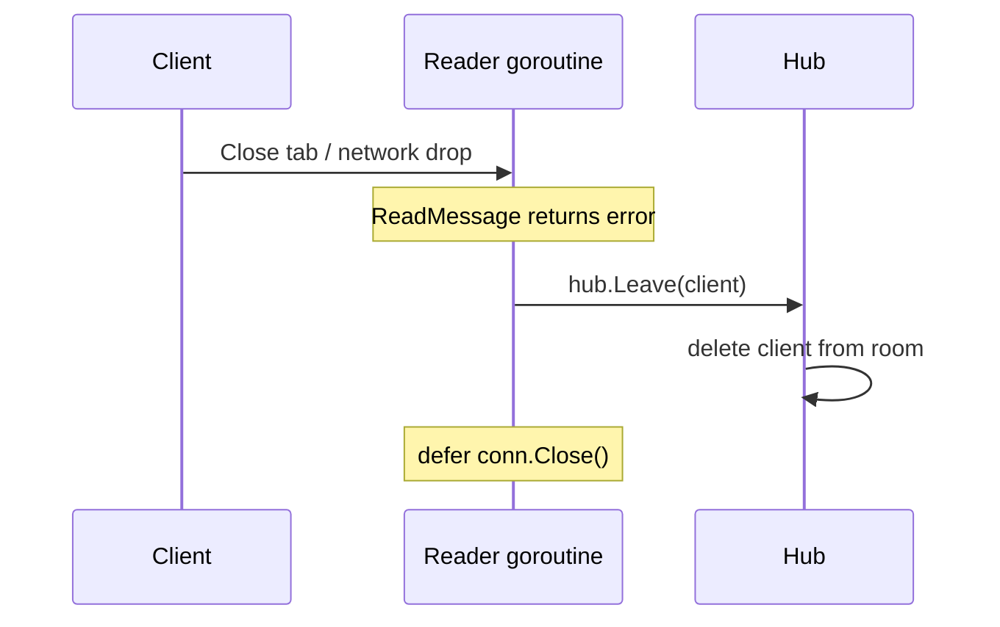

# 03-websocket-chat: Deep Dive

## WebSocket Upgrade

WebSocket starts as an HTTP request and upgrades to a persistent bidirectional connection:

## Hub Pattern

The hub is a single goroutine that owns all client state. No locks needed on the hot path:

## Per-Client Goroutines

Each WebSocket connection spawns two goroutines — one for reading, one for writing:

The writer goroutine uses a buffered `send chan []byte`. If the channel is full (slow client), the message is dropped rather than blocking the hub.

## Room Isolation

## Graceful Disconnect

