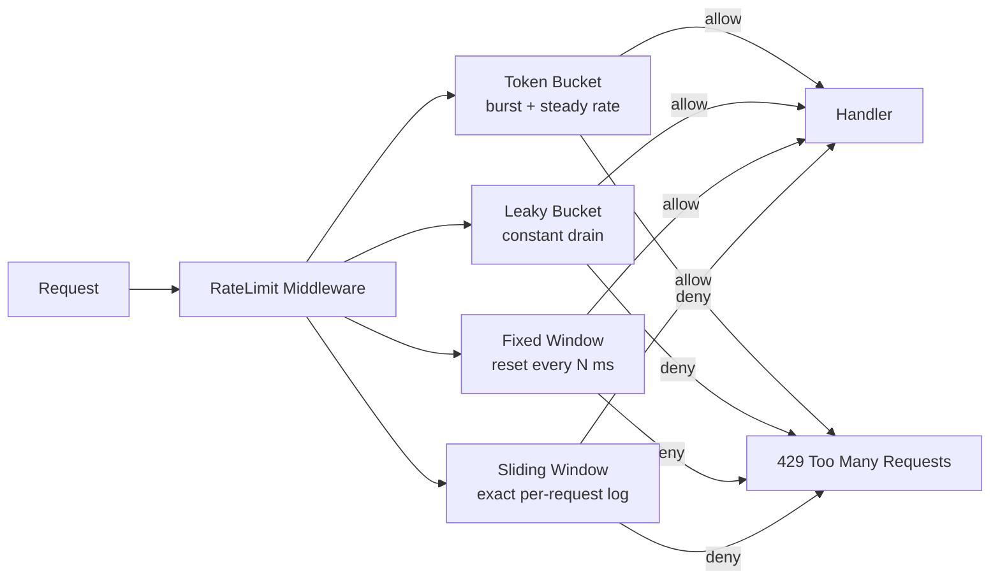

# 04-rate-limiter

All four rate limiting algorithms as a reusable Go library + HTTP middleware.

## Algorithms



## Algorithm Comparison

| Algorithm | Memory | Accuracy | Burst | Use case |
|---|---|---|---|---|
| Token Bucket | O(1) | Good | Yes | APIs, general purpose |
| Leaky Bucket | O(capacity) | Exact rate | No | Traffic shaping |
| Fixed Window | O(1) | Approximate | At boundary | Simple counters |
| Sliding Window | O(requests) | Exact | No | Strict per-window limits |

## Quick Start

```bash
ALGO=token   make run   # token bucket
ALGO=leaky   make run   # leaky bucket
ALGO=fixed   make run   # fixed window
ALGO=sliding make run   # sliding window

# Test rate limiting:
for i in $(seq 10); do curl -s -o /dev/null -w "%{http_code}\n" localhost:8083/; done
```

## Docs

- [`docs/deep-dive.md`](./docs/deep-dive.md)
