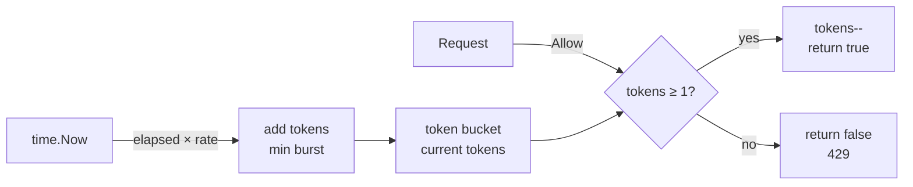
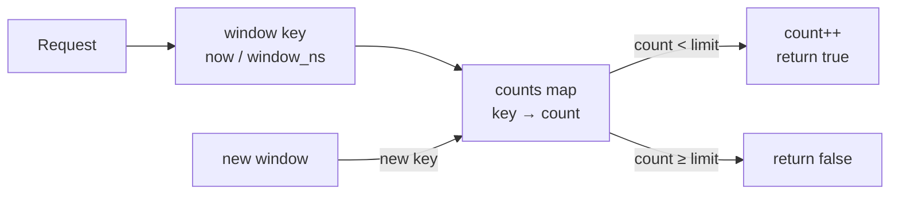
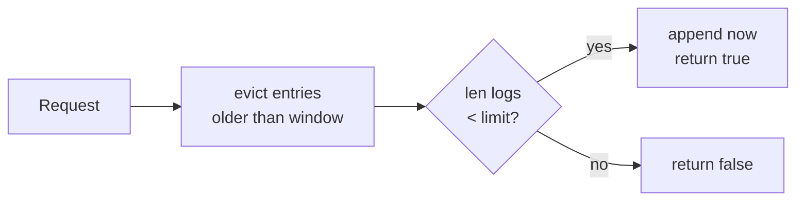
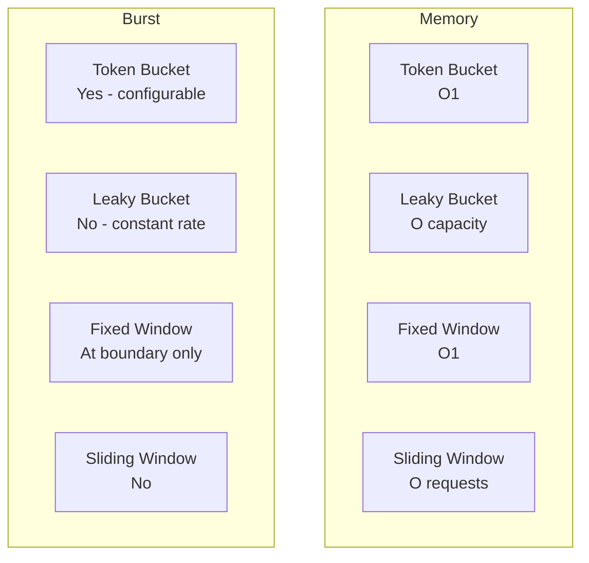
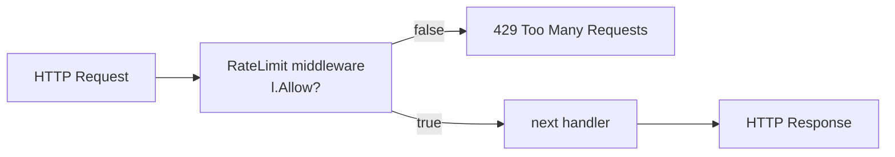

# 04-rate-limiter: Deep Dive

## Why Rate Limiting?

Without rate limiting, a single client can exhaust your server's resources. Rate limiting protects against:
- Accidental thundering herd (retry storms)
- Intentional abuse / DDoS
- Downstream service overload

## Algorithm Internals

### Token Bucket

Tokens accumulate at a fixed rate up to a burst capacity. Each request consumes one token:



**Best for**: APIs that allow short bursts (e.g., 10 req/s with burst of 50).

### Leaky Bucket

A buffered channel acts as the bucket. A background goroutine drains it at a constant rate:

```mermaid
graph LR
    REQ[Request] -->|Allow| CHAN{channel\nfull?}
    CHAN -->|space available| ENQUEUE[queue ← struct{}\nreturn true]
    CHAN -->|full| REJECT[return false\n429]
    DRAIN[ticker goroutine\nevery 1/rate] -->|drain one| CHAN
```

**Best for**: Traffic shaping — output rate is always constant regardless of input bursts.

### Fixed Window

Counts requests per time window. Resets at window boundary:



**Problem**: Boundary burst — 2× limit requests possible at window boundary.

### Sliding Window Log

Stores a timestamp for every request. Evicts old entries on each check:



**Best for**: Strict per-window limits. **Cost**: O(requests) memory.

## Algorithm Comparison



## Middleware Chain


