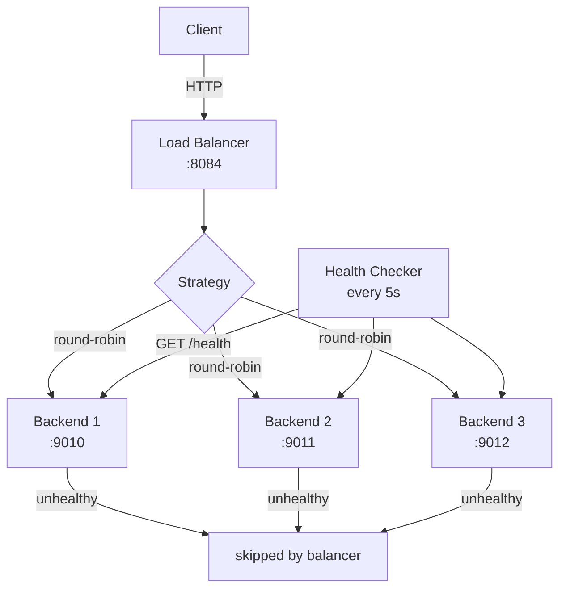

# 05-load-balancer

L7 reverse proxy with round-robin, least-connections, and background health checks.

## Architecture



## Quick Start

```bash
# Start 3 backends
PORT=9010 make run-backend &
PORT=9011 make run-backend &
PORT=9012 make run-backend &

# Start load balancer (round-robin)
make run-lb

# Test distribution
for i in $(seq 9); do curl -s localhost:8084/; done
# → backend:9010, backend:9011, backend:9012 × 3

# Least-connections
STRATEGY=lc make run-lb
```

## Docs

- [`docs/deep-dive.md`](./docs/deep-dive.md)
