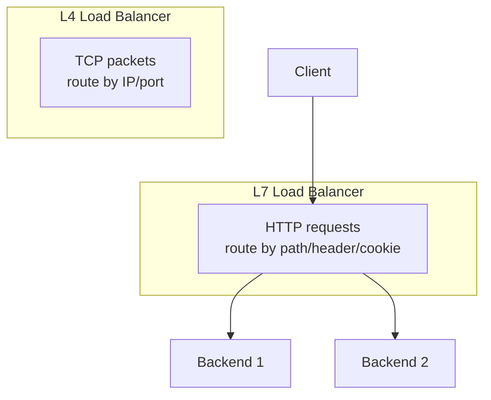
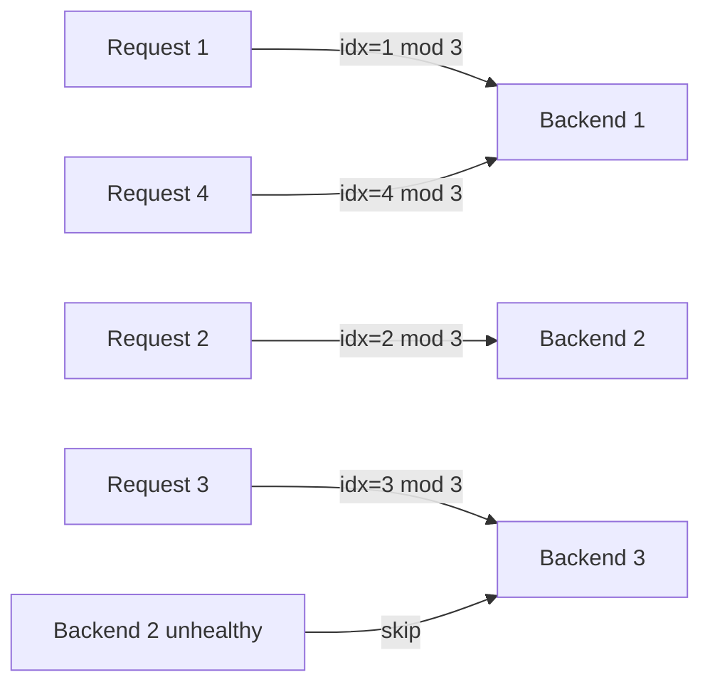
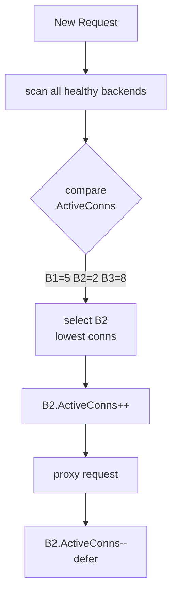
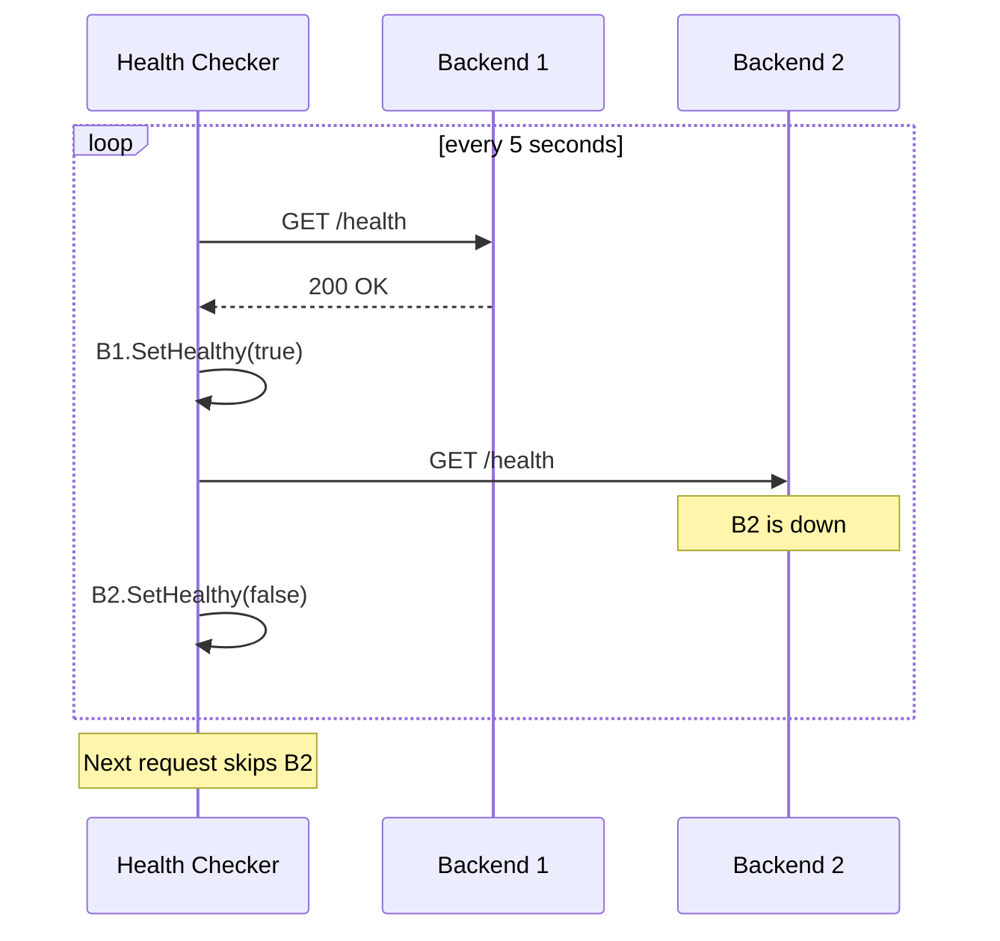
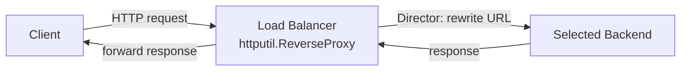

# 05-load-balancer: Deep Dive

## What is L7 Load Balancing?

L7 (application layer) load balancing operates on HTTP — it can inspect headers, paths, and cookies to make routing decisions. L4 load balancing only sees TCP/IP.

## Round Robin

Requests cycle through backends in order. Uses an atomic counter for lock-free operation:

The `atomic.Uint64` counter increments on every request — no mutex needed.

## Least Connections

Routes to the backend with the fewest active connections:

`ActiveConns` is an `atomic.Int64` — incremented before the request, decremented via `defer` after.

## Health Checker

A background goroutine polls each backend's `/health` endpoint:

## Reverse Proxy Flow

`httputil.ReverseProxy` handles connection pooling, header forwarding, and response streaming. The `Director` function is the only customization point — it rewrites the request URL to point to the selected backend.
