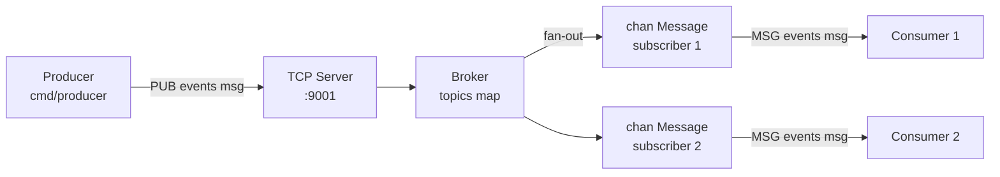

# 06-message-queue

An in-memory pub/sub message broker with a TCP server interface.

## Architecture



## Protocol

```
# Publish
PUB <topic> <payload>\n  →  OK\n

# Subscribe
SUB <topic>\n            →  OK\n
                         ←  MSG <topic> <payload>\n  (for each message)
```

## Quick Start

```bash
make run-server    # start broker on :9001
make run-consumer  # subscribe to "events"
make run-producer  # publish 5 messages
```

## Docs

- [`docs/deep-dive.md`](./docs/deep-dive.md)
