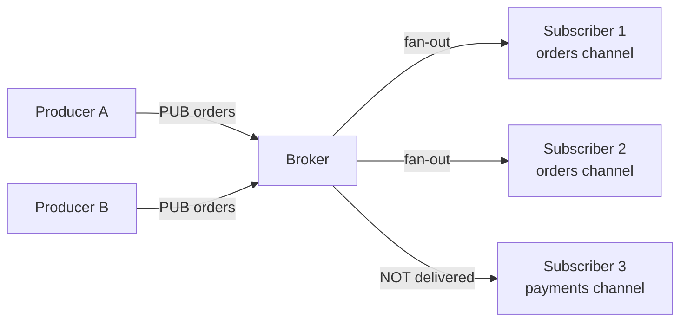
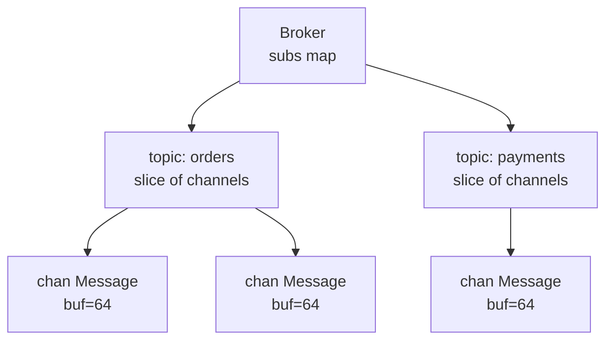
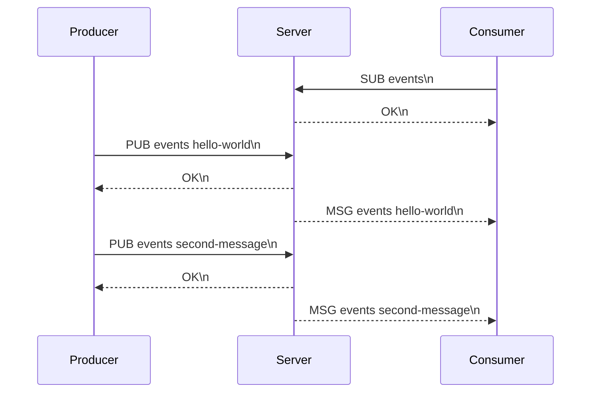
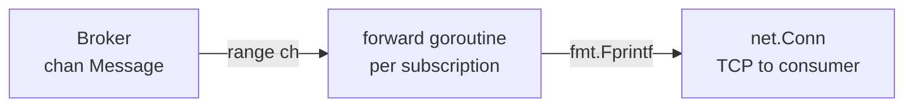
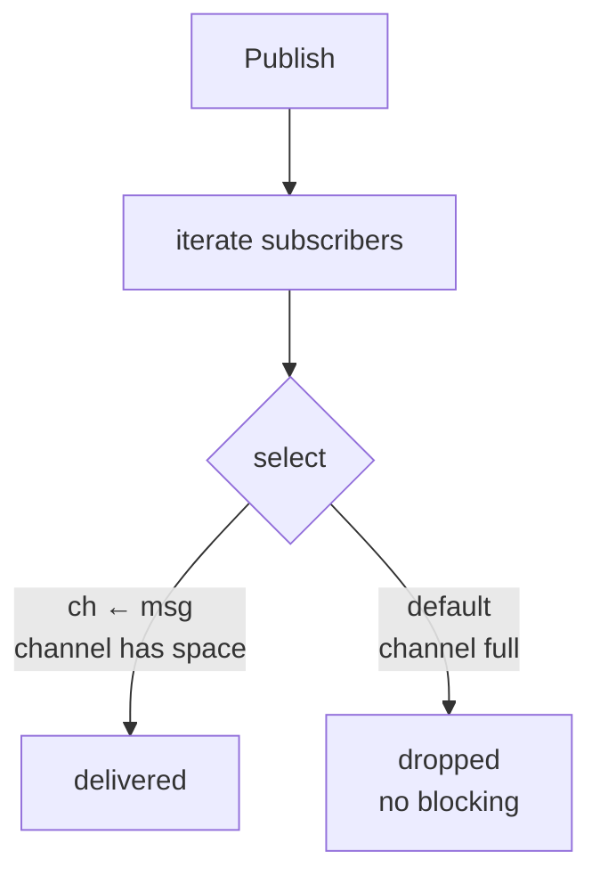

# 06-message-queue: Deep Dive

## Pub/Sub Model

Publishers and subscribers are decoupled — they don't know about each other:

## Broker Internals

`Subscribe` appends a new buffered channel to the topic's slice. `Publish` iterates the slice and sends to each channel with a non-blocking `select` — slow subscribers drop messages rather than blocking the publisher.

## TCP Protocol

## Fan-out with Goroutines

When a consumer subscribes, the server spawns a goroutine to forward messages from the broker channel to the TCP connection:

## Slow Subscriber Handling

This prevents one slow consumer from blocking all other consumers or the publisher.
