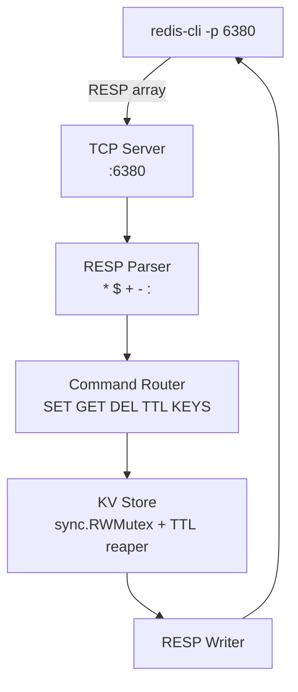

# 07-distributed-cache

A Redis-compatible KV store that speaks the RESP protocol — `redis-cli` works out of the box.

## Architecture



## Supported Commands

| Command | Example |
|---|---|
| `PING` | `PING` → `+PONG` |
| `SET` | `SET foo bar EX 60` |
| `GET` | `GET foo` → `$3\r\nbar` |
| `DEL` | `DEL foo bar` → `:2` |
| `EXISTS` | `EXISTS foo` → `:1` |
| `TTL` | `TTL foo` → `:58` |
| `KEYS` | `KEYS` → array |
| `INFO` | `INFO` → server info |

## Quick Start

```bash
make run
redis-cli -p 6380 SET foo bar EX 60
redis-cli -p 6380 GET foo
redis-cli -p 6380 TTL foo
redis-cli -p 6380 KEYS
```

## Docs

- [`docs/deep-dive.md`](./docs/deep-dive.md)
