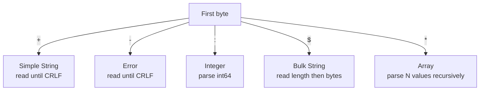
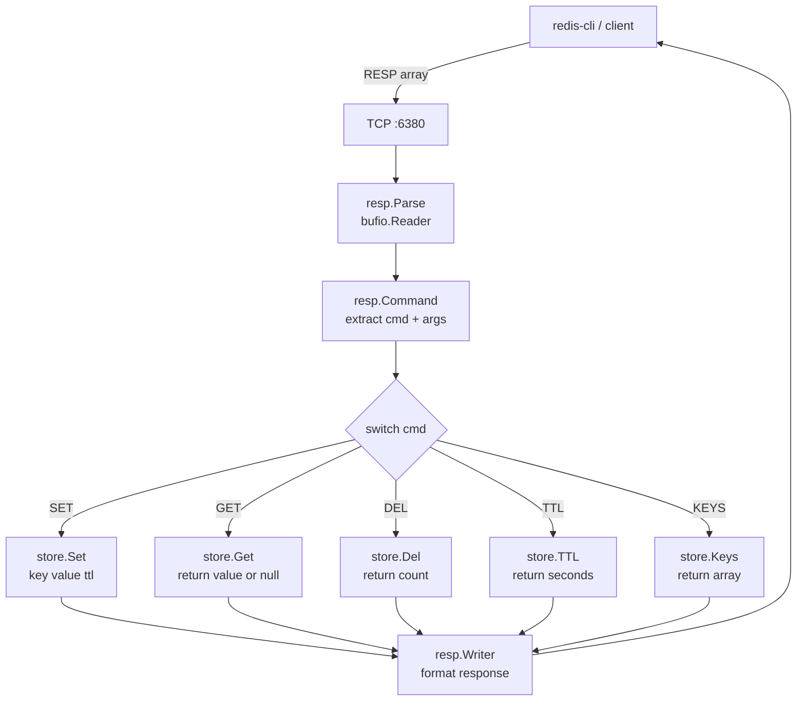
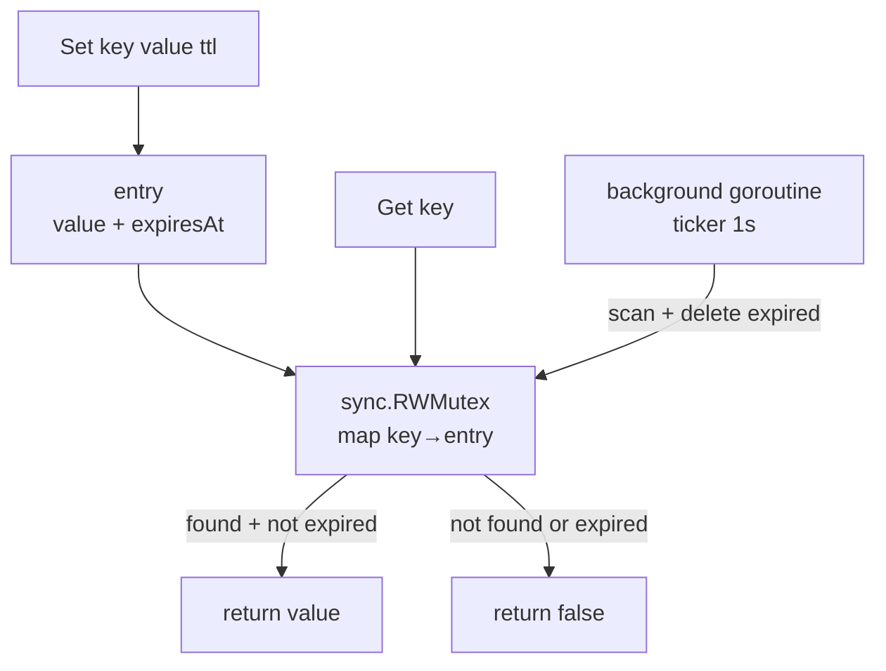
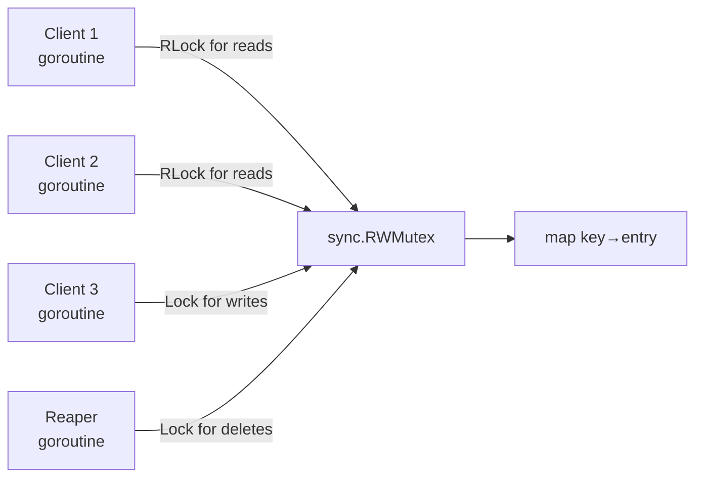

# 07-distributed-cache: Deep Dive

## RESP Protocol

Redis Serialization Protocol (RESP) uses a type prefix byte followed by data:

```
+OK\r\n              → Simple String "OK"
-ERR message\r\n     → Error
:42\r\n              → Integer 42
$5\r\nhello\r\n      → Bulk String "hello" (5 bytes)
$-1\r\n              → Null Bulk String
*3\r\n$3\r\nSET\r\n$3\r\nfoo\r\n$3\r\nbar\r\n  → Array ["SET","foo","bar"]
```



## Command Execution Flow



## KV Store with TTL



## Concurrency Model



Multiple readers can hold `RLock` simultaneously. A writer (`Set`, `Del`, reaper) acquires exclusive `Lock`.

## redis-cli Compatibility

Because we speak RESP, any Redis client works:

```bash
redis-cli -p 6380 SET foo bar EX 60
# → +OK

redis-cli -p 6380 GET foo
# → $3\r\nbar

redis-cli -p 6380 TTL foo
# → :58

redis-cli -p 6380 KEYS
# → *1\r\n$3\r\nfoo
```
