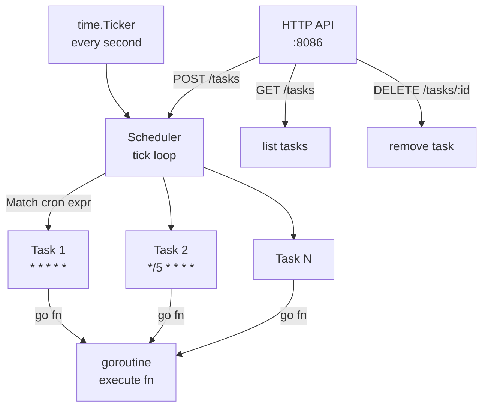

# 09-task-scheduler

A cron-like task scheduler with HTTP API for managing tasks at runtime.

## Architecture



## Cron Syntax

```
* * * * *
│ │ │ │ └── weekday (0-6, Sun=0)
│ │ │ └──── month (1-12)
│ │ └────── day (1-31)
│ └──────── hour (0-23)
└────────── minute (0-59)

Supported: * (any), */n (every n), n (exact), n-m (range), n,m (list)
```

## Quick Start

```bash
make run   # starts on :8086

# List tasks
curl localhost:8086/tasks

# Add a task
curl -X POST localhost:8086/tasks \
  -H 'Content-Type: application/json' \
  -d '{"id":"cleanup","name":"cleanup job","expr":"*/5 * * * *"}'

# Remove a task
curl -X DELETE localhost:8086/tasks/cleanup
```

## Docs

- [`docs/deep-dive.md`](./docs/deep-dive.md)
