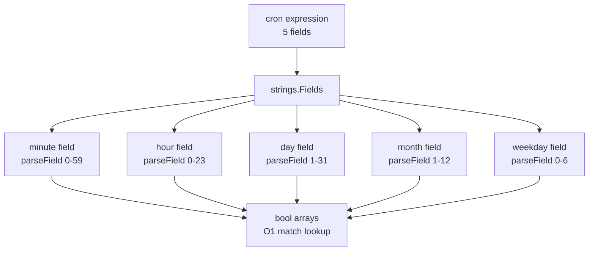
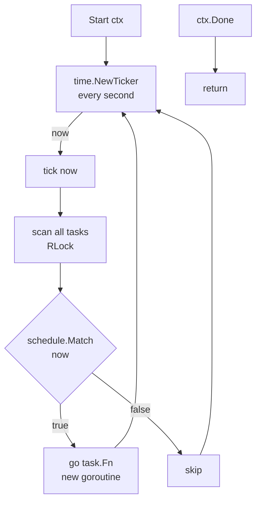
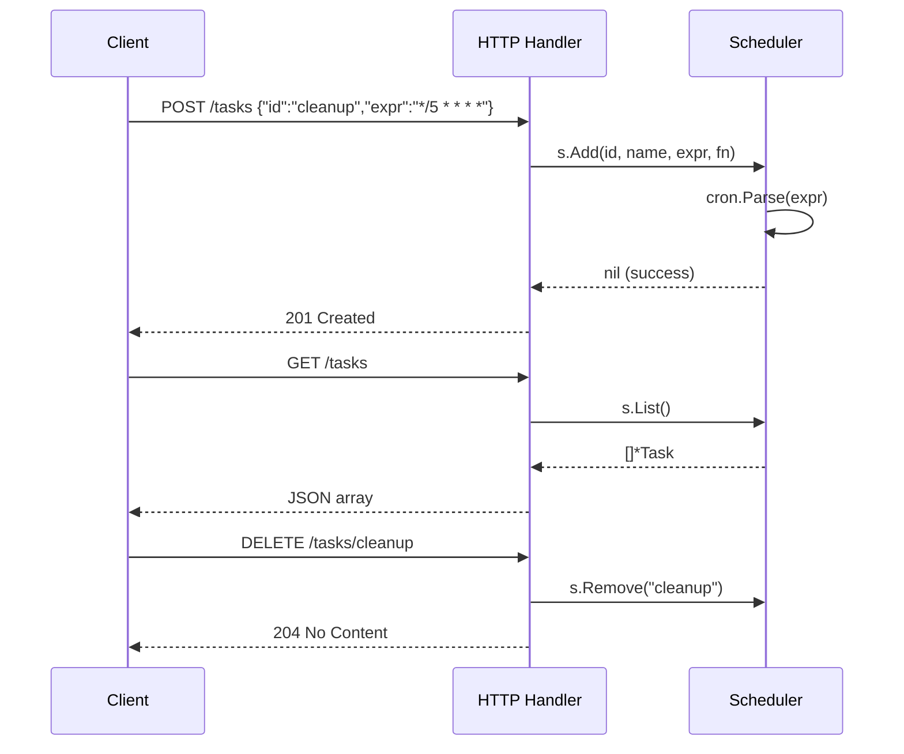
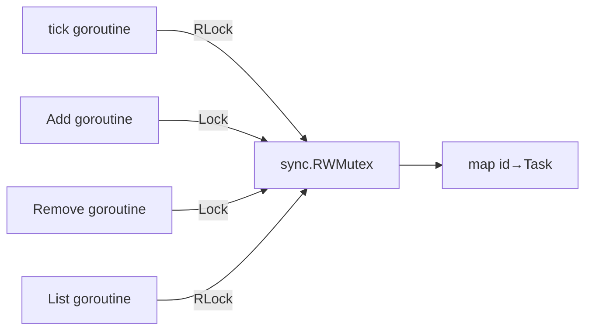

# 09-task-scheduler: Deep Dive

## Cron Expression Format

```
┌───────────── minute (0-59)
│ ┌───────────── hour (0-23)
│ │ ┌───────────── day of month (1-31)
│ │ │ ┌───────────── month (1-12)
│ │ │ │ ┌───────────── day of week (0-6, Sun=0)
│ │ │ │ │
* * * * *
```

Supported syntax:

| Pattern | Meaning |
|---|---|
| `*` | every value |
| `*/5` | every 5th value |
| `1-5` | range 1 through 5 |
| `1,3,5` | specific values |
| `30 9 * * 1-5` | 9:30 on weekdays |

## Cron Parser



Each field is parsed into a `[]bool` array. Matching is O(1) — just index into the array.

## Scheduler Tick Loop



The scheduler ticks every second but cron expressions have minute-level granularity. A task with `* * * * *` fires once per minute (when `second=0` of that minute is the first tick in that minute). In practice, the tick at second 0 of each minute matches.

## HTTP API Flow



## Concurrency Safety



Task functions run in their own goroutines (`go task.Fn()`), so a slow task doesn't block the tick loop.
