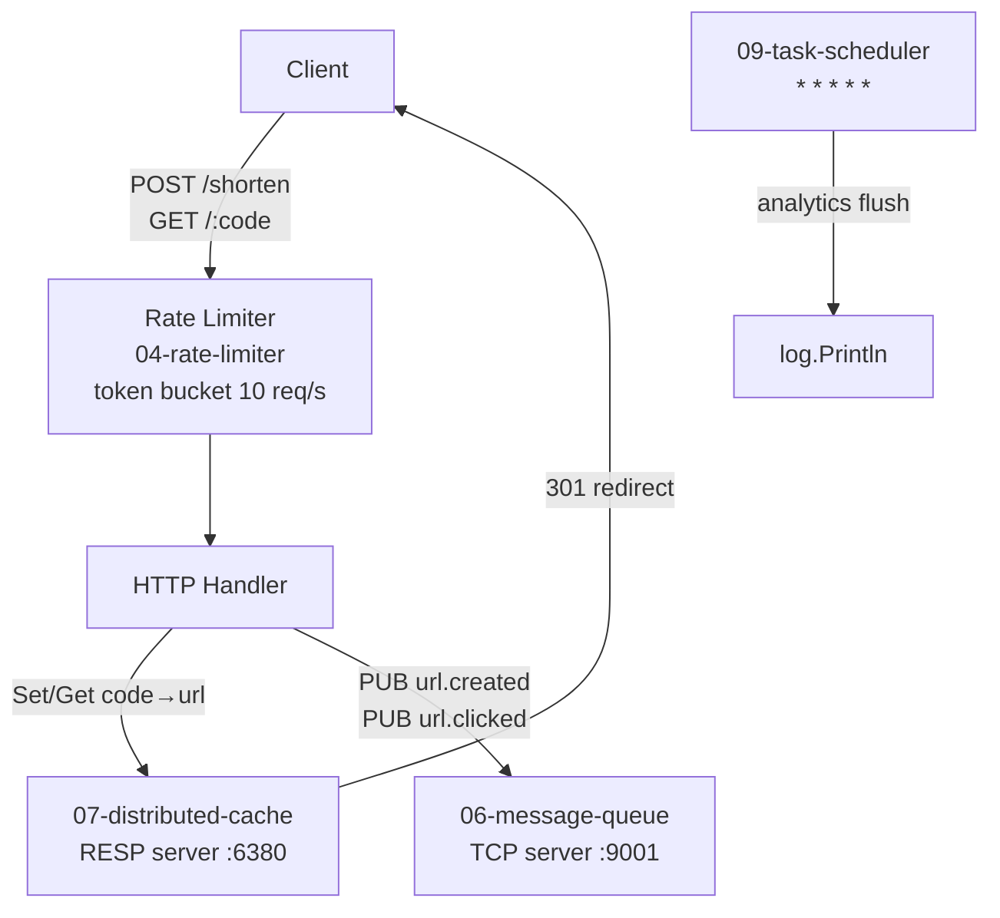

# 10-url-shortener

Capstone project — a URL shortener that integrates the from-scratch components built in this series.

## Architecture



## Integrations

| Component | From | Role |
|---|---|---|
| Token bucket rate limiter | `04-rate-limiter/ratelimit` | 10 req/s, burst 10 |
| RESP cache client | `07-distributed-cache` | Store code→URL with 24h TTL |
| MQ client | `06-message-queue` | Publish `url.created` / `url.clicked` events |
| Task scheduler | `09-task-scheduler/taskscheduler` | Scheduled analytics flush every minute |

## Quick Start

```bash
# Start dependencies (from their directories)
cd ../07-distributed-cache && make run &   # cache on :6380
cd ../06-message-queue && make run-server & # MQ on :9001

# Start URL shortener
make run   # :8087

# Shorten a URL
curl -s -X POST http://localhost:8087/shorten \
  -H 'Content-Type: application/json' \
  -d '{"url":"https://github.com"}' | jq .

# Redirect
curl -L http://localhost:8087/<code>

# Rate limit test (11th request gets 429)
for i in $(seq 12); do curl -s -o /dev/null -w "%{http_code}\n" localhost:8087/health; done
```

## Docs

- [`docs/deep-dive.md`](./docs/deep-dive.md)
