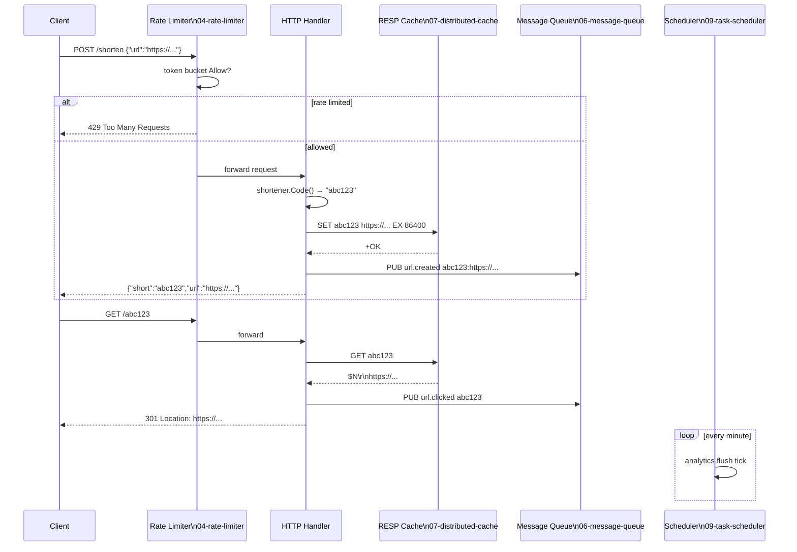
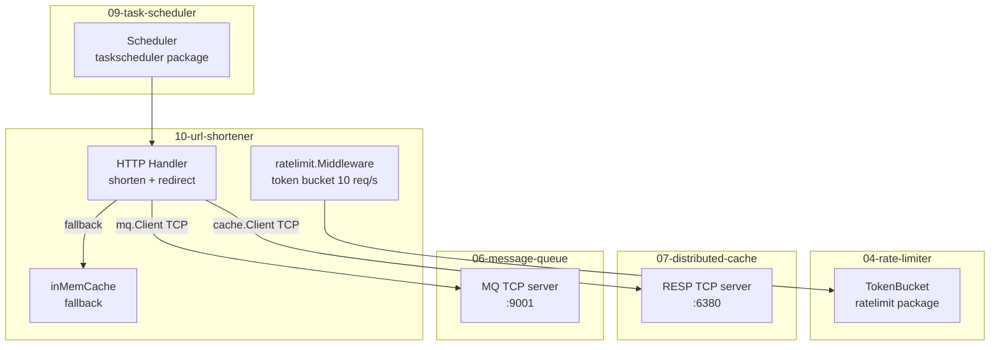
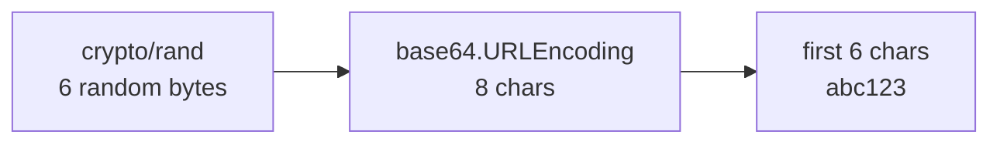
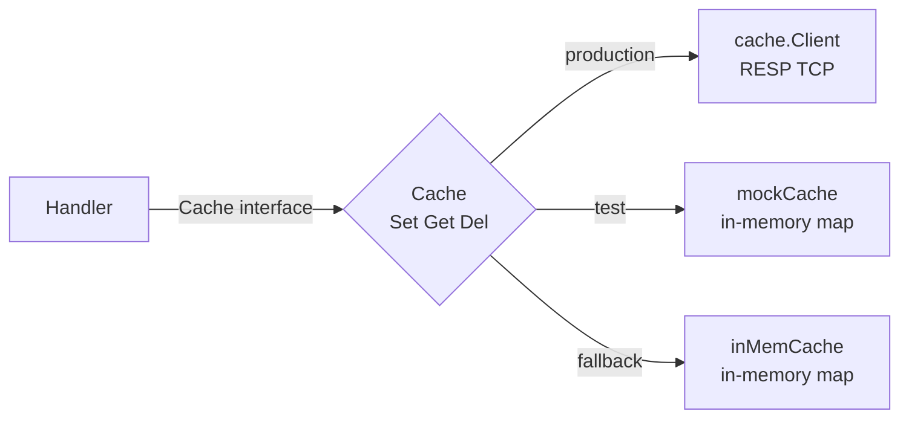
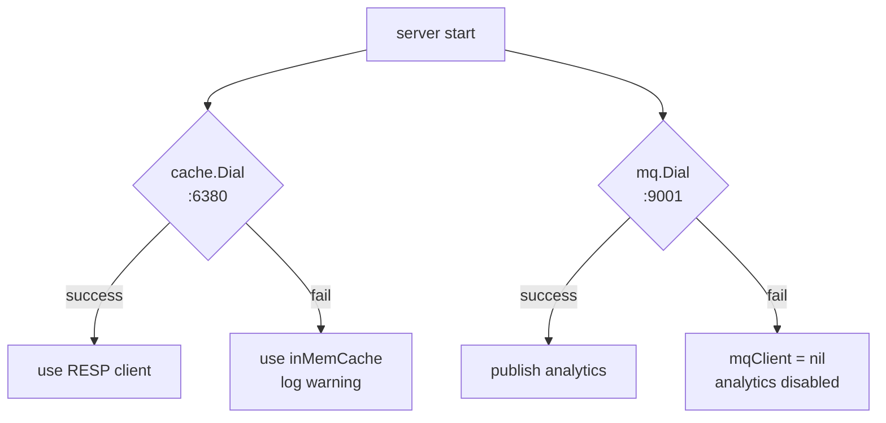

# 10-url-shortener: Deep Dive

## Full Request Flow

## Component Integration Map

## Short Code Generation

`crypto/rand` is used (not `math/rand`) to prevent predictable codes. Base64 URL encoding avoids `+` and `/` which are problematic in URLs.

## Cache Interface (Dependency Inversion)

The handler depends on the `Cache` interface, not the concrete `*cache.Client`:

This is the Dependency Inversion Principle in action — the handler is testable without a running RESP server.

## Graceful Degradation

The server starts and serves traffic even if the cache or MQ is unavailable — it degrades gracefully.
