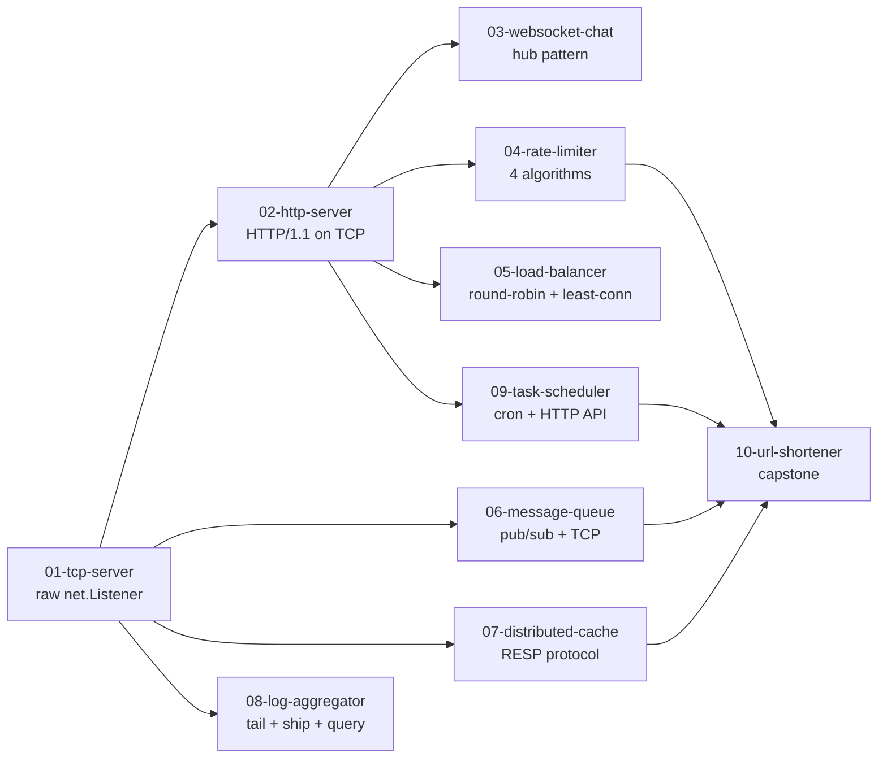

# From Scratch Series

Build fundamental distributed systems components from the ground up in Go — no magic, no frameworks, just `net`, `sync`, and the standard library.

Each project builds on the previous one. The series culminates in a URL shortener that integrates the rate limiter, cache, message queue, and task scheduler you built along the way.

---

## Learning Path



---

## Projects

| # | Project | What you build | Key concepts |
|---|---------|---------------|--------------|
| 01 | [`01-tcp-server`](./01-tcp-server/) | Raw TCP echo server | `net.Listener`, goroutine-per-conn, `io.Copy` |
| 02 | [`02-http-server`](./02-http-server/) | HTTP/1.1 parser on TCP + stdlib comparison | Request line parsing, routing, response writing |
| 03 | [`03-websocket-chat`](./03-websocket-chat/) | Multi-room chat server | Hub pattern, broadcast, gorilla/websocket |
| 04 | [`04-rate-limiter`](./04-rate-limiter/) | All 4 rate limiting algorithms | Token bucket, leaky bucket, fixed window, sliding window |
| 05 | [`05-load-balancer`](./05-load-balancer/) | L7 reverse proxy | Round-robin, least-connections, health checks |
| 06 | [`06-message-queue`](./06-message-queue/) | In-memory pub/sub + TCP server | Broker, topics, fan-out, custom protocol |
| 07 | [`07-distributed-cache`](./07-distributed-cache/) | Redis-compatible KV store | RESP protocol, TTL eviction, `redis-cli` compatible |
| 08 | [`08-log-aggregator`](./08-log-aggregator/) | Log tail → ship → aggregate → query | File tailer, TCP shipper, in-memory store, HTTP search |
| 09 | [`09-task-scheduler`](./09-task-scheduler/) | Cron-like task scheduler | Cron parser, tick loop, HTTP API |
| 10 | [`10-url-shortener`](./10-url-shortener/) | URL shortener (capstone) | Integrates 04 + 07 + 06 + 09 |

---

## Running Any Project

```bash
cd 01-tcp-server
make build   # compile
make test    # run tests with -race
make run     # start the server
```
