# From Scratch Series

Build fundamental distributed systems components from the ground up in Go — no magic, no frameworks, just `net`, `sync`, and the standard library.

Each project builds on the previous one. The series culminates in a URL shortener that integrates the rate limiter, cache, message queue, and task scheduler you built along the way. Project 11 introduces `go-chi/chi` to show where a router earns its place.

---

## Learning Path

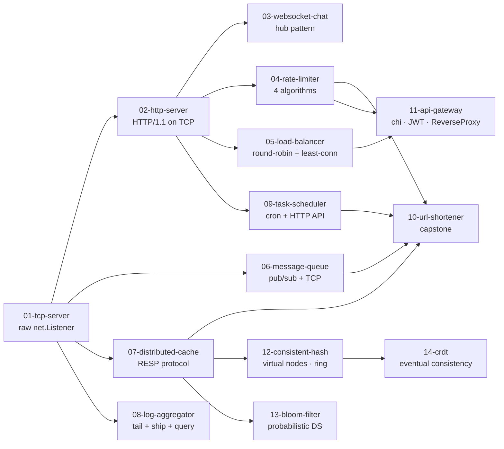
```mermaid
graph LR
    T[01-tcp-server\nraw net.Listener] --> H[02-http-server\nHTTP/1.1 on TCP]
    H --> W[03-websocket-chat\nhub pattern]
    H --> R[04-rate-limiter\n4 algorithms]
    H --> L[05-load-balancer\nround-robin + least-conn]
    T --> M[06-message-queue\npub/sub + TCP]
    T --> C[07-distributed-cache\nRESP protocol]
    T --> A[08-log-aggregator\ntail + ship + query]
    H --> S[09-task-scheduler\ncron + HTTP API]
    R & C & M & S --> U[10-url-shortener\ncapstone]
    R & L --> G[11-api-gateway\nchi · JWT · ReverseProxy]
    C --> CH[12-consistent-hash\nvirtual nodes · ring]
    C --> BF[13-bloom-filter\nprobabilistic DS]
    CH --> CRDT[14-crdt\neventual consistency]
```

---

## Projects

| # | Project | What you build | Key concepts |
|---|---------|---------------|--------------|
| 01 | [`01-tcp-server`](./01-tcp-server/) | Raw TCP echo server | `net.Listener`, goroutine-per-conn, `io.Copy` |
| 02 | [`02-http-server`](./02-http-server/) | HTTP/1.1 parser on TCP + stdlib comparison | Request line parsing, routing, response writing |
| 03 | [`03-websocket-chat`](./03-websocket-chat/) | Multi-room chat server | Hub pattern, broadcast, gorilla/websocket |
| 04 | [`04-rate-limiter`](./04-rate-limiter/) | All 4 rate limiting algorithms | Token bucket, leaky bucket, fixed window, sliding window |
| 05 | [`05-load-balancer`](./05-load-balancer/) | L7 reverse proxy | Round-robin, least-connections, health checks |
| 06 | [`06-message-queue`](./06-message-queue/) | In-memory pub/sub + TCP server | Broker, topics, fan-out, custom protocol |
| 07 | [`07-distributed-cache`](./07-distributed-cache/) | Redis-compatible KV store | RESP protocol, TTL eviction, `redis-cli` compatible |
| 08 | [`08-log-aggregator`](./08-log-aggregator/) | Log tail → ship → aggregate → query | File tailer, TCP shipper, in-memory store, HTTP search |
| 09 | [`09-task-scheduler`](./09-task-scheduler/) | Cron-like task scheduler | Cron parser, tick loop, HTTP API |
| 10 | [`10-url-shortener`](./10-url-shortener/) | URL shortener (capstone) | Integrates 04 + 07 + 06 + 09 |
| 11 | [`11-api-gateway`](./11-api-gateway/) | Edge API Gateway (JWT auth, rate limiting, reverse proxy) | `go-chi/chi` middleware composability, HS256 JWT, `httputil.ReverseProxy` Director, `context.Context` identity propagation, `replace` directive |
| 12 | [`12-consistent-hash`](./12-consistent-hash/) | Consistent hashing ring | Virtual nodes, crc32, binary search, minimal redistribution |
| 13 | [`13-bloom-filter`](./13-bloom-filter/) | Bloom filter + HyperLogLog | Probabilistic membership, cardinality estimation, false positive rates |
| 14 | [`14-crdt`](./14-crdt/) | Conflict-Free Replicated Data Types | G-Counter, PN-Counter, LWW-Register, eventual consistency |

---

## Running Any Project

```bash
cd 01-tcp-server
make build   # compile
make test    # run tests with -race
make run     # start the server
```

---

## Project Architectures

### 01. TCP Server

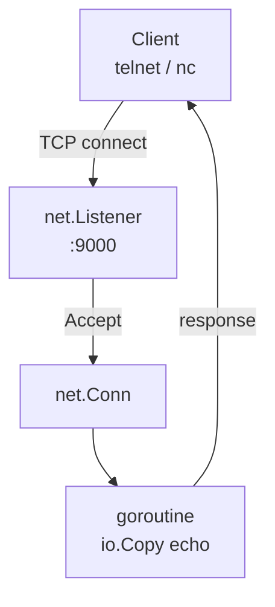
```mermaid
graph TD
    CLIENT[Client\ntelnet / nc] -->|TCP connect| LISTENER[net.Listener\n:9000]
    LISTENER -->|Accept| CONN[net.Conn]
    CONN --> GOR[goroutine\nio.Copy echo]
    GOR -->|response| CLIENT
```

Raw TCP echo server. One goroutine per connection, `io.Copy` reflects data back.

---

### 02. HTTP Server

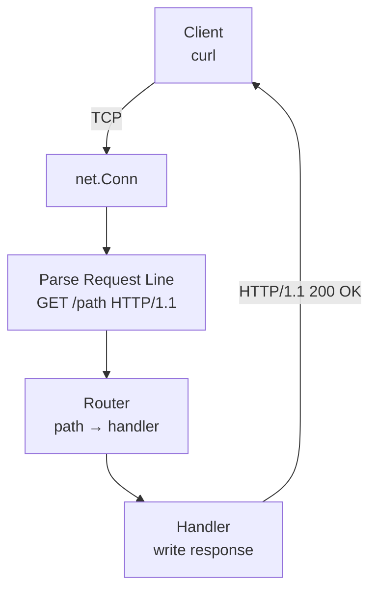
```mermaid
graph TD
    CLIENT[Client\ncurl] -->|TCP| CONN[net.Conn]
    CONN --> PARSE[Parse Request Line\nGET /path HTTP/1.1]
    PARSE --> ROUTE[Router\npath → handler]
    ROUTE --> HANDLER[Handler\nwrite response]
    HANDLER -->|HTTP/1.1 200 OK| CLIENT
```

HTTP/1.1 parser built on raw TCP. Parses request line, routes to handlers, writes properly formatted responses.

---

### 03. WebSocket Chat

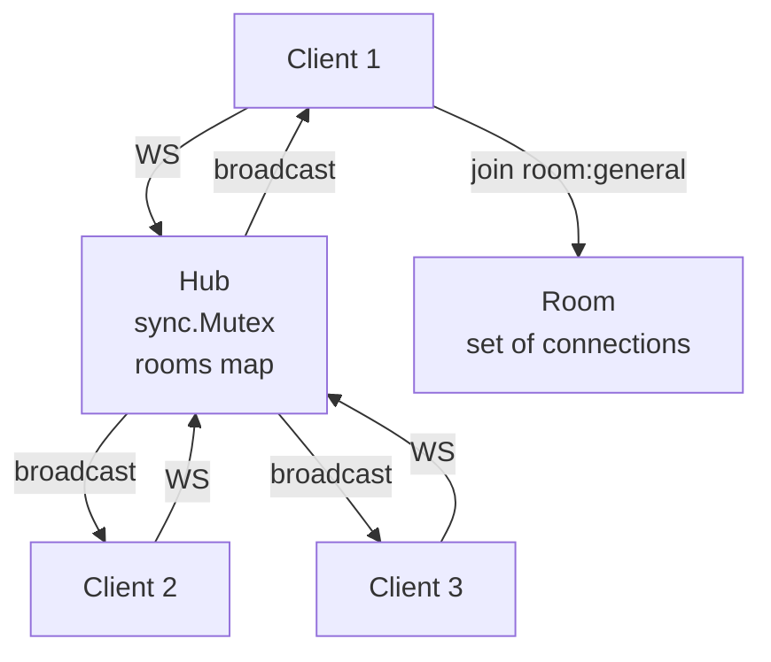
```mermaid
graph TD
    C1[Client 1] -->|WS| HUB[Hub\nsync.Mutex\nrooms map]
    C2[Client 2] -->|WS| HUB
    C3[Client 3] -->|WS| HUB
    HUB -->|broadcast| C1
    HUB -->|broadcast| C2
    HUB -->|broadcast| C3
    
    C1 -->|join room:general| ROOM[Room\nset of connections]
```

Multi-room chat with hub pattern. Hub manages rooms, broadcasts messages to all clients in a room.

---

### 04. Rate Limiter

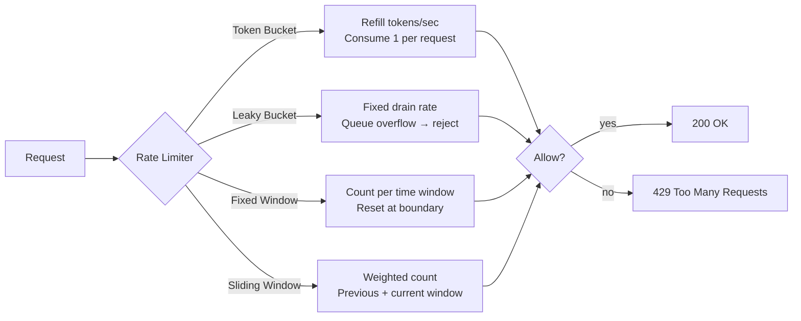
```mermaid
graph LR
    REQ[Request] --> RL{Rate Limiter}
    RL -->|Token Bucket| TB[Refill tokens/sec\nConsume 1 per request]
    RL -->|Leaky Bucket| LB[Fixed drain rate\nQueue overflow → reject]
    RL -->|Fixed Window| FW[Count per time window\nReset at boundary]
    RL -->|Sliding Window| SW[Weighted count\nPrevious + current window]
    TB & LB & FW & SW --> DECISION{Allow?}
    DECISION -->|yes| PASS[200 OK]
    DECISION -->|no| REJECT[429 Too Many Requests]
```

All 4 rate limiting algorithms implemented and benchmarked.

---

### 05. Load Balancer

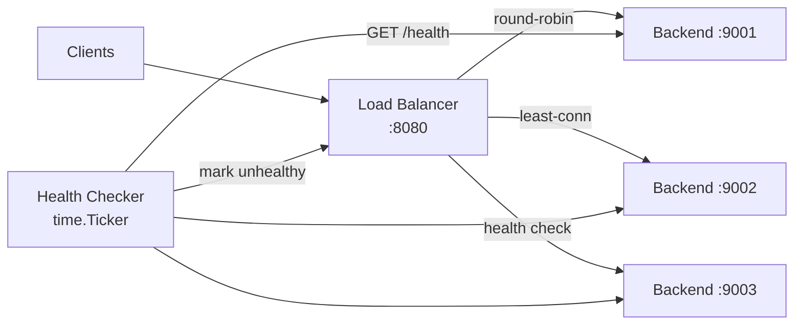
```mermaid
graph LR
    CLIENT[Clients] --> LB[Load Balancer\n:8080]
    LB -->|round-robin| B1[Backend :9001]
    LB -->|least-conn| B2[Backend :9002]
    LB -->|health check| B3[Backend :9003]
    
    HC[Health Checker\ntime.Ticker] -->|GET /health| B1
    HC --> B2
    HC --> B3
    HC -->|mark unhealthy| LB
```

L7 reverse proxy with round-robin, least-connections, and periodic health checks.

---

### 06. Message Queue

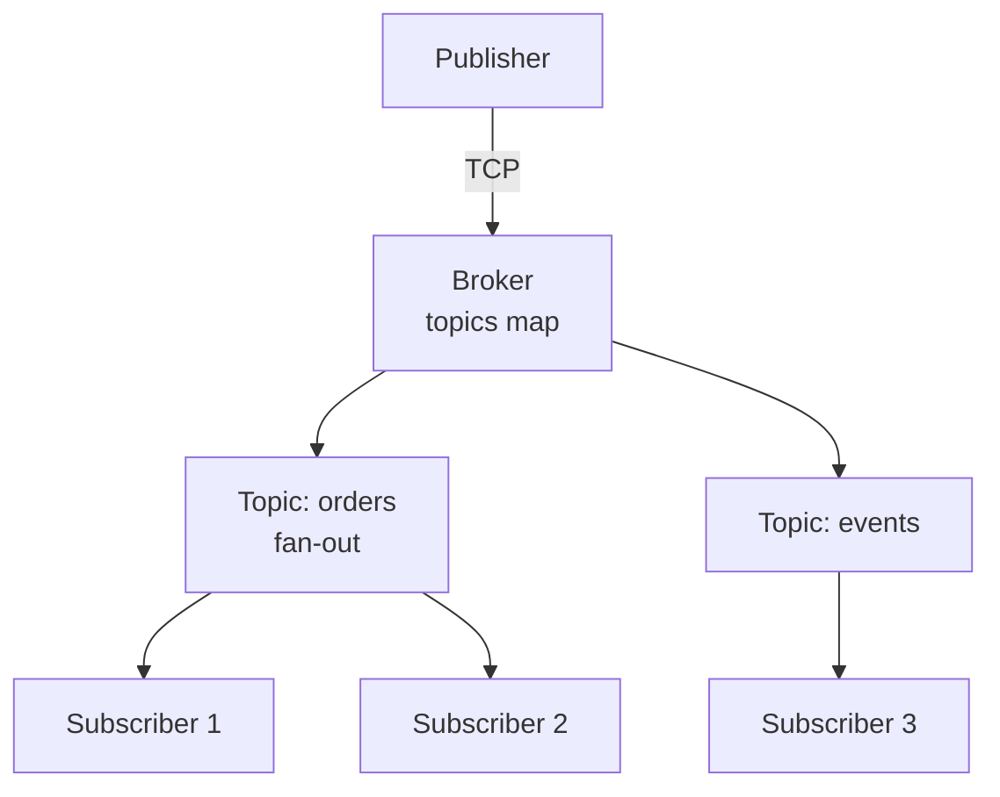
```mermaid
graph TD
    PUB[Publisher] -->|TCP| BROKER[Broker\ntopics map]
    BROKER --> T1[Topic: orders\nfan-out]
    BROKER --> T2[Topic: events]
    T1 --> SUB1[Subscriber 1]
    T1 --> SUB2[Subscriber 2]
    T2 --> SUB3[Subscriber 3]
```

In-memory pub/sub with custom TCP text protocol. Broker manages topics, fan-out to all subscribers.

---

### 07. Distributed Cache

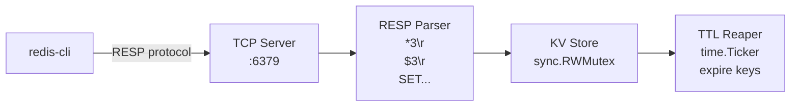
```mermaid
graph LR
    CLIENT[redis-cli] -->|RESP protocol| SERVER[TCP Server\n:6379]
    SERVER --> PARSE[RESP Parser\n*3\r\n$3\r\nSET...]
    PARSE --> STORE[KV Store\nsync.RWMutex]
    STORE --> TTL[TTL Reaper\ntime.Ticker\nexpire keys]
```

Redis-compatible KV store. Speaks RESP protocol — works with `redis-cli`. Supports GET, SET, DEL, EXPIRE, TTL.

---

### 08. Log Aggregator

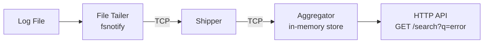
```mermaid
graph LR
    FILE[Log File] --> TAIL[File Tailer\nfsnotify]
    TAIL -->|TCP| SHIP[Shipper]
    SHIP -->|TCP| AGG[Aggregator\nin-memory store]
    AGG --> HTTP[HTTP API\nGET /search?q=error]
```

End-to-end log pipeline: tail files → ship over TCP → aggregate → query via HTTP.

---

### 09. Task Scheduler

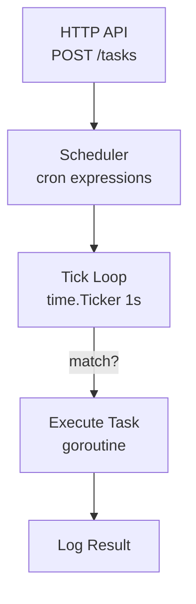
```mermaid
graph TD
    API[HTTP API\nPOST /tasks] --> SCHED[Scheduler\ncron expressions]
    SCHED --> TICK[Tick Loop\ntime.Ticker 1s]
    TICK -->|match?| EXEC[Execute Task\ngoroutine]
    EXEC --> LOG[Log Result]
```

Cron-like scheduler with HTTP API for task management. Parses cron expressions, executes on schedule.

---

### 10. URL Shortener (Capstone)

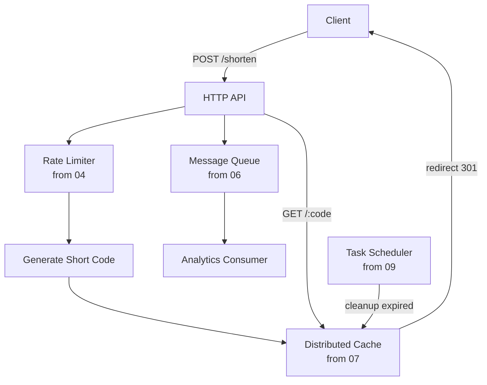
```mermaid
graph TD
    CLIENT[Client] -->|POST /shorten| API[HTTP API]
    API --> RL[Rate Limiter\nfrom 04]
    RL --> GEN[Generate Short Code]
    GEN --> CACHE[Distributed Cache\nfrom 07]
    API -->|GET /:code| CACHE
    CACHE -->|redirect 301| CLIENT
    
    API --> MQ[Message Queue\nfrom 06]
    MQ --> ANALYTICS[Analytics Consumer]
    
    SCHED[Task Scheduler\nfrom 09] -->|cleanup expired| CACHE
```

Capstone project integrating rate limiter (04), distributed cache (07), message queue (06), and task scheduler (09).

---

### 11. API Gateway

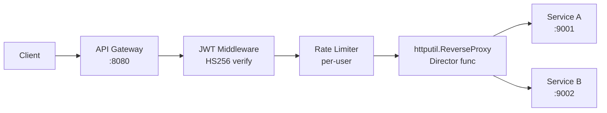
```mermaid
graph LR
    CLIENT[Client] --> GW[API Gateway\n:8080]
    GW --> AUTH[JWT Middleware\nHS256 verify]
    AUTH --> RL[Rate Limiter\nper-user]
    RL --> PROXY[httputil.ReverseProxy\nDirector func]
    PROXY --> SVC1[Service A\n:9001]
    PROXY --> SVC2[Service B\n:9002]
```

Edge gateway with `go-chi/chi` middleware composability, JWT authentication, per-user rate limiting, and reverse proxy routing.

---

### 12. Consistent Hash

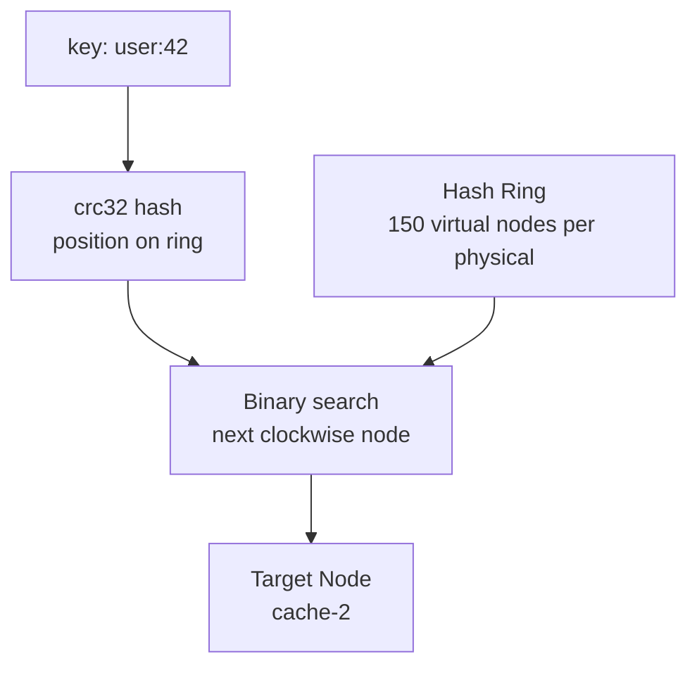
```mermaid
graph TD
    KEY[key: user:42] --> HASH[crc32 hash\nposition on ring]
    HASH --> SEARCH[Binary search\nnext clockwise node]
    SEARCH --> NODE[Target Node\ncache-2]
    
    RING[Hash Ring\n150 virtual nodes per physical] --> SEARCH
```

Consistent hashing ring with virtual nodes. Demonstrates minimal key redistribution when nodes join/leave.

---

### 13. Bloom Filter

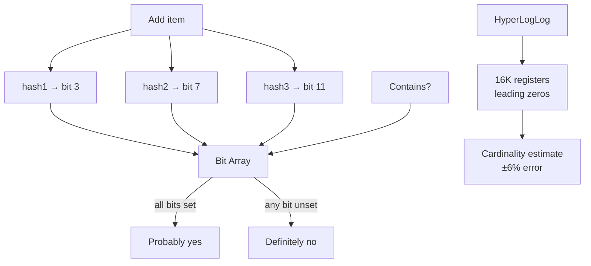
```mermaid
graph TD
    ADD[Add item] --> H1[hash1 → bit 3]
    ADD --> H2[hash2 → bit 7]
    ADD --> H3[hash3 → bit 11]
    H1 & H2 & H3 --> BITS[Bit Array]
    
    CHECK[Contains?] --> BITS
    BITS -->|all bits set| MAYBE[Probably yes]
    BITS -->|any bit unset| NO[Definitely no]
    
    HLL[HyperLogLog] --> REG[16K registers\nleading zeros]
    REG --> EST[Cardinality estimate\n±6% error]
```

Bloom filter for probabilistic membership + HyperLogLog for cardinality estimation using 16KB.

---

### 14. CRDT

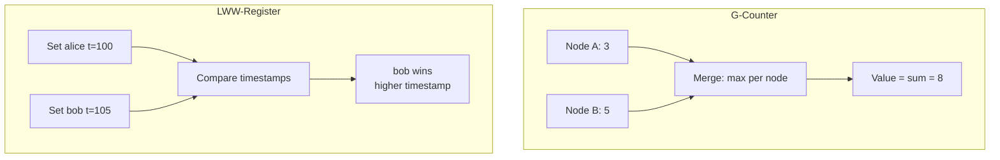
```mermaid
graph TD
    subgraph G-Counter
        A[Node A: 3] --> MERGE[Merge: max per node]
        B[Node B: 5] --> MERGE
        MERGE --> SUM[Value = sum = 8]
    end
    
    subgraph LWW-Register
        W1[Set alice t=100] --> CMP[Compare timestamps]
        W2[Set bob t=105] --> CMP
        CMP --> WIN[bob wins\nhigher timestamp]
    end
```

Conflict-Free Replicated Data Types. G-Counter (grow-only), PN-Counter (inc+dec), LWW-Register (last-writer-wins). All converge without coordination.
