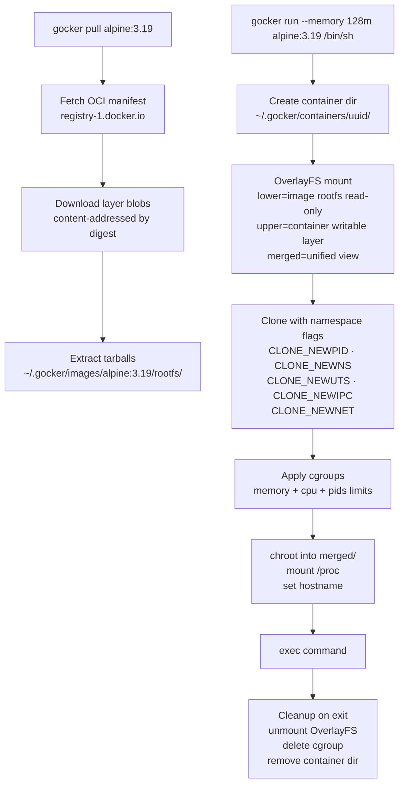

# gocker — Mini Container Runtime

A Go CLI tool that runs commands inside a fully isolated Linux environment — essentially a mini Docker built from scratch. Uses Linux namespaces, OverlayFS, cgroups, and chroot to replicate the core mechanics of container runtimes.

> **Linux only.** Requires root (`sudo`) for namespace creation, OverlayFS mounts, and cgroup management.

---

## How It Works



### OverlayFS Layer Model

```
~/.gocker/
├── images/
│   └── alpine:3.19/
│       └── rootfs/          ← read-only lower layer (image, never modified)
└── containers/
    └── <uuid>/
        ├── upper/           ← writable layer (all container writes land here)
        ├── work/            ← OverlayFS internal work dir
        └── merged/          ← unified view (chroot target)
```

Every container run gets a fresh `upper/` layer. The image `rootfs/` is never touched — exactly how Docker image layers work.

### cgroup Auto-Detection

```
/sys/fs/cgroup/cgroup.controllers exists?
  YES → cgroups v2 (unified hierarchy)  → /sys/fs/cgroup/gocker/<id>/
  NO  → cgroups v1 (separate controllers) → /sys/fs/cgroup/{memory,cpu,pids}/gocker/<id>/
```

---

## What Gets Isolated

| Mechanism | What it isolates |
|-----------|-----------------|
| `CLONE_NEWPID` | Process tree — container sees only its own PIDs, starting from PID 1 |
| `CLONE_NEWNS` | Mount namespace — container has its own filesystem view |
| `CLONE_NEWUTS` | Hostname and domain name |
| `CLONE_NEWIPC` | IPC resources (shared memory, semaphores) |
| `CLONE_NEWNET` | Network namespace — container has no network interfaces (isolated) |
| `chroot` | Root filesystem — container sees OverlayFS merged dir as `/` |
| cgroups | Resource limits — memory, CPU quota, max PIDs |

---

## Quick Start

### Prerequisites

- Linux (Ubuntu 22.04+, Fedora, Arch, or WSL2)
- Go 1.22+
- Root access (`sudo`)
- OverlayFS kernel module loaded (`modprobe overlay`)

### Build

```bash
make build
# or
go build -o gocker ./cmd/gocker
```

### Pull an image

```bash
sudo ./gocker pull alpine:3.19
```

### List cached images

```bash
sudo ./gocker images
```

### Run a command

```bash
# Interactive shell
sudo ./gocker run alpine:3.19 /bin/sh

# With resource limits
sudo ./gocker run --memory 128m --cpus 0.5 --pids-limit 20 alpine:3.19 /bin/sh

# Single command
sudo ./gocker run alpine:3.19 ps
sudo ./gocker run alpine:3.19 hostname
```

### Delete a cached image

```bash
sudo ./gocker rmi alpine:3.19
```

---

## CLI Reference

```
gocker [command] [flags]

Commands:
  pull   Pull an image from Docker Hub (e.g. alpine:3.19)
  images List locally cached images
  run    Run a command in an isolated container
  rmi    Delete a cached image

gocker run [flags] <image:tag> <command> [args...]

Flags:
  --memory      string   Memory limit (e.g. 128m, 1g)
  --cpus        float    CPU quota (e.g. 0.5 = 50% of one core)
  --pids-limit  int      Max number of processes inside the container
  --hostname    string   Container hostname (default: container UUID)
```

---

## Example Session

```bash
$ sudo ./gocker pull alpine:3.19
Pulling alpine:3.19...
Fetching manifest...
Downloading layer sha256:f18232174bc9... (3.4 MB)
Extracting layer...
Done. Image stored at ~/.gocker/images/alpine:3.19/

$ sudo ./gocker images
IMAGE           TAG     SIZE
alpine          3.19    7.4 MB

$ sudo ./gocker run --memory 64m --pids-limit 10 alpine:3.19 /bin/sh
/ # ps
PID   USER     TIME  COMMAND
    1 root      0:00 /bin/sh
    5 root      0:00 ps
/ # hostname
3f2a1b4c-gocker
/ # cat /proc/1/status | grep Pid
Pid:    1
/ # exit

$ # Image rootfs is untouched — writes went to the container's upper layer
```

---

## Project Structure

```
cmd/gocker/          — Cobra CLI (pull, images, run, rmi subcommands)
internal/
  image/             — OCI manifest fetch, layer download, image store
  overlay/           — OverlayFS mount/unmount via syscall.Mount
  namespace/         — Clone flags, /proc mount, hostname, child re-exec
  cgroup/            — v1/v2 auto-detect, memory/cpu/pids limit writers
  container/         — Orchestrates full run lifecycle
go.mod               — Independent module, Linux-only build
Makefile
docs/
  how-it-works.md    — Deep dive: namespaces, cgroups, OverlayFS internals
  scenarios.md       — Use cases and learning scenarios
```

---

## Development

```bash
make build   # compile
make test    # run unit tests (no root needed for unit tests)
make lint    # go vet
make tidy    # go mod tidy
```

> Integration tests (OverlayFS, namespace, cgroup) require Linux + root. Run with `sudo go test ./... -tags integration`.

---

## Known Limitations

- **Linux only** — macOS and Windows are not supported (no Linux kernel syscalls)
- **No networking** — containers are network-isolated but have no internet access (no veth/NAT wiring)
- **No image layers** — all image layers are merged into a single `rootfs/` on pull (no layer deduplication across images)
- **Root required** — namespace creation and OverlayFS mount require `CAP_SYS_ADMIN`
- **Alpine only tested** — other OCI images may work but are not validated

---

## Docs

- [How It Works — Deep Dive](./docs/how-it-works.md)
- [Design Decisions](./docs/design-decisions.md)
- [Use Cases & Scenarios](./docs/scenarios.md)
