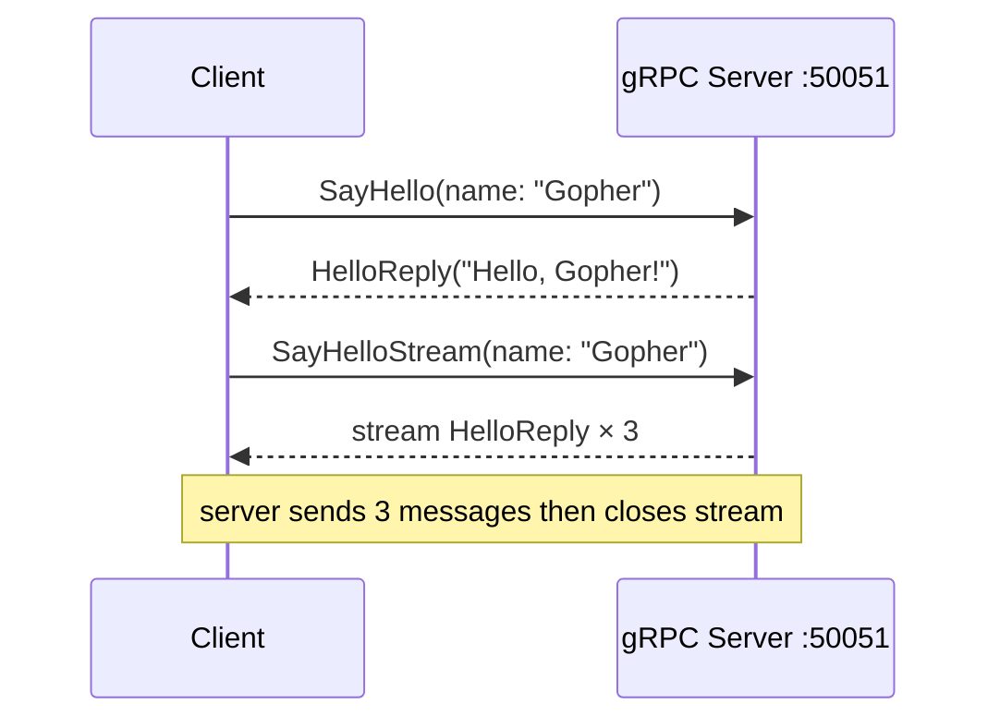
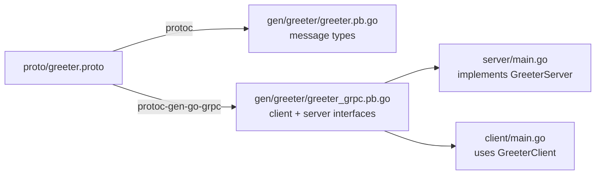

# gRPC Service

A minimal gRPC server and client in Go demonstrating unary and server-streaming RPCs.

---

## Architecture



## Proto → Code Flow



## Concepts

- **Protobuf** — language-neutral schema for services and messages (`proto/greeter.proto`)
- **Unary RPC** — single request → single response (like a regular function call over the network)
- **Server-Streaming RPC** — single request → stream of responses (useful for logs, events, progress)
- **Generated code** — `gen/greeter/` contains Go types and gRPC stubs generated from the proto

## How to Run

```shell
# Terminal 1 — start the server
go run ./server/

# Terminal 2 — run the client
go run ./client/
```

Expected output:
```
SayHello Response: Hello, Gopher! (from gRPC server)
Stream: Stream message 1: Hello, Gopher!
Stream: Stream message 2: Hello, Gopher!
Stream: Stream message 3: Hello, Gopher!
```

## Regenerating Proto Code

```shell
brew install protobuf
go install google.golang.org/protobuf/cmd/protoc-gen-go@latest
go install google.golang.org/grpc/cmd/protoc-gen-go-grpc@latest
protoc --go_out=gen --go-grpc_out=gen proto/greeter.proto
```

## Key Files

```
proto/greeter.proto              # Service definition (source of truth)
gen/greeter/greeter.pb.go        # Generated message types
gen/greeter/greeter_grpc.pb.go   # Generated gRPC client/server interfaces
server/main.go                   # gRPC server implementation
client/main.go                   # gRPC client
```
