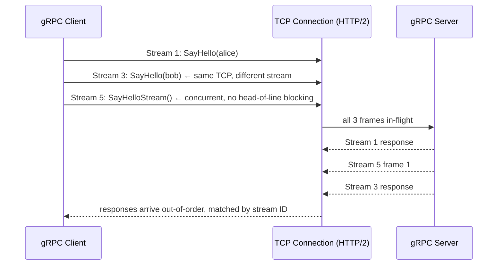
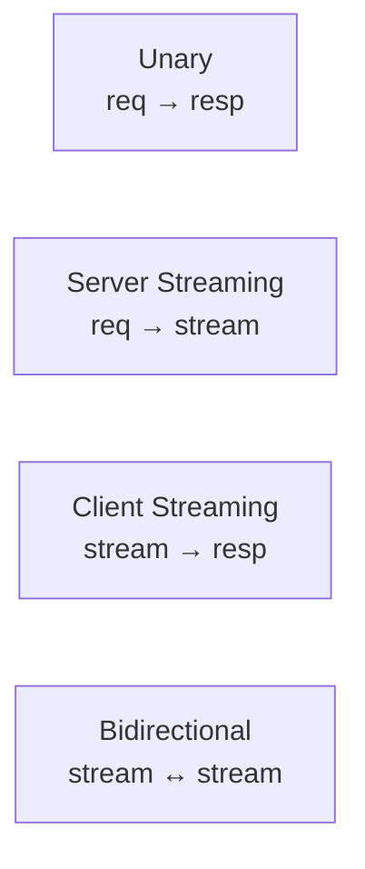
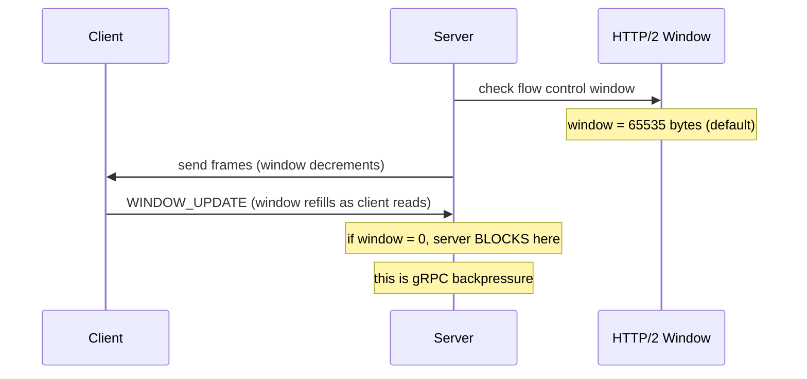

# grpc-service: Deep Dive

## Why gRPC over REST?

| Aspect | REST/JSON | gRPC/Protobuf |
|--------|-----------|---------------|
| Serialization | Text JSON | Binary Protobuf (~5–10× smaller) |
| Schema | Optional (OpenAPI) | Mandatory (.proto IDL) |
| Code generation | Manual / Swagger | `protoc` generates client + server |
| Streaming | Workarounds (SSE, WS) | First-class (4 modes) |
| Browser support | Native | Needs grpc-web proxy |
| Best for | Public APIs, external clients | Internal microservice-to-microservice |

---

## HTTP/2 Multiplexing — the Key Difference

HTTP/1.1 sends requests sequentially on a TCP connection. HTTP/2 multiplexes multiple streams over a single TCP connection:



**Head-of-line blocking eliminated:** HTTP/1.1 forces one request to complete before the next. HTTP/2 streams are independent — a slow response on stream 1 does not block stream 3.

---

## The Four gRPC Call Modes

```protobuf
service Greeter {
  // 1. Unary: single request → single response
  rpc SayHello(HelloRequest) returns (HelloReply);

  // 2. Server streaming: single request → stream of responses
  rpc SayHelloStream(HelloRequest) returns (stream HelloReply);

  // 3. Client streaming: stream of requests → single response
  rpc UploadData(stream DataChunk) returns (UploadSummary);

  // 4. Bidirectional streaming: stream ↔ stream
  rpc Chat(stream ChatMessage) returns (stream ChatMessage);
}
```



**This project implements modes 1 and 2.** Bidirectional streaming is used for real-time systems (gRPC-based chat, live telemetry).

---

## Protobuf Serialization Internals

Each field in a Protobuf message is encoded as a **tag-value pair**:

```
tag = (field_number << 3) | wire_type
```

| Wire type | Used for |
|-----------|---------|
| 0 | Varint (int32, int64, bool, enum) |
| 1 | 64-bit (double, fixed64) |
| 2 | Length-delimited (string, bytes, embedded messages) |
| 5 | 32-bit (float, fixed32) |

```
HelloRequest { name: "alice" }

Encoded bytes: 0x0a 0x05 0x61 0x6c 0x69 0x63 0x65
               ^^^^ ^^^^  a    l    i    c    e
               tag  len
               field 1 (name), wire type 2 (length-delimited), length 5
```

JSON encoding: `{"name":"alice"}` = 15 bytes
Protobuf:      7 bytes — **53% smaller**

Advantage grows with nested messages and repeated fields.

---

## Server-Streaming Backpressure



In Go:
```go
// Server streaming — the Send call blocks when the client is slow to read
func (s *server) SayHelloStream(req *pb.HelloRequest, stream pb.Greeter_SayHelloStreamServer) error {
    for i := 0; i < 10; i++ {
        // blocks if HTTP/2 flow control window is exhausted
        // this prevents unbounded memory growth on the server
        if err := stream.Send(&pb.HelloReply{Message: fmt.Sprintf("Hello %s #%d", req.Name, i)}); err != nil {
            return err // client disconnected or cancelled
        }
        time.Sleep(100 * time.Millisecond)
    }
    return nil
}

// Client — must read fast enough or the server will block
func clientStream(stream pb.Greeter_SayHelloStreamClient) {
    for {
        reply, err := stream.Recv()
        if err == io.EOF {
            break // stream done
        }
        if err != nil {
            break // error or cancellation
        }
        fmt.Println(reply.Message)
    }
}
```

---

## Connection Management and Pooling

```go
// gRPC connection is reused — do NOT create per-request
// Create once at startup, share across goroutines (it's safe)
conn, err := grpc.NewClient("localhost:50051",
    grpc.WithTransportCredentials(insecure.NewCredentials()),

    // Connection pool tuning
    grpc.WithKeepaliveParams(keepalive.ClientParameters{
        Time:                10 * time.Second, // send keepalive ping every 10s
        Timeout:             3 * time.Second,  // connection dead if no response in 3s
        PermitWithoutStream: true,             // ping even when no active RPCs
    }),
)

// One client, many concurrent RPCs
client := pb.NewGreeterClient(conn)
// Use client from multiple goroutines — HTTP/2 multiplexes them
```

**Why one connection?** HTTP/2 multiplexes thousands of concurrent RPCs over a single TCP connection. Creating a new connection per request defeats this entirely.

**When to pool:** Only if you need to scale beyond ~100 concurrent streams on one connection. `grpc.Dial` with `WithBalancerName("round_robin")` + multiple targets handles this.

---

## Interceptors — gRPC Middleware

```go
// Unary server interceptor (equivalent of HTTP middleware)
func loggingInterceptor(ctx context.Context, req any, info *grpc.UnaryServerInfo, handler grpc.UnaryHandler) (any, error) {
    start := time.Now()
    resp, err := handler(ctx, req)
    slog.Info("rpc",
        "method", info.FullMethod,
        "duration", time.Since(start),
        "error", err,
    )
    return resp, err
}

// Register interceptors
s := grpc.NewServer(
    grpc.UnaryInterceptor(loggingInterceptor),
    // chain multiple: use grpc.ChainUnaryInterceptor(a, b, c)
)
```

Standard interceptors available: `grpc-ecosystem/go-grpc-middleware` — logging, recovery, auth, rate limiting.

---

## Status Codes — Not HTTP Status

gRPC uses its own status codes, not HTTP:

| gRPC code | Meaning | HTTP equivalent |
|-----------|---------|----------------|
| `OK` | Success | 200 |
| `NOT_FOUND` | Resource missing | 404 |
| `INVALID_ARGUMENT` | Bad input | 400 |
| `UNAUTHENTICATED` | No credentials | 401 |
| `PERMISSION_DENIED` | Wrong credentials | 403 |
| `RESOURCE_EXHAUSTED` | Rate limited | 429 |
| `UNAVAILABLE` | Server down, retry | 503 |
| `DEADLINE_EXCEEDED` | Timeout | 504 |

```go
import "google.golang.org/grpc/codes"
import "google.golang.org/grpc/status"

// Return a typed error the client can check
return nil, status.Errorf(codes.NotFound, "user %s not found", req.UserId)

// Client-side: check the code
if st, ok := status.FromError(err); ok {
    switch st.Code() {
    case codes.NotFound:
        // handle not found
    case codes.Unavailable:
        // retry with backoff
    }
}
```
