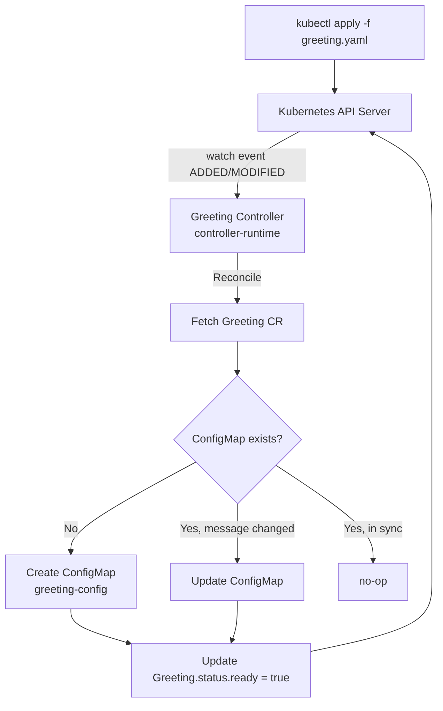
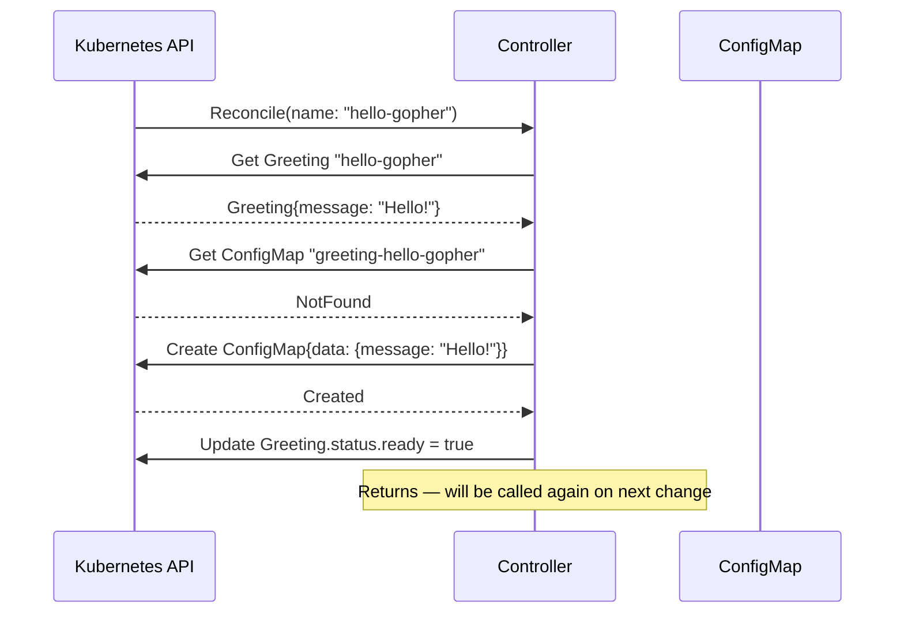

# Kubernetes Controller (Greeting Operator)

A minimal Kubernetes operator built with `controller-runtime`. It watches a custom `Greeting` resource and creates a ConfigMap containing the greeting message.

---

## Architecture



## Reconciliation Loop



## Concepts

- **CRD** — extends the Kubernetes API with your own resource types (`config/crd/greeting.yaml`)
- **Custom Resource** — an instance of your CRD (`config/samples/greeting_sample.yaml`)
- **Reconciliation Loop** — called on every create/update/delete; must be idempotent
- **OwnerReference** — links the ConfigMap to the Greeting so K8s auto-deletes it when the Greeting is deleted

## Prerequisites

```shell
brew install kind
kind create cluster --name tour-of-go
```

## How to Run

```shell
kubectl apply -f config/crd/
make run
kubectl apply -f config/samples/
kubectl get greetings
kubectl get configmaps | grep greeting
```

## Key Files

```
api/v1/greeting_types.go                    # CRD Go types (Spec, Status)
internal/controller/greeting_controller.go  # The reconciliation loop
config/crd/greeting.yaml                    # CRD YAML manifest
config/samples/greeting_sample.yaml         # Sample CR to apply
```
