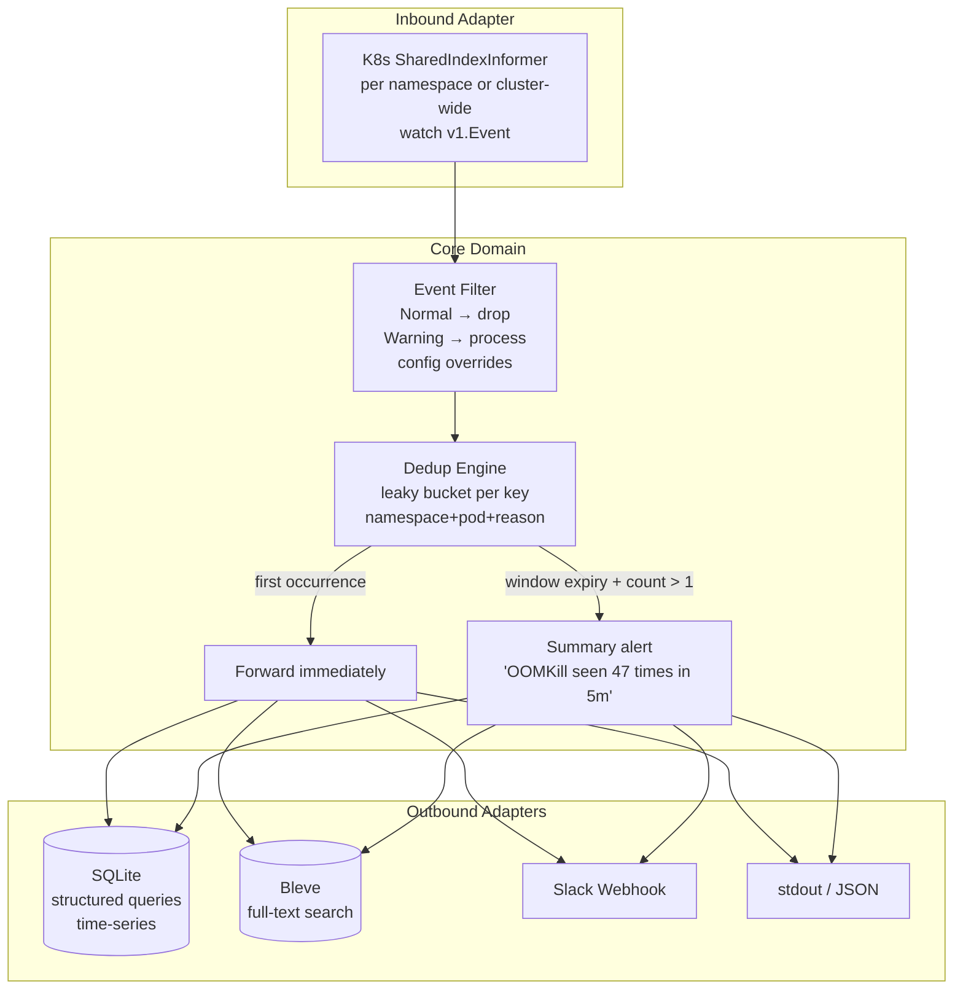
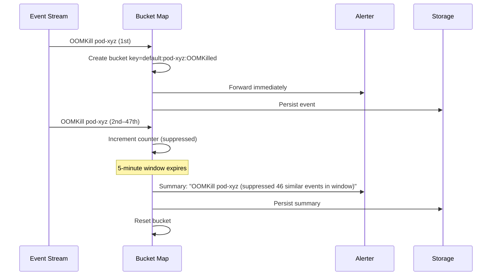
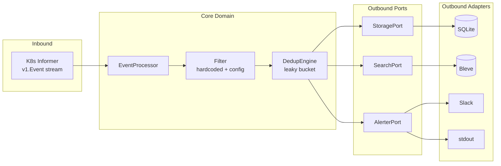

# k8s-event-sink

A Kubernetes daemon that vacuums cluster events before etcd deletes them (default: 1 hour TTL). Streams events in real-time via informers, deduplicates them with a leaky bucket algorithm, classifies severity, persists to SQLite + Bleve for long-term storage and search, and alerts on critical events via Slack.

Single binary. Zero external dependencies. Mount a PersistentVolume and deploy.

---

## Architecture



---

## Leaky Bucket Deduplication



---

## Hexagonal Architecture



---

## Event Classification

| Type | Reason | Default Action |
|------|--------|---------------|
| Normal | Scheduled, Pulling, Pulled, Created, Started | **Drop** |
| Warning | OOMKilled, CrashLoopBackOff, NodeNotReady, Evicted | **Critical** |
| Warning | Unhealthy, FailedMount, NetworkNotReady | **Warning** |
| Warning | Any unknown reason | **Warning** |

Override any reason in `config.yaml`:
```yaml
severity:
  Unhealthy: ignore   # suppress noisy health checks
  BackOff: critical   # escalate back-off to critical
ignore_reasons:
  - Pulling
```

---

## Quick Start

```bash
make build

# Run locally (uses ~/.kube/config)
./event-sink --config config.example.yaml

# Query events
curl "localhost:9090/events?severity=critical"
curl "localhost:9090/search?q=connection+refused"
curl "localhost:9090/metrics" | grep k8s_events
```

---

## Kubernetes Deployment

```yaml
apiVersion: apps/v1
kind: Deployment
metadata:
  name: event-sink
spec:
  replicas: 1
  template:
    spec:
      serviceAccountName: event-sink
      containers:
        - name: event-sink
          image: event-sink:latest
          args: ["--config", "/etc/event-sink/config.yaml"]
          volumeMounts:
            - name: config
              mountPath: /etc/event-sink
            - name: data
              mountPath: /data
      volumes:
        - name: config
          configMap:
            name: event-sink-config
        - name: data
          persistentVolumeClaim:
            claimName: event-sink-data
---
apiVersion: v1
kind: ServiceAccount
metadata:
  name: event-sink
---
apiVersion: rbac.authorization.k8s.io/v1
kind: ClusterRole
metadata:
  name: event-sink
rules:
  - apiGroups: [""]
    resources: ["events"]
    verbs: ["get", "list", "watch"]
---
apiVersion: rbac.authorization.k8s.io/v1
kind: ClusterRoleBinding
metadata:
  name: event-sink
roleRef:
  apiGroup: rbac.authorization.k8s.io
  kind: ClusterRole
  name: event-sink
subjects:
  - kind: ServiceAccount
    name: event-sink
    namespace: default
```

---

## HTTP API

| Endpoint | Description |
|----------|-------------|
| `GET /events?namespace=X&severity=critical` | Query events from SQLite |
| `GET /search?q=connection+refused` | Full-text search via Bleve |
| `GET /metrics` | Prometheus metrics |

---

## Project Structure

```
cmd/event-sink/main.go       — Cobra CLI, wires all components
internal/
  core/
    ports.go                 — StoragePort, SearchPort, AlerterPort interfaces
    filter.go                — Event classification (hardcoded + config)
    dedup.go                 — Leaky bucket deduplication engine
    processor.go             — EventProcessor: filter → dedup → storage + alert
    multi_alerter.go         — Fan-out to multiple alerters
  adapters/
    informer/watcher.go      — K8s SharedIndexInformer (inbound)
    sqlite/store.go          — SQLite storage (modernc.org/sqlite, no CGo)
    bleve/index.go           — Bleve full-text search
    slack/alerter.go         — Slack webhook alerter
    stdout/alerter.go        — stdout JSON alerter
  config/config.go           — YAML config loader
  metrics/metrics.go         — Prometheus counters
go.mod                       — Independent module, no CGo
```

---

## Development

```bash
make test    # 22 tests, all pass
make lint    # go vet
make build   # compile
```

---

## Docs

- [Scenarios](./docs/scenarios.md)
- [Design Decisions](./docs/design-decisions.md)
