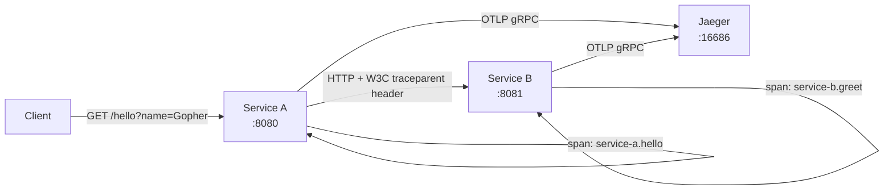
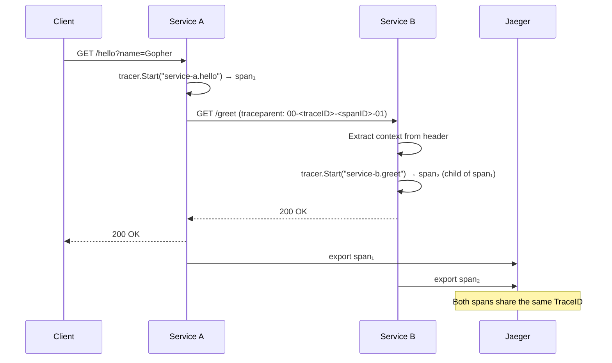

# OpenTelemetry Distributed Tracing

Two HTTP services instrumented with OpenTelemetry. A request to `service-a` triggers a call to `service-b`, and both emit spans with the **same trace ID** — showing how a single request is tracked across service boundaries.

---

## Architecture



## Trace Propagation



## Concepts

- **Span** — a single unit of work with start time, end time, and attributes
- **Trace** — a tree of spans sharing one Trace ID — the full journey of a request
- **Context Propagation** — Trace ID travels via `traceparent` HTTP header (W3C standard)
- **Exporter** — where spans are sent; this demo uses stdout or Jaeger via OTLP

## How to Run

```shell
# stdout mode (no Docker needed)
go run ./service-b/ &
go run ./service-a/ &
curl "http://localhost:8080/hello?name=Gopher"
# Watch both terminals for matching TraceID values

# With Jaeger UI
docker-compose up -d jaeger
# Open http://localhost:16686
```

## Key Code Patterns

```go
// Start a span
ctx, span := tracer.Start(r.Context(), "service-a.hello")
defer span.End()

// Inject trace context into outgoing HTTP (service-a → service-b)
otel.GetTextMapPropagator().Inject(ctx, propagation.HeaderCarrier(req.Header))

// Extract trace context from incoming HTTP (service-b)
ctx := otel.GetTextMapPropagator().Extract(r.Context(), propagation.HeaderCarrier(r.Header))
```
