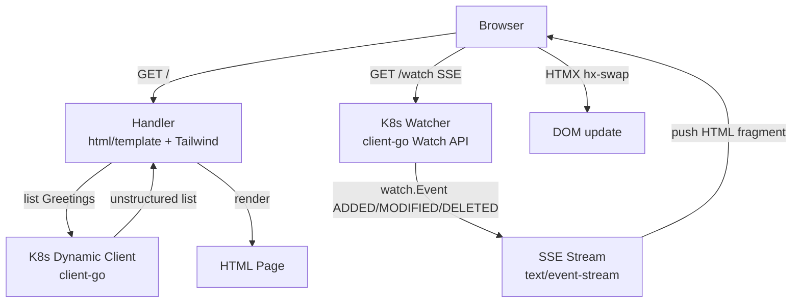
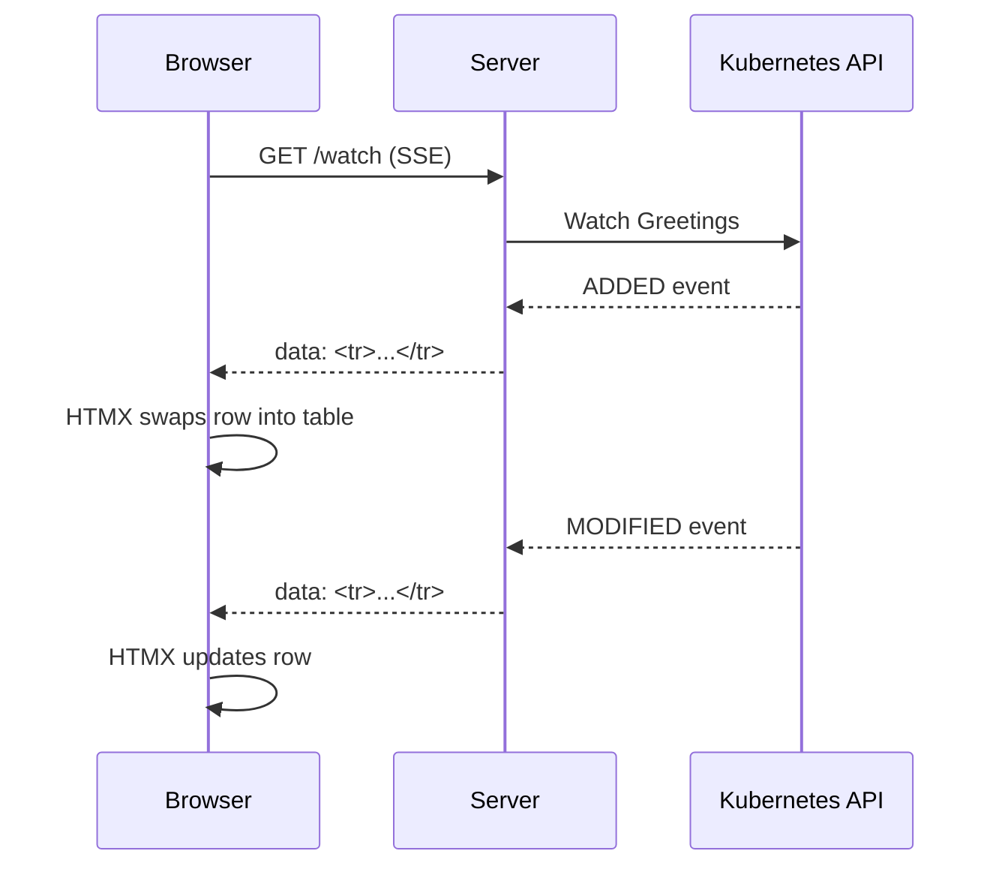

# platform-console

A web console for browsing Kubernetes `Greeting` custom resources. Lists CRs via the dynamic client and streams live updates to the browser via Server-Sent Events.

---

## Architecture



## SSE + HTMX Flow



## Key Concepts

- **Dynamic client** — uses `client-go`'s dynamic client to list/watch any CRD without generated types. Returns `unstructured.Unstructured`.
- **Server-Sent Events** — one-way push from server to browser. Simpler than WebSocket for read-only live updates.
- **HTMX** — browser receives HTML fragments over SSE and swaps them into the DOM. No JavaScript written.
- **html/template** — renders both the full page and the SSE fragment updates from the same template.

## Quick Start

```bash
# Requires a running K8s cluster with the Greeting CRD installed
# See projects/k8s-controller for CRD setup
make run
# Open http://localhost:8080
```
