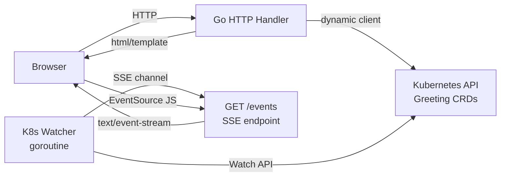

# Platform Console: Deep Dive

A K8s Greeting resource browser connecting to the k8s-controller project via client-go.

## Architecture



## Key Patterns

### Server-Sent Events (SSE)
SSE is simpler than WebSocket for server→client push:
```go
w.Header().Set("Content-Type", "text/event-stream")
fmt.Fprintf(w, "data: %s\n\n", jsonData)
flusher.Flush()
```
The browser uses `new EventSource("/events")` — no library needed.

### Dynamic Client for CRDs
We use `k8s.io/client-go/dynamic` instead of a typed client because Greeting is a custom resource:
```go
dynamic.Resource(GreetingGVR).Namespace(ns).List(ctx, metav1.ListOptions{})
```

### Live Updates
When the K8s watcher detects a Greeting change, it sends an SSE event. The browser reloads the page to show the updated list.

## How to Run

```shell
# Ensure k8s-controller CRD is installed
cd ../k8s-controller && kubectl apply -f config/crd/

# Run the console
make run
# Open http://localhost:3001
```
