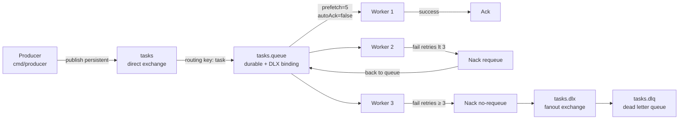
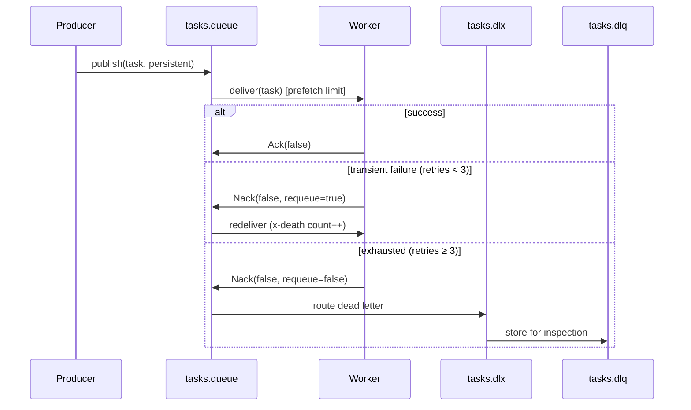

# rabbitmq-worker

A task worker system demonstrating **RabbitMQ** (AMQP) with durable exchanges, dead letter exchanges (DLX), QoS prefetch, manual acknowledgement, and graceful shutdown.

---

## Architecture



## Message Lifecycle



## Key Concepts

- **Durable exchange + queue** — survive broker restart; messages with `DeliveryMode: Persistent` survive too
- **Dead Letter Exchange (DLX)** — messages that exhaust retries are routed to `tasks.dlx` → `tasks.dlq` for inspection
- **QoS Prefetch** — `channel.Qos(5, 0, false)` limits unacked messages per consumer, providing backpressure
- **Manual ack** — `Ack(false)` on success, `Nack(false, requeue)` on failure — no message lost on crash
- **Graceful shutdown** — SIGTERM → stop consuming → drain in-flight → close connection

## Quick Start

```bash
# Start RabbitMQ
make docker-up

# Start consumer (in one terminal)
make run-consumer

# Publish 10 tasks (in another terminal)
make run-producer

# Inspect queues at http://localhost:15672 (guest/guest)
# tasks.queue — active messages
# tasks.dlq   — failed messages after 3 retries
```

## Docs

- [`docs/deep-dive.md`](./docs/deep-dive.md)
- [`docs/adr/001-rabbitmq-over-sqs.md`](./docs/adr/001-rabbitmq-over-sqs.md)
