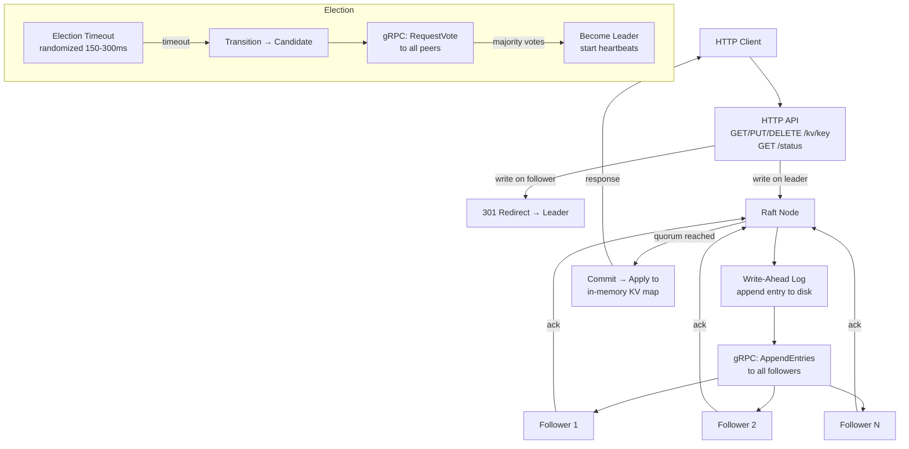

# raft-kv-store

A distributed key-value store built from scratch using the Raft consensus algorithm in Go. Implements leader election, log replication, write-ahead log durability, gRPC inter-node transport, and an HTTP REST API for clients.

> Focus is on correctness of the core Raft mechanics, not performance optimization.

---

## Architecture



## Raft State Machine

```
                    timeout                    wins election
  ┌──────────┐  ──────────►  ┌───────────┐  ──────────────►  ┌──────────┐
  │ Follower │               │ Candidate │                   │  Leader  │
  └──────────┘  ◄──────────  └───────────┘  ◄──────────────  └──────────┘
                discovers                    discovers
                leader/                      higher term
                higher term
```

---

## Key Properties

- **Leader election** — randomized timeouts (150–300ms) prevent split votes
- **Log replication** — leader appends to WAL, replicates to followers, commits on quorum
- **Durability** — write-ahead log survives process restarts; state recovered on startup
- **Follower redirect** — writes to followers return HTTP 307 with the leader's address
- **Configurable cluster** — any odd number of nodes via YAML config

---

## Quick Start

### Build

```bash
make build
# or: go build -o raft-kv ./cmd/raft-kv
```

### Configure a 3-node cluster

Create three config files (see `config.example.yaml`):

```bash
cp config.example.yaml config-node1.yaml  # node_id: node1, grpc :9001, http :8001
cp config.example.yaml config-node2.yaml  # node_id: node2, grpc :9002, http :8002
cp config.example.yaml config-node3.yaml  # node_id: node3, grpc :9003, http :8003
```

### Start the cluster

```bash
make run-cluster
# or manually:
./raft-kv start --config config-node1.yaml &
./raft-kv start --config config-node2.yaml &
./raft-kv start --config config-node3.yaml &
```

### Use the KV API

```bash
# Write (to leader — node1 in this example)
curl -X PUT localhost:8001/kv/foo -d 'bar'

# Read from any node
curl localhost:8001/kv/foo   # → bar
curl localhost:8002/kv/foo   # → bar (reads local state after commit)

# Write to a follower — gets redirected to leader
curl -L -X PUT localhost:8002/kv/hello -d 'world'

# Delete
curl -X DELETE localhost:8001/kv/foo

# Cluster status
curl localhost:8001/status
# {"commit_index":3,"leader_id":"node1","node_id":"node1","role":"Leader","term":1}
```

---

## HTTP API Reference

| Method | Path | Description |
|--------|------|-------------|
| `GET` | `/kv/{key}` | Read value (any node) |
| `PUT` | `/kv/{key}` | Write value (leader only; followers redirect) |
| `DELETE` | `/kv/{key}` | Delete key (leader only; followers redirect) |
| `GET` | `/status` | Node role, term, leader ID, commit index |

**Follower write response:**
```
HTTP/1.1 307 Temporary Redirect
Location: http://localhost:8001/kv/foo
```

---

## Configuration

```yaml
node_id: node1
grpc_addr: ":9001"          # inter-node gRPC
http_addr: ":8001"          # client-facing HTTP
wal_dir: /tmp/raft-node1    # write-ahead log directory

election_timeout_min_ms: 150
election_timeout_max_ms: 300
heartbeat_ms: 50

peers:
  - id: node2
    grpc_addr: ":9002"
    http_addr: ":8002"
  - id: node3
    grpc_addr: ":9003"
    http_addr: ":8003"
```

---

## Directory Layout

```
projects/raft-kv-store/
├── cmd/raft-kv/main.go         # Cobra CLI: start node
├── internal/
│   ├── config/                 # YAML loader (peers, ports, WAL path)
│   ├── raft/                   # Core Raft: state, election, log replication
│   ├── wal/                    # Write-ahead log (append-only file)
│   ├── transport/              # gRPC server + client (AppendEntries, RequestVote)
│   ├── kv/                     # In-memory KV state machine
│   └── api/                    # HTTP REST API
├── proto/
│   └── raft.proto              # Protobuf definitions
├── docs/
│   ├── usage.md
│   ├── scenarios.md
│   └── design-decisions.md
├── config.example.yaml
├── go.mod
└── Makefile
```

---

## Development

```bash
make test    # 19 tests, all pass
make lint    # go vet
make proto   # regenerate protobuf (requires protoc)
make build   # compile
```

---

## Docs

- [Usage Guide](./docs/usage.md)
- [Scenarios](./docs/scenarios.md)
- [Design Decisions](./docs/design-decisions.md)
