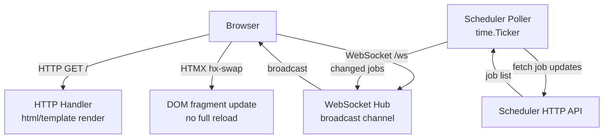
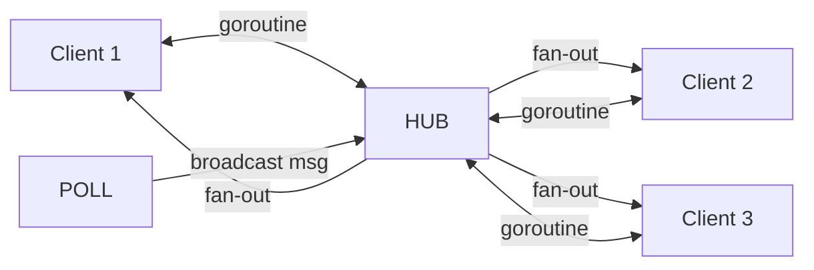

# realtime-dashboard

A live ops dashboard for the distributed scheduler. Job state changes are pushed to the browser in real time via WebSocket — no polling, no React, no build step.

---

## Architecture



## WebSocket Hub



The hub maintains a `map[*Client]bool` protected by a `sync.Mutex`. Each connected browser gets a goroutine that reads from a per-client channel and writes to the WebSocket.

## Key Concepts

- **WebSocket Hub** — central broadcaster. Poller sends one message; hub fans it out to all connected clients.
- **HTMX** — browser swaps only the changed table rows, not the full page. Zero JavaScript written.
- **html/template** — server-rendered HTML fragments. The same template renders both the initial page and WebSocket push updates.
- **time.Ticker** — poller runs every 2s, diffs against previous state, only broadcasts actual changes.

## Quick Start

```bash
# Requires the distributed-scheduler to be running
make run
# Open http://localhost:3000
```
