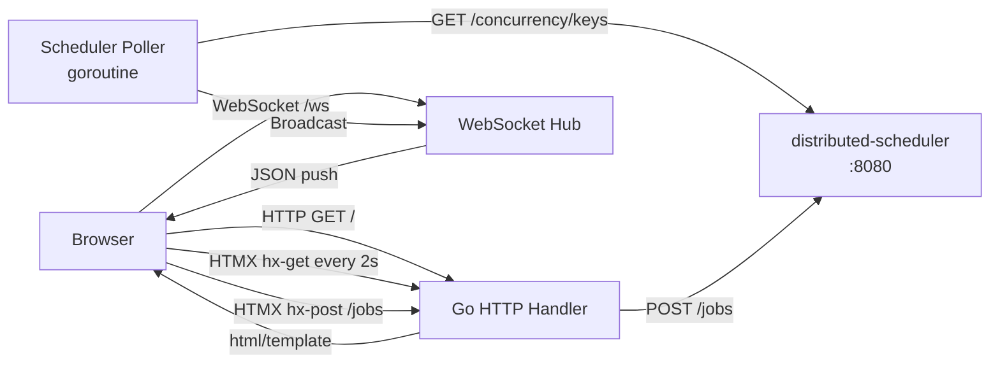

# Realtime Dashboard: Deep Dive

A live ops dashboard for the distributed-scheduler, built with Go's `html/template`, HTMX, and WebSocket.

## Architecture



## Key Patterns

### HTMX Polling (job table refresh)
```html
<div hx-get="/partials/concurrency"
     hx-trigger="every 2s, refresh from:body"
     hx-swap="innerHTML">
```
HTMX sends a GET request every 2 seconds and swaps the response HTML into the div. No JavaScript needed.

### WebSocket Hub (instant concurrency updates)
The hub goroutine owns the client set. Per-client write goroutines prevent slow clients from blocking the broadcaster:
```
Poller goroutine → hub.broadcast channel → Hub goroutine → per-client send channel → writePump goroutine → WebSocket
```

### Server-Side Rendering
Go renders complete HTML fragments. The browser never manages state — the server is the source of truth.

## How to Run

```shell
# Start the distributed-scheduler first
cd ../distributed-scheduler && make docker-up && make run

# Then start the dashboard
make run
# Open http://localhost:3000
```
