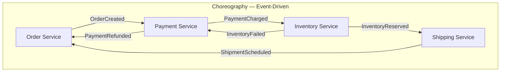
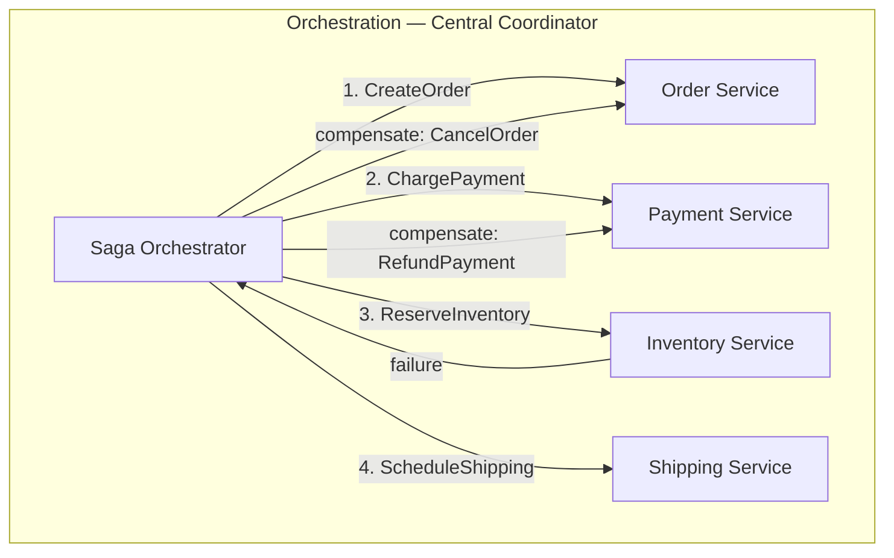
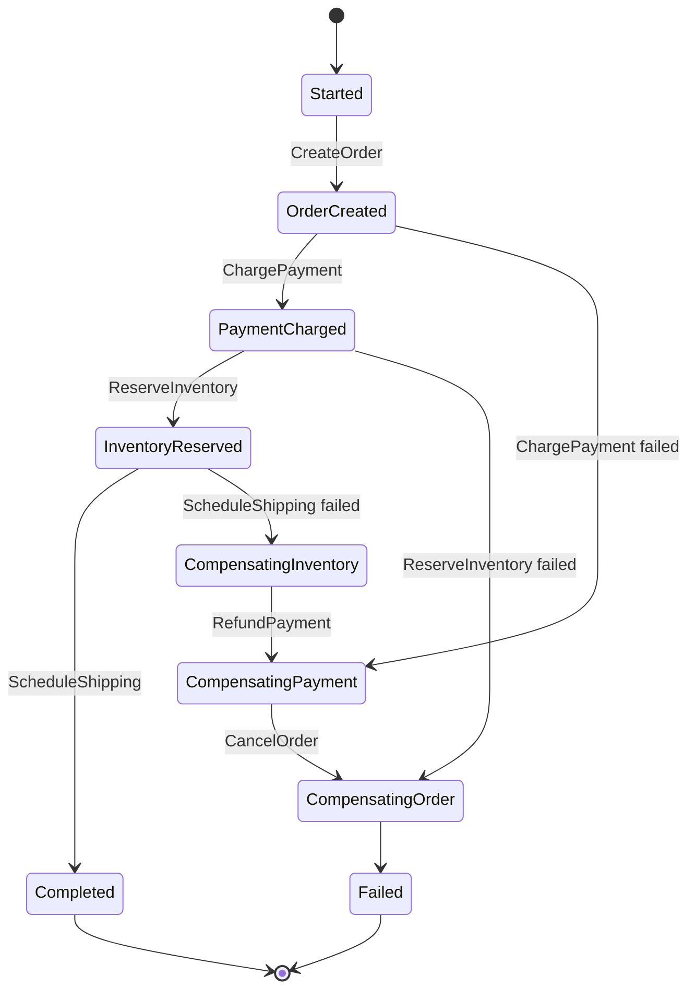
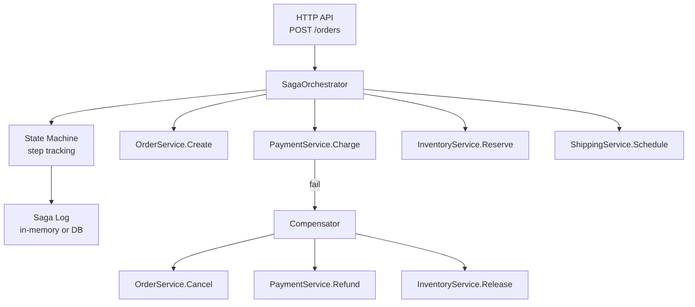

# Saga Orchestrator

Distributed transactions across multiple services using the Saga pattern — both choreography and orchestration approaches implemented in Go.

## Docs

- [`docs/deep-dive.md`](./docs/deep-dive.md) — choreography vs orchestration trade-off, saga log durability, idempotent compensations, forward vs backward recovery, 2PC comparison

---

## Why Sagas?

In a monolith, a single DB transaction guarantees ACID. In microservices, each service owns its database — you can't use distributed transactions (2PC is slow and fragile). Sagas break a transaction into local transactions with compensating actions.

---

## Choreography vs Orchestration





| Aspect | Choreography | Orchestration |
|--------|-------------|---------------|
| Coupling | Loose (events) | Central coordinator |
| Visibility | Hard to trace | Clear flow in one place |
| Complexity | Grows with services | Grows with steps |
| Best for | Simple flows (2-3 steps) | Complex flows (4+ steps) |

---

## Saga State Machine



---

## Architecture



---

## Running

```bash
make run
# POST http://localhost:8080/orders with JSON body
# Watch saga execution and compensation in logs
```

## Key Concepts

- **Saga Step**: A local transaction + its compensating action
- **Compensating Transaction**: Undo a committed step (not rollback — semantic undo)
- **Saga Log**: Persists saga state for crash recovery
- **Idempotency**: Each step must be idempotent (safe to retry)
