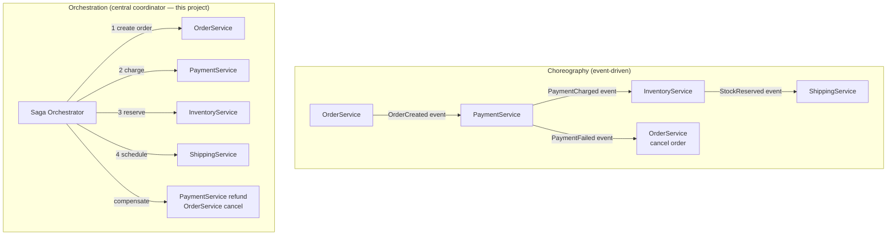
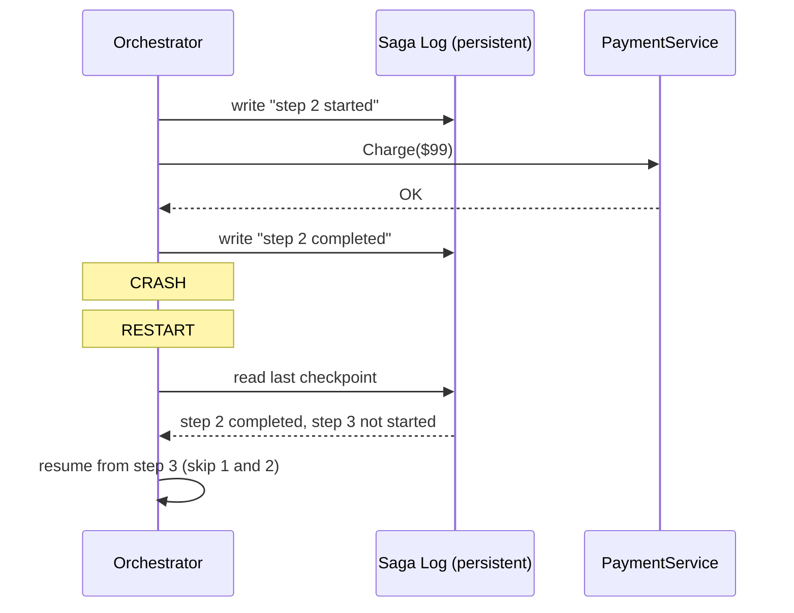

# saga-orchestrator: Deep Dive

## The Problem: Distributed Transactions

ACID transactions work within a single database. Across services, you can't hold a lock across an HTTP call. The Saga pattern breaks a distributed transaction into a sequence of local transactions, each with a compensating action for rollback.

---

## Choreography vs Orchestration



| | Choreography | Orchestration |
|--|-------------|---------------|
| Coupling | Services know about each other (via events) | Services only talk to orchestrator |
| Visibility | Hard to see full flow (scattered across services) | Full flow visible in one place |
| Complexity | Simple per-service, complex overall | Complex orchestrator, simple services |
| Failure handling | Each service handles its own compensation | Orchestrator drives all compensation |
| Best for | Simple flows, high team autonomy | Complex flows, clear ownership |

---

## The Critical Problem: Orchestrator Crashes Mid-Saga

What if the orchestrator crashes after step 2 (payment charged) but before step 3 (inventory reserved)?

**Without a saga log:** restart → retry from step 1 → charge the customer twice.

**With a saga log:**



The saga log is append-only. On recovery, replay from the last completed step.

---

## Compensating Transactions Must Be Idempotent

Compensation may be retried multiple times (orchestrator crashes during compensation). The compensating action must produce the same result regardless of how many times it runs.

```go
// BAD: not idempotent — creates a new refund each time
func (p *PaymentService) Refund(amount float64) error {
    return db.Exec("INSERT INTO refunds VALUES (?)", amount)
}

// GOOD: idempotent — checks before inserting
func (p *PaymentService) Refund(sagaID, amount float64) error {
    _, err := db.Exec(`
        INSERT INTO refunds (saga_id, amount)
        VALUES (?, ?)
        ON CONFLICT (saga_id) DO NOTHING
    `, sagaID, amount)
    return err
}
```

**The sagaID is the idempotency key** for every step and compensation.

---

## Forward vs Backward Recovery

```mermaid
flowchart LR
    S1["Step 1\nOrder created"] --> S2
    S2["Step 2\nPayment charged"] --> S3
    S3["Step 3 FAILS\nInventory"] --> DECISION{Recovery\nstrategy}
    DECISION -->|Backward\n(this project)| BACK["Compensate S2\nCompensate S1\nSaga: Aborted"]
    DECISION -->|Forward\nretry| RETRY["Retry S3\nuntil success or max retries\nSaga: Completed"]
```

**Backward recovery (compensating transactions):** undo the work done so far. Used when the failure is non-transient (out of stock — retrying won't help).

**Forward recovery (retry):** keep trying the failed step. Used when the failure is transient (network timeout — will likely succeed on retry).

This project implements backward recovery. Forward recovery is appropriate when:
- All steps are idempotent
- The failure is expected to be temporary
- You don't want to undo already-done work (e.g., a sent email can't be unsent)

---

## The Data Bag Pattern

Steps share data by reading/writing a `map[string]any`. This avoids coupling steps to each other's types:

```go
type SagaContext map[string]any

func OrderStep(ctx context.Context, data SagaContext) error {
    orderID := uuid.New().String()
    data["order_id"] = orderID  // downstream steps can read this
    return nil
}

func PaymentStep(ctx context.Context, data SagaContext) error {
    orderID := data["order_id"].(string)  // read from upstream step
    return chargeCard(orderID)
}

// Compensation also reads from the bag
func PaymentCompensate(ctx context.Context, data SagaContext) error {
    orderID := data["order_id"].(string)
    return refundCard(orderID)  // uses same order_id for idempotency
}
```

**Risk:** type assertions at runtime. In production, prefer typed structs or serialize to/from JSON at each step boundary.

---

## Saga vs 2PC (Two-Phase Commit)

| | 2PC | Saga |
|--|-----|------|
| Consistency | Strong (all or nothing) | Eventual (visible intermediate states) |
| Availability | Low (all participants must be up) | High (participants can be independent) |
| Blocking | Yes (locks held across network) | No (local transactions only) |
| Complexity | Lock manager, recovery protocol | Compensating transactions |
| Best for | Databases on same network | Distributed microservices |

**Why 2PC fails at scale:** The coordinator holds locks on all participants during phase 1. A slow participant (network jitter, GC pause) blocks everyone. At 100 services, one slow service blocks 99 others.

---

## Production Additions This Project Doesn't Have

| Feature | What it solves |
|---------|----------------|
| Persistent saga log (DB) | Survives orchestrator crash mid-saga |
| Retry with exponential backoff on each step | Handles transient failures before compensating |
| Timeout per step | Prevents saga from hanging on an unresponsive service |
| Dead-letter / alert on saga stuck > N minutes | Ops visibility |
| Saga status API | "What happened to order abc-123?" |
