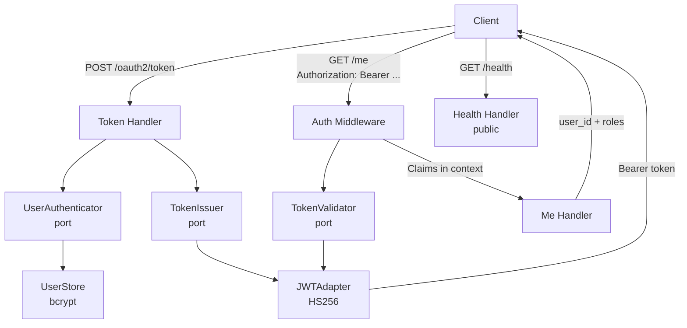
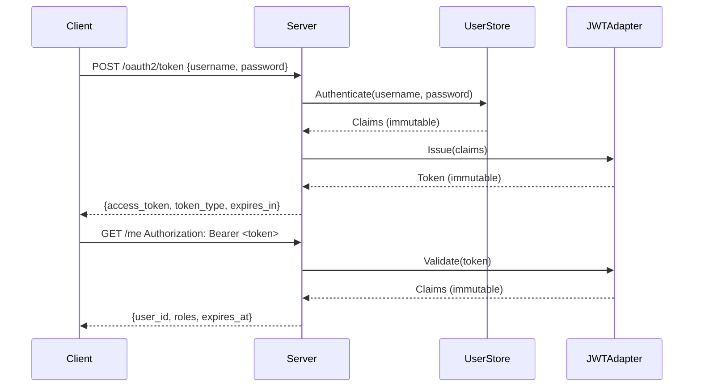

# secure-api

An HTTP API demonstrating **Security** (JWT, OAuth2 password grant, mTLS), **SOLID design principles**, **Test-Driven Development**, and **Immutable value objects** — all in idiomatic Go.

---

## Architecture



## Request Flow



## Key Concepts

### SOLID Principles — mapped to code

| Principle | Where |
|---|---|
| **S**ingle Responsibility | Each package has one concern: `auth` authenticates, `handler` handles HTTP, `middleware` intercepts |
| **O**pen/Closed | Middleware chain is `[]func(http.Handler) http.Handler` — add new middleware without touching existing code |
| **L**iskov Substitution | `JWTAdapter` satisfies both `TokenIssuer` and `TokenValidator` interfaces transparently |
| **I**nterface Segregation | Each port interface has exactly one method — callers depend only on what they use |
| **D**ependency Inversion | `handler.Token` depends on `ports.UserAuthenticator` and `ports.TokenIssuer`, not on concrete types |

### TDD Approach
Every component was written test-first:
1. Write a failing test that describes the desired behaviour
2. Write the minimal code to make it pass
3. Refactor

Table-driven tests cover all edge cases: expired tokens, wrong signatures, bad credentials, missing headers.

### Immutability
`Claims` and `Token` are immutable value objects — no setters, all fields set at construction, `Roles()` returns a copy to prevent external mutation.

### Security
- **JWT**: HMAC-SHA256 signed tokens, configurable secret and expiry
- **OAuth2**: Resource Owner Password Grant — validates bcrypt-hashed credentials, returns JWT
- **mTLS**: Optional mutual TLS for service-to-service — server requires client cert signed by trusted CA

## Quick Start

```bash
# Run without mTLS (JWT + OAuth2 only)
make run

# Get a token
curl -s -X POST http://localhost:8080/oauth2/token \
  -H 'Content-Type: application/json' \
  -d '{"username":"admin","password":"secret"}' | jq .

# Call a protected endpoint
curl -s http://localhost:8080/me \
  -H 'Authorization: Bearer <access_token>' | jq .

# Health check (public)
curl http://localhost:8080/health

# Generate certs and run with mTLS
make certs
TLS_CERT=certs/server.crt TLS_KEY=certs/server.key TLS_CA=certs/ca.crt make run
```

## Docs

- [`docs/deep-dive.md`](./docs/deep-dive.md)
- [`docs/adr/001-mtls-over-api-keys.md`](./docs/adr/001-mtls-over-api-keys.md)
- [`docs/adr/002-jwt-over-session.md`](./docs/adr/002-jwt-over-session.md)
