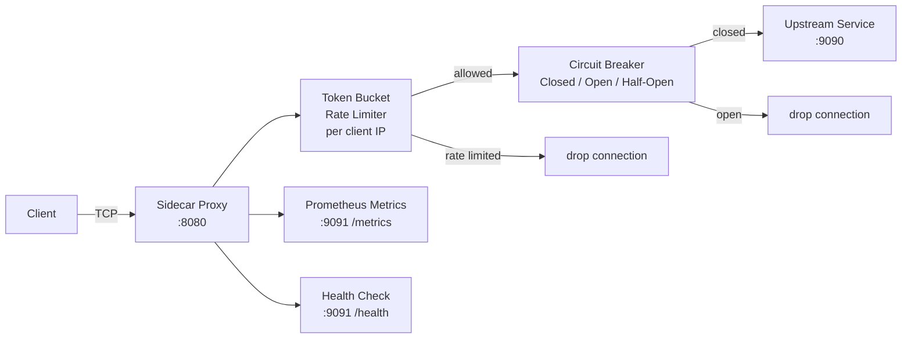
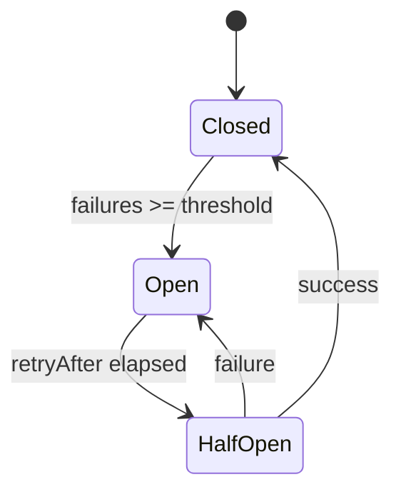

# service-mesh-sidecar

A TCP reverse proxy sidecar with token bucket rate limiting, a 3-state circuit breaker, Prometheus metrics, and health checks — demonstrating how service mesh proxies (Envoy, Linkerd) work under the hood.

---

## Architecture



## Circuit Breaker States



## Key Concepts

- **Token Bucket** — per-IP rate limiting. Each IP gets a bucket refilled at a fixed rate. Requests that exceed the bucket are dropped.
- **Circuit Breaker** — protects the upstream from cascading failures. Opens after N failures, probes with one request after a cooldown.
- **Bidirectional proxy** — `io.Copy` in two goroutines. On Linux, uses `splice(2)` for zero-copy kernel-level transfer.
- **Goroutine-per-connection** — cheap in Go (2KB stack). Each accepted TCP connection gets its own goroutine.

## Quick Start

```bash
make run
# Proxy listens on :8080, metrics on :9091
curl http://localhost:9091/health
curl http://localhost:9091/metrics
```

## Docs

- [`docs/deep-dive.md`](./docs/deep-dive.md)
