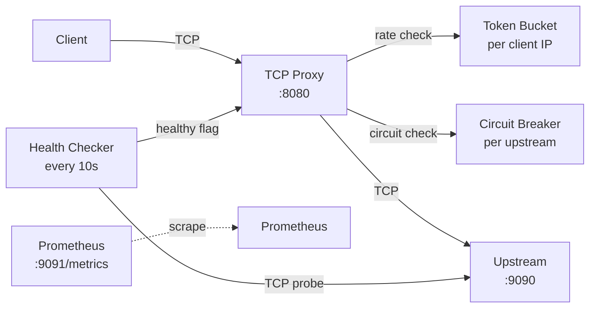
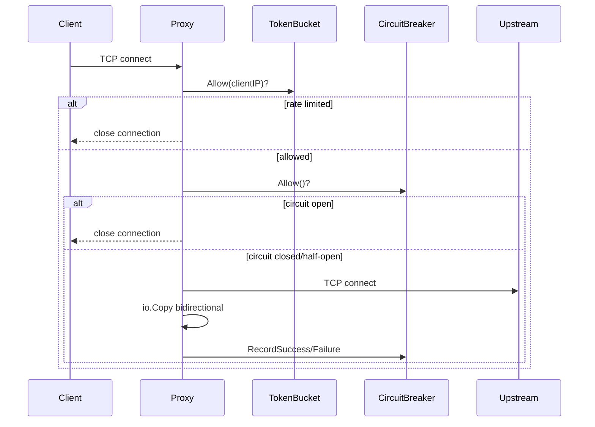

# Service Mesh Sidecar: Deep Dive

A TCP proxy sidecar with rate limiting, circuit breaking, health checks, and Prometheus metrics.

---

## Architecture

---

## Connection Flow

---

## Key Design Decisions

### io.Copy for Proxying (ADR-001)
`io.Copy` uses `splice(2)` on Linux — data moves directly between file descriptors in the kernel without copying to userspace. This is zero-copy proxying.

### Goroutine-per-Connection (ADR-002)
Go goroutines start at ~2KB stack (vs 1MB for OS threads). A Go process can handle 100,000+ concurrent connections with goroutine-per-connection. The M:N scheduler parks goroutines waiting on I/O without blocking OS threads.

### Token Bucket Rate Limiting (ADR-003)
Token bucket allows bursting (up to `burst` tokens) while maintaining a steady long-term rate. This is more user-friendly than a fixed window counter which can cause thundering herd at window boundaries.

---

## Metrics

| Metric | Type | Description |
|---|---|---|
| `sidecar_connections_total` | Counter | Total TCP connections accepted |
| `sidecar_connections_active` | Gauge | Currently active connections |
| `sidecar_rate_limited_total` | Counter | Connections rejected by rate limiter |
| `sidecar_circuit_blocked_total` | Counter | Connections blocked by circuit breaker |
| `sidecar_request_duration_seconds` | Histogram | End-to-end proxy latency |
