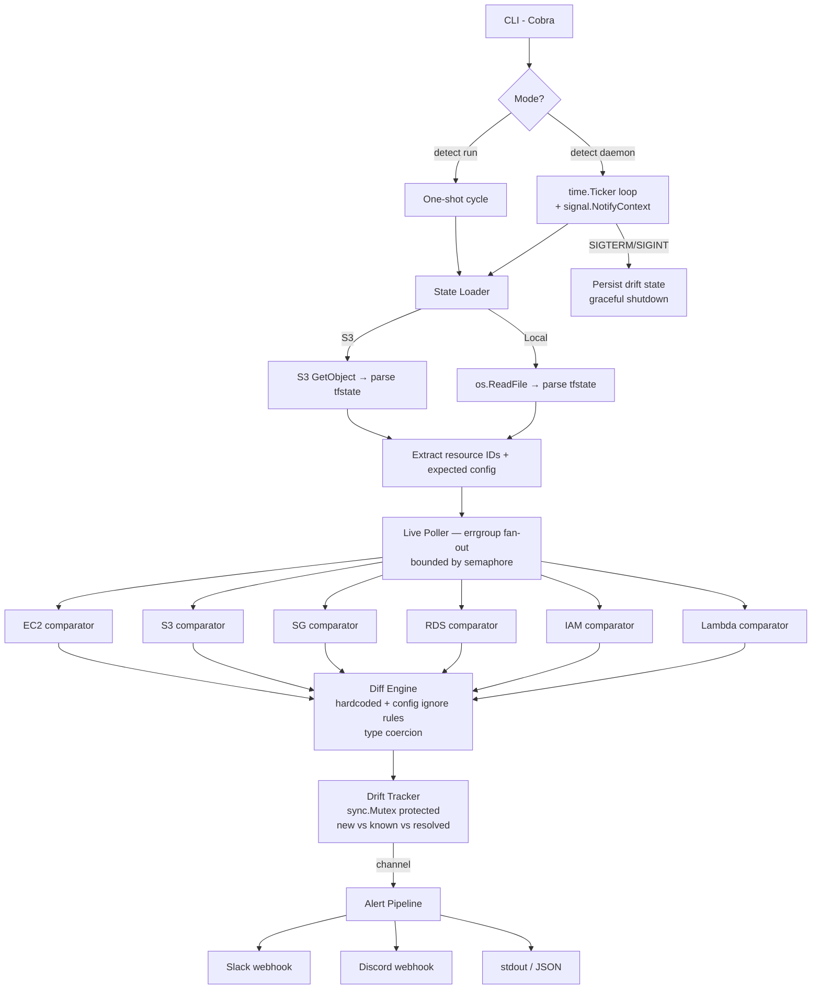

# tf-drift-detector

A Go daemon that detects Terraform drift — comparing declared resource configurations in your Terraform state against live AWS infrastructure. Alerts on new drift and resolved drift via Slack, Discord, or stdout.

The hardest part of drift detection is avoiding false positives. This tool ships with per-resource-type ignore lists for AWS-computed fields, plus user-configurable overrides.

---

## How It Works



### Concurrency Model

```
Main goroutine
  └─ signal.NotifyContext (SIGTERM/SIGINT)
  └─ time.Ticker (daemon mode)
       └─ Per cycle:
            └─ errgroup fan-out (1 goroutine per resource)
                 └─ semaphore bounds concurrent AWS API calls
            └─ Drift tracker update (sync.Mutex)
            └─ Alert on new/resolved drift only
  └─ Shutdown: cancel context → persist state → exit
```

---

## What It Detects

| Resource Type | TF Resource | Key Fields Compared |
|--------------|-------------|---------------------|
| EC2 Instances | `aws_instance` | `instance_type`, `ami`, `subnet_id`, `vpc_security_group_ids`, `tags` |
| S3 Buckets | `aws_s3_bucket` | `versioning`, `sse_algorithm`, `tags` |
| Security Groups | `aws_security_group` | `name`, `description`, `vpc_id`, `tags` |
| RDS Instances | `aws_db_instance` | `engine`, `instance_class`, `multi_az`, `storage_encrypted` |
| IAM Roles | `aws_iam_role` | `assume_role_policy`, `path`, `max_session_duration` |
| Lambda Functions | `aws_lambda_function` | `runtime`, `handler`, `memory_size`, `timeout`, `environment` |

---

## Quick Start

### Build

```bash
make build
```

### One-shot check

```bash
./detect run --config config.yaml
```

### Continuous daemon

```bash
./detect daemon --config config.yaml --interval 5m
# Ctrl+C → persists drift state and exits cleanly
```

---

## Configuration

```yaml
backend:
  type: s3                          # or "local"
  bucket: my-terraform-state-bucket
  key: path/to/terraform.tfstate
  region: us-east-1

aws_region: us-east-1
interval: "5m"
concurrency: 10
drift_state_file: /var/lib/tf-drift/state.json

alerts:
  stdout: true
  slack:
    webhook_url: "https://hooks.slack.com/services/..."
  discord:
    webhook_url: "https://discord.com/api/webhooks/..."

# Extra fields to ignore per resource type (on top of built-in defaults)
ignore_fields:
  aws_instance:
    - "user_data"
  aws_lambda_function:
    - "last_modified"
```

See [`config.example.yaml`](./config.example.yaml) for an annotated example.

---

## CLI Reference

```
detect [command] [flags]

Commands:
  run     One-shot drift check — exits after one cycle
  daemon  Continuous drift monitoring with ticker

Flags:
  -c, --config string     Path to config file (default "config.yaml")
      --interval string   Override check interval (daemon only, e.g. 5m)
```

---

## False Positive Suppression

AWS APIs return many computed/default fields that Terraform never manages. Without filtering, every resource would appear drifted. This tool handles it two ways:

**1. Hardcoded ignore list** — Built-in per resource type. Examples:
- `aws_instance`: `metadata_options`, `credit_specification`, `root_block_device.0.volume_id`
- `aws_s3_bucket`: `arn`, `bucket_domain_name`, `hosted_zone_id`, `region`
- `aws_lambda_function`: `arn`, `last_modified`, `source_code_hash`, `version`

**2. Config-driven overrides** — Add your own via `ignore_fields` in the config YAML.

**3. Type coercion** — Terraform stores numbers as strings (`"128"`); AWS returns `int32(128)`. The diff engine coerces both to string before comparing.

---

## Alert Examples

### Slack

```
🚨 Terraform Drift Detected — 2 resource(s)
• `aws_instance` / `i-0abc123def456`
  - `instance_type`: `t3.micro` → `t3.large`
• `aws_lambda_function` / `my-function`
  - `memory_size`: `128` → `256`

✅ Drift Resolved — 1 resource(s)
• `aws_s3_bucket` / `my-bucket`
```

### JSON (stdout)

```json
{
  "new_drift": [
    {
      "Resource": {"Type": "aws_instance", "ID": "i-0abc123"},
      "Drifted": true,
      "Fields": [{"Path": "instance_type", "Expected": "t3.micro", "Actual": "t3.large"}]
    }
  ],
  "resolved": []
}
```

---

## Project Structure

```
cmd/detect/          — Cobra CLI (run + daemon subcommands)
internal/
  config/            — YAML config loader
  state/             — TF state parser (S3 + local)
  poller/            — Comparator interface + 6 resource comparators + errgroup engine
  diff/              — Diff engine with ignore rules and type coercion
  tracker/           — Stateful drift tracker with file persistence
  alert/             — Slack, Discord, stdout alerters
go.mod               — Independent module
Makefile
docs/
  usage.md           — Full runbook
  scenarios.md       — Real-world use cases
  design-decisions.md — Architectural decisions
```

---

## Development

```bash
make test    # 30 tests, all pass without AWS credentials
make lint    # go vet
make build   # compile
```

---

## Docs

- [Usage Guide](./docs/usage.md)
- [Scenarios](./docs/scenarios.md)
- [Design Decisions](./docs/design-decisions.md)
