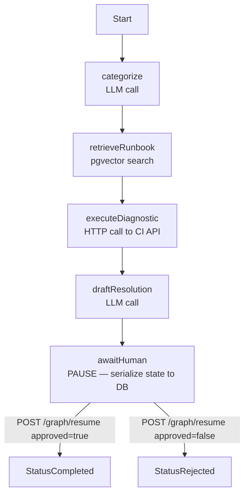
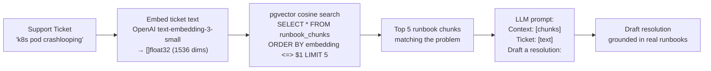

# triage-engine: Deep Dive

## What is a LangGraph-Equivalent?

LangGraph (Python) models AI workflows as a directed graph where nodes are functions and edges are transitions. This project implements the same pattern in Go: a typed state machine where each node processes state and returns the next node to execute.

The key insight: **AI workflows need to pause and resume.** A node may wait hours for a human to approve before the next node runs. This requires persistent state — not just in-memory.

---

## The Graph Execution Model



Each node is a function with a standard signature:

```go
type NodeFunc func(ctx context.Context, state *InvestigationState) (NodeName, error)
// returns the name of the NEXT node to execute, or "" to stop

type Graph struct {
    nodes map[NodeName]NodeFunc
}

func (g *Graph) Run(ctx context.Context, state *InvestigationState, startNode NodeName) error {
    current := startNode
    for current != "" {
        node, ok := g.nodes[current]
        if !ok {
            return fmt.Errorf("unknown node: %s", current)
        }
        next, err := node(ctx, state)
        if err != nil {
            return err
        }
        current = next
    }
    return nil
}
```

---

## State Persistence — The Pause/Resume Pattern

The `awaitHuman` node is the pause point. It serializes the entire `InvestigationState` to PostgreSQL as JSONB, then returns `""` (stop execution). The process can die here — state is safe in the DB.

```go
func (n *AwaitHumanNode) Execute(ctx context.Context, state *InvestigationState) (NodeName, error) {
    // Serialize the full state to JSONB
    stateJSON, err := json.Marshal(state)
    if err != nil {
        return "", err
    }

    _, err = n.db.ExecContext(ctx, `
        UPDATE investigation_states
        SET status = 'awaiting_human',
            state_json = $1,
            updated_at = now()
        WHERE id = $2
    `, stateJSON, state.ID)
    if err != nil {
        return "", err
    }

    // Notify engineer (Slack, email, etc.)
    n.notifier.Notify(state.ID, state.DraftResolution)

    // Return "" — execution STOPS here
    // The HTTP server will call Resume() when the engineer responds
    return "", nil
}

// Resume loads state and continues from the node after awaitHuman
func (e *TriageEngine) Resume(ctx context.Context, investigationID string, approved bool) error {
    // Load state from DB
    var stateJSON []byte
    err := e.db.QueryRowContext(ctx,
        "SELECT state_json FROM investigation_states WHERE id = $1",
        investigationID,
    ).Scan(&stateJSON)
    if err != nil {
        return err
    }

    var state InvestigationState
    json.Unmarshal(stateJSON, &state)
    state.HumanApproved = &approved

    // Continue execution from the next node
    nextNode := NodeCompleted
    if !approved {
        nextNode = NodeRejected
    }
    return e.graph.Run(ctx, &state, nextNode)
}
```

---

## RAG: pgvector Runbook Retrieval

RAG (Retrieval-Augmented Generation) retrieves relevant context before asking the LLM to generate a response. This prevents hallucination and grounds the answer in real documentation.



```go
func (r *Retriever) FindSimilar(ctx context.Context, query string, limit int) ([]RunbookChunk, error) {
    // 1. Embed the query using OpenAI
    embedding, err := r.openai.CreateEmbedding(ctx, query)
    if err != nil {
        return nil, err
    }

    // 2. pgvector cosine similarity search
    // <=> operator = cosine distance (1 - similarity)
    rows, err := r.db.QueryContext(ctx, `
        SELECT id, content, source_file, 1 - (embedding <=> $1) AS similarity
        FROM runbook_chunks
        WHERE 1 - (embedding <=> $1) > 0.7
        ORDER BY embedding <=> $1
        LIMIT $2
    `, pgvector.NewVector(embedding), limit)
    // ...
}
```

**Indexing runbooks (done once):**
```go
func (r *Retriever) IndexRunbook(ctx context.Context, content, sourceFile string) error {
    embedding, _ := r.openai.CreateEmbedding(ctx, content)
    _, err := r.db.ExecContext(ctx, `
        INSERT INTO runbook_chunks (content, source_file, embedding)
        VALUES ($1, $2, $3)
    `, content, sourceFile, pgvector.NewVector(embedding))
    return err
}
```

---

## testcontainers-go — Integration Tests Without Mocks

The triage engine requires `pgvector/pgvector:pg16` with the `vector` extension. `testcontainers-go` spins up real containers in CI:

```go
func setupTestDB(t *testing.T) *sql.DB {
    t.Helper()
    ctx := context.Background()

    // Start pgvector container
    req := testcontainers.ContainerRequest{
        Image:        "pgvector/pgvector:pg16",
        ExposedPorts: []string{"5432/tcp"},
        Env: map[string]string{
            "POSTGRES_DB":       "testdb",
            "POSTGRES_USER":     "test",
            "POSTGRES_PASSWORD": "test",
        },
        WaitingFor: wait.ForLog("database system is ready to accept connections"),
    }
    container, err := testcontainers.GenericContainer(ctx,
        testcontainers.GenericContainerRequest{
            ContainerRequest: req,
            Started:          true,
        },
    )
    require.NoError(t, err)
    t.Cleanup(func() { container.Terminate(ctx) })

    // Get dynamic port
    host, _ := container.Host(ctx)
    port, _ := container.MappedPort(ctx, "5432")
    dsn := fmt.Sprintf("postgres://test:test@%s:%s/testdb?sslmode=disable", host, port.Port())

    db, err := sql.Open("pgx", dsn)
    require.NoError(t, err)

    // Run migrations
    runMigrations(t, db)
    return db
}

// Test uses a real pgvector database — no mocking
func TestRAGRetrieval(t *testing.T) {
    db := setupTestDB(t)
    retriever := NewRetriever(db, mockOpenAI)

    retriever.IndexRunbook(context.Background(), "CrashLoopBackOff fix: check logs with kubectl logs --previous", "k8s.md")

    chunks, err := retriever.FindSimilar(context.Background(), "pod keeps restarting", 3)
    require.NoError(t, err)
    require.NotEmpty(t, chunks)
    assert.Contains(t, chunks[0].Content, "CrashLoopBackOff")
}
```

**Why testcontainers over mocks for this test:**
- pgvector's `<=>` cosine operator is not mockable — it's a PostgreSQL extension
- The test verifies the query, index, and retrieval actually work together
- Runs in CI via Docker — no external database needed

---

## HITL (Human-in-the-Loop) Design Principles

| Principle | Implementation |
|-----------|---------------|
| State must survive restart | JSONB in PostgreSQL, not in-memory |
| Resume is idempotent | Checking status before applying to prevent double-resume |
| Timeout on human approval | cron job escalates investigations stuck > 24h |
| Audit trail | Every state transition logged with timestamp and actor |
| Partial automation | Low-confidence tickets → HITL; high-confidence → skip awaitHuman |

```go
// Confidence-based routing: skip human approval for high-confidence resolutions
func (n *DraftResolutionNode) Execute(ctx context.Context, state *InvestigationState) (NodeName, error) {
    draft, confidence := n.llm.Draft(ctx, state)
    state.DraftResolution = draft
    state.Confidence = confidence

    if confidence > 0.95 {
        return NodeCompleted, nil  // auto-approve
    }
    return NodeAwaitHuman, nil     // needs human review
}
```
