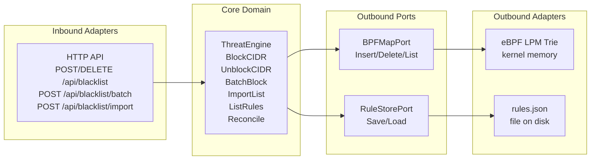
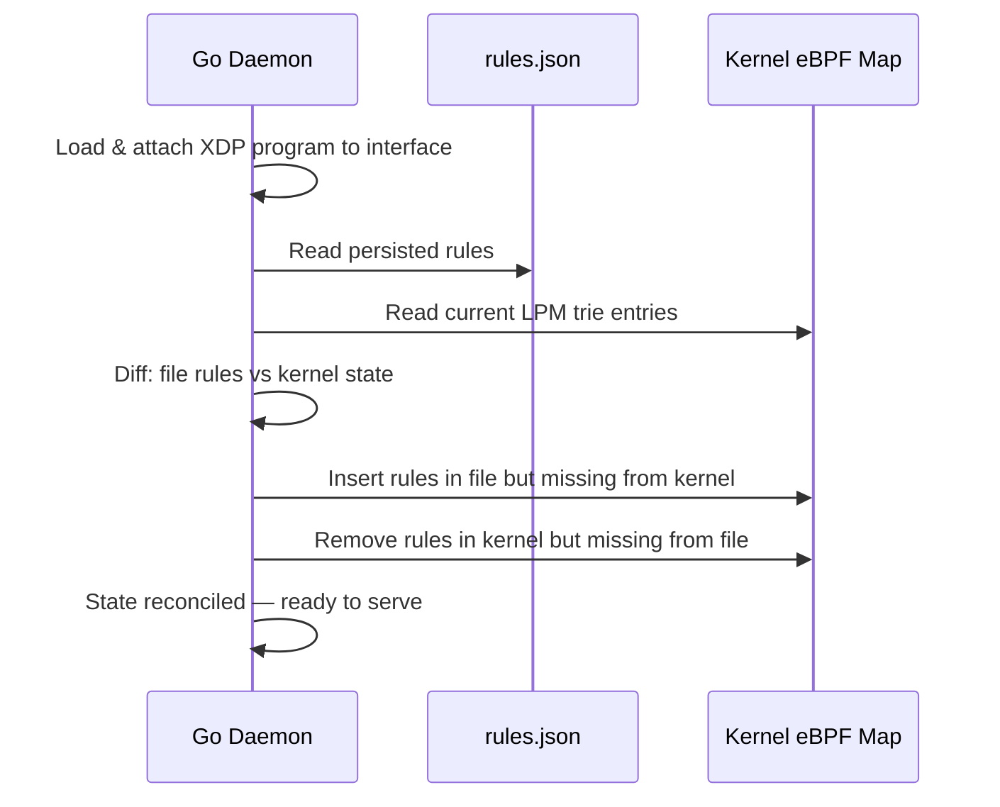

# xdp-firewall

A kernel-level XDP packet filter in Go. Compiles a C eBPF program and loads it directly into the Linux kernel's eXpress Data Path (XDP), dropping packets from blacklisted IP/CIDR ranges **before the OS networking stack allocates memory for them**.

Built with hexagonal (ports & adapters) architecture. The core domain never touches the kernel or disk directly — it speaks through ports.

> **Linux only.** Requires root (`CAP_NET_ADMIN`) and kernel 5.8+.

---

## How It Works

```mermaid
graph TD
    subgraph User Space - Go Daemon
        HTTP[HTTP Admin API\nInbound Adapter] --> CORE[ThreatEngine\nCore Domain]
        CORE --> BPF_ADAPTER[eBPF Map Adapter\nOutbound Port]
        CORE --> FILE_ADAPTER[File Store Adapter\nOutbound Port\nrules.json]
        POLLER[Metrics Poller\ntime.Ticker] --> BPF_READ[Read PERCPU_ARRAY\nfrom kernel]
        BPF_READ --> PROM[Prometheus Counters]
        PROM --> METRICS[/metrics endpoint]
        PROM --> STATS[/stats JSON endpoint]
    end

    subgraph Kernel Space - eBPF/XDP
        NIC[Network Card\ndriver level] --> XDP[XDP Program\nC compiled to BPF]
        XDP --> PARSE[Parse IP Header\nextract src_ip]
        PARSE --> LPM[LPM Trie Lookup\nBPF_MAP_TYPE_LPM_TRIE]
        LPM -->|match| DROP[XDP_DROP\npacket discarded]
        LPM -->|no match| PASS[XDP_PASS\npacket continues to kernel]
        XDP --> COUNTERS[PERCPU_ARRAY\npackets_total\ndrops_total]
    end

    BPF_ADAPTER -->|write CIDR| LPM
    BPF_READ -->|read counters| COUNTERS
```

---

## Hexagonal Architecture



---

## Startup Reconciliation



This handles the **daemon vs. kernel disconnect**: if the Go daemon crashes and restarts, the XDP program keeps running in the kernel. On restart, the daemon reads `rules.json` and re-syncs the kernel map to the intended state.

---

## Quick Start

### Prerequisites

- Linux kernel 5.8+
- `clang` (for compiling the C eBPF program)
- Root access

### Build

```bash
# Compile the C eBPF program to BPF bytecode
make generate

# Build the Go daemon
make build
```

### Run

```bash
sudo ./xdp-fw start --config config.example.yaml
# or override interface:
sudo ./xdp-fw start --config config.example.yaml --interface eth0
```

---

## HTTP API Reference

| Method | Path | Body | Description |
|--------|------|------|-------------|
| `POST` | `/api/blacklist` | `{"cidr": "10.0.0.0/8"}` | Block a CIDR |
| `DELETE` | `/api/blacklist` | `{"cidr": "10.0.0.0/8"}` | Unblock a CIDR |
| `GET` | `/api/blacklist` | — | List all blocked CIDRs |
| `POST` | `/api/blacklist/batch` | `{"cidrs": [...]}` | Block multiple CIDRs |
| `POST` | `/api/blacklist/import` | JSON or multipart file | Import a threat feed |
| `GET` | `/stats` | — | Human-readable JSON stats |
| `GET` | `/metrics` | — | Prometheus metrics |

### Examples

```bash
# Block a single IP
curl -X POST localhost:8080/api/blacklist \
  -H "Content-Type: application/json" \
  -d '{"cidr": "203.0.113.0/24"}'

# Block a subnet
curl -X POST localhost:8080/api/blacklist \
  -d '{"cidr": "10.0.0.0/8"}'

# Batch block (threat feed)
curl -X POST localhost:8080/api/blacklist/batch \
  -d '{"cidrs": ["198.51.100.0/24", "203.0.113.0/24"]}'

# Import from file (one CIDR per line, # comments supported)
curl -X POST localhost:8080/api/blacklist/import \
  -F "file=@threat-feed.txt"

# List current rules
curl localhost:8080/api/blacklist

# Stats
curl localhost:8080/stats

# Prometheus metrics
curl localhost:8080/metrics | grep xdp_
```

---

## eBPF Maps

| Map | Type | Purpose |
|-----|------|---------|
| `blacklist` | `BPF_MAP_TYPE_LPM_TRIE` | CIDR blacklist — longest-prefix-match on source IP |
| `counters` | `BPF_MAP_TYPE_PERCPU_ARRAY` | Lock-free per-CPU packet/drop counters |

The LPM trie means blocking `10.0.0.0/8` automatically drops packets from `10.0.5.5`, `10.255.0.1`, etc. — exactly how AWS Security Groups and iptables evaluate IP addresses.

The PERCPU_ARRAY means each CPU core has its own counter copy — no lock contention at line rate (millions of packets/second).

---

## Project Structure

```
bpf/
  xdp_firewall.c         — C eBPF program (XDP hook, LPM trie, PERCPU counters)
cmd/xdp-fw/main.go       — Cobra CLI: start daemon
internal/
  core/
    ports.go             — BPFMapPort, RuleStorePort, CounterReader interfaces
    engine.go            — ThreatEngine (domain logic)
  adapters/
    bpfmap/
      helpers.go         — CIDR ↔ LPM key conversion (cross-platform)
      adapter.go         — eBPF map adapter (linux build tag)
    filestore/
      store.go           — Atomic JSON file persistence
    http/
      handler.go         — HTTP inbound adapter (all endpoints)
  metrics/
    metrics.go           — Prometheus counter/gauge registration
    poller.go            — Background per-CPU counter aggregation
  config/
    config.go            — YAML config loader
go.mod                   — Independent module (no CGo)
Makefile
docs/
  scenarios.md           — Real-world use cases
  design-decisions.md    — Why each architectural choice was made
```

---

## Development

```bash
make test    # 22 tests, all pass (no root needed)
make lint    # go vet
make tidy    # go mod tidy
```

---

## Docs

- [Scenarios](./docs/scenarios.md)
- [Design Decisions](./docs/design-decisions.md)
