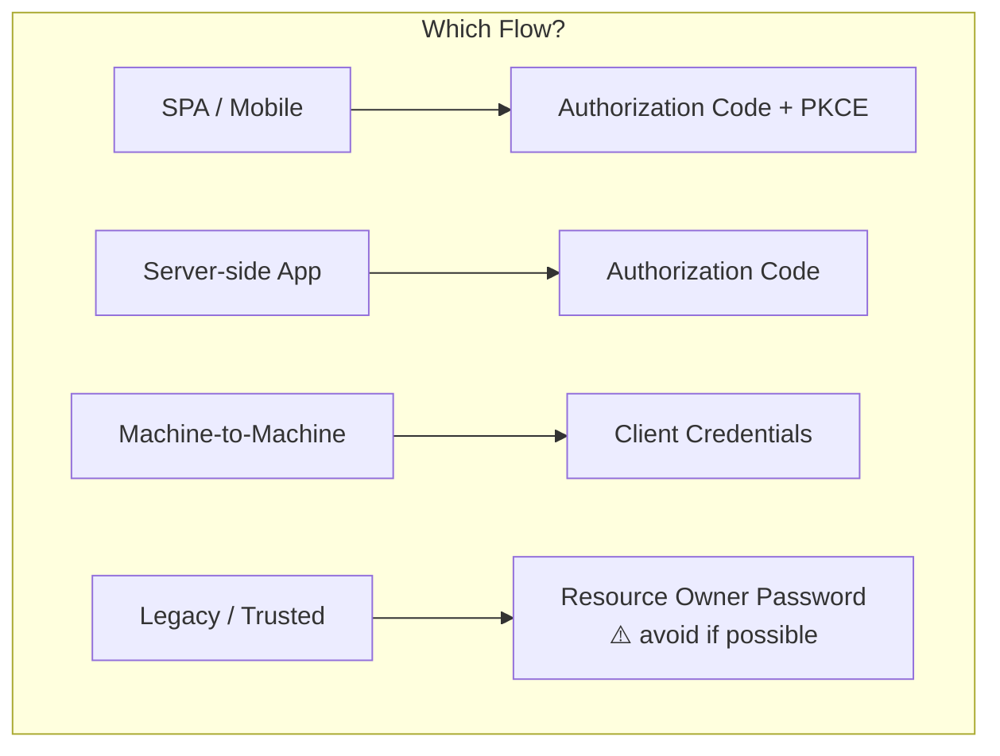
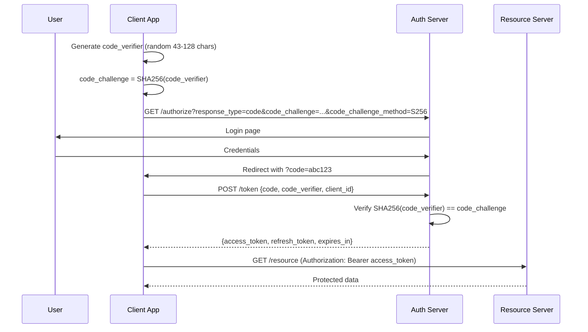
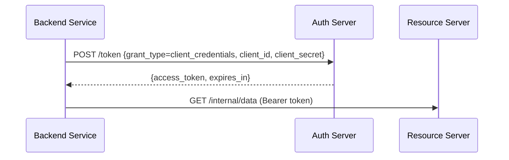
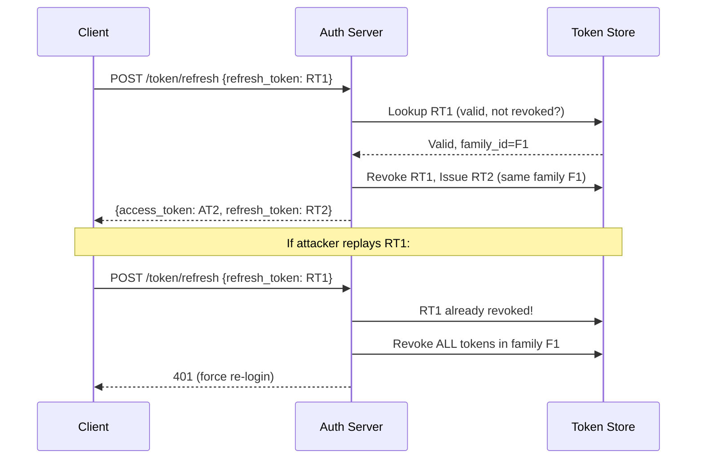
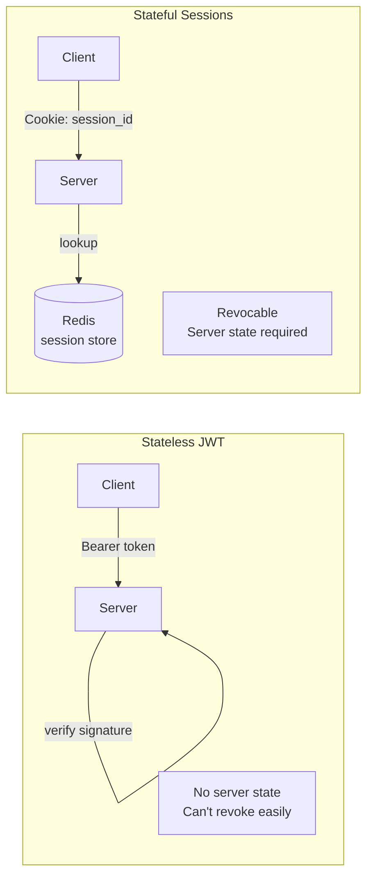

# Authentication & Authorization Deep Dive

OAuth2 flows, PKCE, session management, refresh token rotation, and JWT best practices.

---

## OAuth2 Flows



---

### Authorization Code + PKCE (Recommended for all clients)



**Why PKCE?**
- Prevents authorization code interception attacks
- No client_secret needed (safe for SPAs/mobile)
- `code_verifier` proves the same client that started the flow is finishing it

---

### Client Credentials (M2M)



No user involved — service authenticates itself.

---

## JWT Structure

```
eyJhbGciOiJSUzI1NiJ9.eyJzdWIiOiJ1c2VyLTEyMyIsInJvbGVzIjpbImFkbWluIl0sImV4cCI6MTcwMH0.signature
│── Header ──────────│── Payload ──────────────────────────────────────────────────│── Signature ──│
```

```go
// Claims
type Claims struct {
    jwt.RegisteredClaims
    UserID string   `json:"sub"`
    Roles  []string `json:"roles"`
}

// Issue
func IssueToken(userID string, roles []string, secret []byte) (string, error) {
    claims := Claims{
        RegisteredClaims: jwt.RegisteredClaims{
            ExpiresAt: jwt.NewNumericDate(time.Now().Add(15 * time.Minute)),
            IssuedAt:  jwt.NewNumericDate(time.Now()),
            Issuer:    "my-service",
        },
        UserID: userID,
        Roles:  roles,
    }
    return jwt.NewWithClaims(jwt.SigningMethodHS256, claims).SignedString(secret)
}
```

### JWT Best Practices

| Practice | Why |
|----------|-----|
| Short expiry (15 min) | Limits damage if stolen |
| Use refresh tokens for longevity | Don't make access tokens long-lived |
| RS256 for multi-service | Verify without sharing secret |
| HS256 for single service | Simpler, faster |
| Never store sensitive data in payload | JWT is base64, not encrypted |
| Validate `iss`, `aud`, `exp` | Prevent token reuse across services |

---

## Refresh Token Rotation



**Key**: Each refresh token is single-use. Reuse = compromise detected → revoke entire family.

---

## Session Management



| Aspect | JWT (Stateless) | Sessions (Stateful) |
|--------|----------------|-------------------|
| Revocation | Hard (need blocklist) | Easy (delete from store) |
| Scalability | No shared state | Need Redis/DB |
| Payload | Claims in token | Server-side only |
| Best for | APIs, microservices | Traditional web apps |

### Hybrid Approach (Recommended)

```
Access Token (JWT, 15 min) → stateless verification
Refresh Token (opaque, stored in DB) → revocable, rotated
```

---

## Go Implementation Patterns

```go
// Middleware: extract and validate JWT
func AuthMiddleware(secret []byte) func(http.Handler) http.Handler {
    return func(next http.Handler) http.Handler {
        return http.HandlerFunc(func(w http.ResponseWriter, r *http.Request) {
            token := strings.TrimPrefix(r.Header.Get("Authorization"), "Bearer ")
            if token == "" {
                http.Error(w, "unauthorized", 401)
                return
            }

            claims := &Claims{}
            _, err := jwt.ParseWithClaims(token, claims, func(t *jwt.Token) (any, error) {
                return secret, nil
            })
            if err != nil {
                http.Error(w, "invalid token", 401)
                return
            }

            ctx := context.WithValue(r.Context(), userIDKey, claims.UserID)
            ctx = context.WithValue(ctx, rolesKey, claims.Roles)
            next.ServeHTTP(w, r.WithContext(ctx))
        })
    }
}

// RBAC check
func RequireRole(role string) func(http.Handler) http.Handler {
    return func(next http.Handler) http.Handler {
        return http.HandlerFunc(func(w http.ResponseWriter, r *http.Request) {
            roles := r.Context().Value(rolesKey).([]string)
            for _, r := range roles {
                if r == role {
                    next.ServeHTTP(w, r)
                    return
                }
            }
            http.Error(w, "forbidden", 403)
        })
    }
}
```

---

## Security Checklist

- [ ] HTTPS everywhere (no tokens over HTTP)
- [ ] HttpOnly + Secure + SameSite cookies for refresh tokens
- [ ] CSRF protection for cookie-based auth
- [ ] Rate limit `/login` and `/token` endpoints
- [ ] Hash refresh tokens in DB (store SHA256, compare on use)
- [ ] Rotate signing keys periodically (JWKS endpoint)
- [ ] Log all auth events (login, refresh, revoke)
