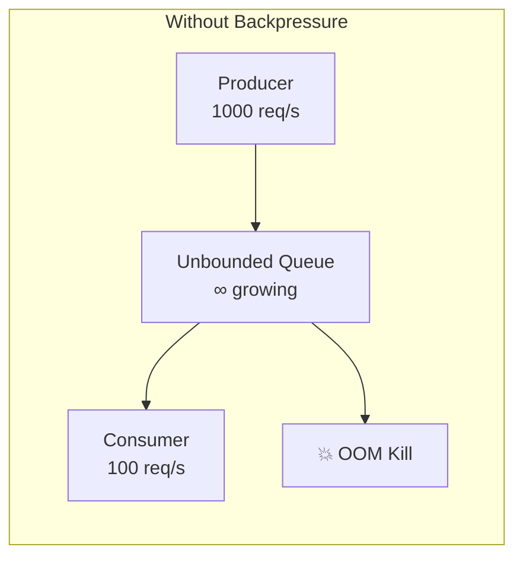
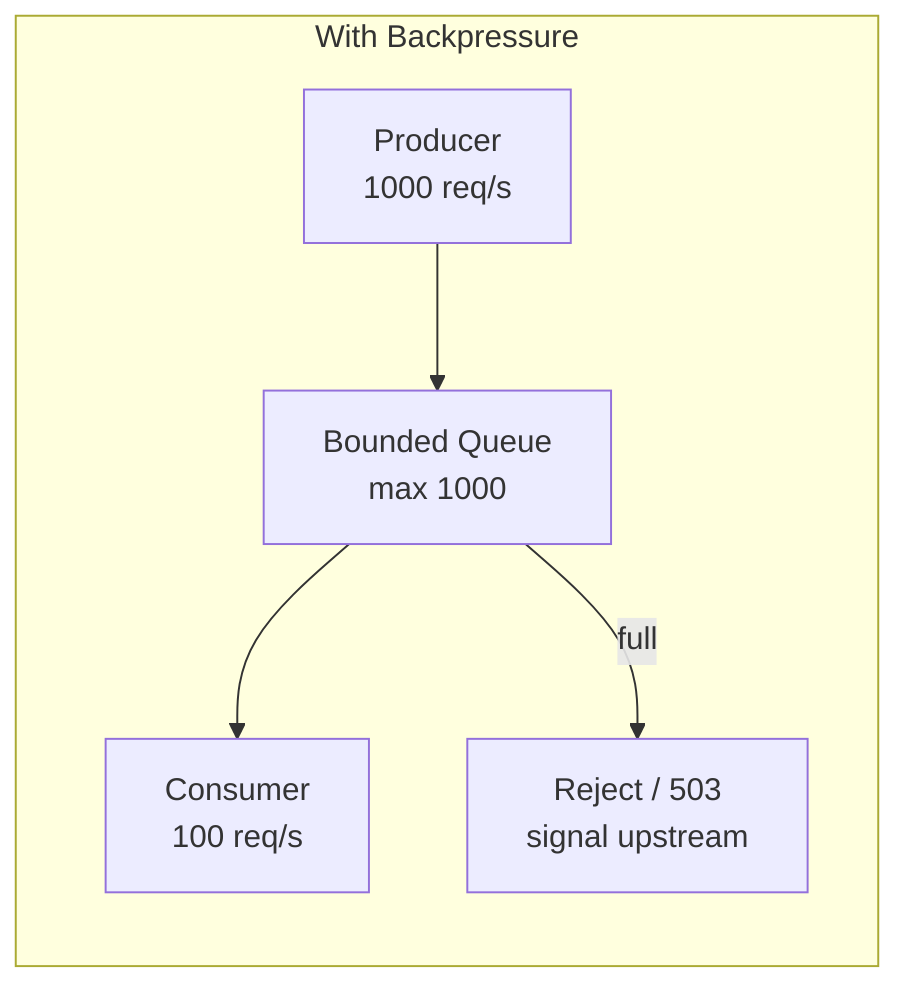
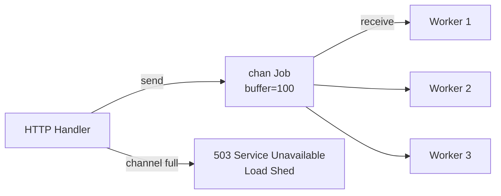
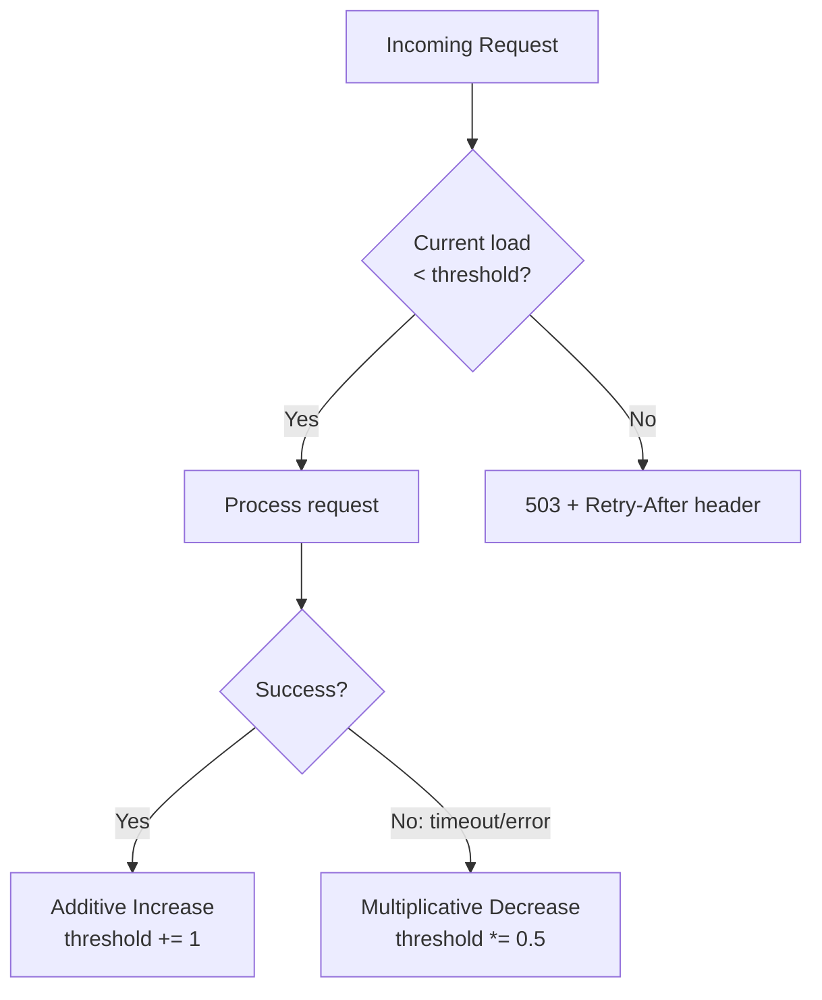

# Backpressure & Flow Control

Adaptive load shedding, bounded channels, and flow control patterns to prevent cascading failures under load.

---

## What is Backpressure?

When a system receives more work than it can process, it must signal upstream to slow down — or shed load gracefully. Without backpressure, queues grow unbounded → OOM → crash → cascading failure.





---

## Go Patterns for Backpressure

### 1. Bounded Channels



```go
type WorkQueue struct {
    jobs chan Job
}

func NewWorkQueue(bufferSize, workers int) *WorkQueue {
    wq := &WorkQueue{jobs: make(chan Job, bufferSize)}
    for i := 0; i < workers; i++ {
        go wq.worker()
    }
    return wq
}

// Submit with backpressure — non-blocking send
func (wq *WorkQueue) Submit(j Job) error {
    select {
    case wq.jobs <- j:
        return nil
    default:
        return ErrOverloaded // signal caller to back off
    }
}

func (wq *WorkQueue) worker() {
    for job := range wq.jobs {
        process(job)
    }
}
```

### 2. Semaphore (Concurrency Limiter)

```go
type Limiter struct {
    sem chan struct{}
}

func NewLimiter(maxConcurrent int) *Limiter {
    return &Limiter{sem: make(chan struct{}, maxConcurrent)}
}

func (l *Limiter) Acquire(ctx context.Context) error {
    select {
    case l.sem <- struct{}{}:
        return nil
    case <-ctx.Done():
        return ctx.Err() // timeout = load shed
    }
}

func (l *Limiter) Release() {
    <-l.sem
}
```

### 3. Adaptive Load Shedding (AIMD)



```go
// AIMD (Additive Increase, Multiplicative Decrease) load shedder
type AdaptiveShedder struct {
    inflight  atomic.Int64
    limit     atomic.Int64
}

func NewAdaptiveShedder(initialLimit int64) *AdaptiveShedder {
    s := &AdaptiveShedder{}
    s.limit.Store(initialLimit)
    return s
}

func (s *AdaptiveShedder) Allow() (done func(success bool), allowed bool) {
    current := s.inflight.Add(1)
    if current > s.limit.Load() {
        s.inflight.Add(-1)
        return nil, false // shed load
    }
    return func(success bool) {
        s.inflight.Add(-1)
        if success {
            // Additive increase
            limit := s.limit.Load()
            s.limit.CompareAndSwap(limit, limit+1)
        } else {
            // Multiplicative decrease
            limit := s.limit.Load()
            newLimit := limit / 2
            if newLimit < 1 {
                newLimit = 1
            }
            s.limit.CompareAndSwap(limit, newLimit)
        }
    }, true
}
```

### 4. Context Timeout as Backpressure

```go
func handler(w http.ResponseWriter, r *http.Request) {
    // If upstream is slow, don't wait forever
    ctx, cancel := context.WithTimeout(r.Context(), 2*time.Second)
    defer cancel()

    result, err := callDownstream(ctx)
    if errors.Is(err, context.DeadlineExceeded) {
        http.Error(w, "service overloaded", http.StatusServiceUnavailable)
        return
    }
    // ...
}
```

---

## HTTP Load Shedding Middleware

```go
func LoadSheddingMiddleware(maxInflight int64) func(http.Handler) http.Handler {
    var inflight atomic.Int64
    return func(next http.Handler) http.Handler {
        return http.HandlerFunc(func(w http.ResponseWriter, r *http.Request) {
            current := inflight.Add(1)
            defer inflight.Add(-1)

            if current > maxInflight {
                w.Header().Set("Retry-After", "5")
                http.Error(w, "service overloaded", http.StatusServiceUnavailable)
                return
            }
            next.ServeHTTP(w, r)
        })
    }
}
```

---

## Flow Control Comparison

| Pattern | Mechanism | Best for |
|---------|-----------|----------|
| Bounded channel | Block or reject on full | Worker pools |
| Semaphore | Limit concurrent operations | DB connections, API calls |
| AIMD | Adaptive limit based on success/failure | Unknown capacity |
| Rate limiter | Fixed requests/second | External API protection |
| Circuit breaker | Stop calling failed dependency | Cascading failure prevention |
| Context timeout | Abandon slow requests | End-to-end latency control |

---

## Running

```bash
go run .
# Starts HTTP server with adaptive load shedding
# Use: hey -n 1000 -c 200 http://localhost:8080/work
# Watch 503s increase as load exceeds capacity
```
