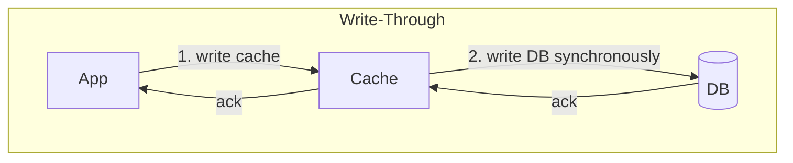
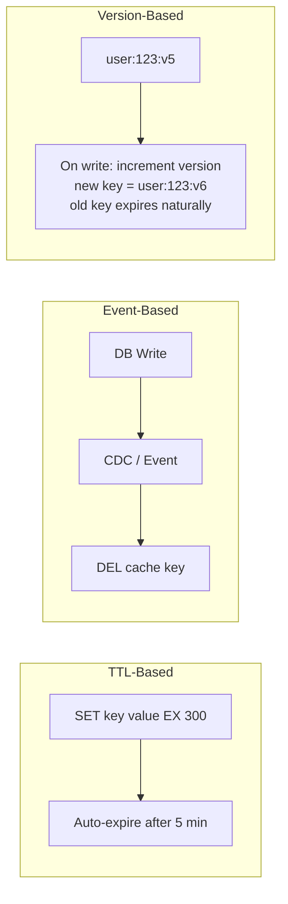
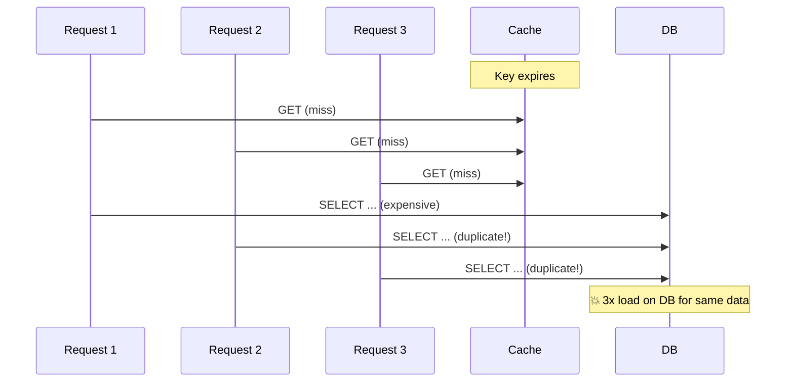
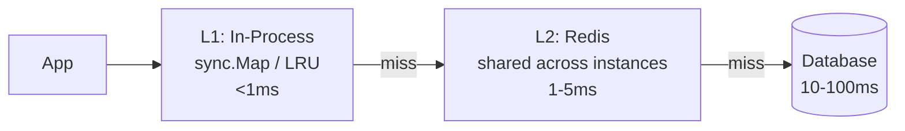

# Caching Strategies

Cache invalidation patterns, thundering herd prevention, write-behind, and TTL strategies.

---

## Caching Patterns

```mermaid
graph TD
    subgraph Cache-Aside (Lazy Loading)
        APP1[App] -->|1. check cache| C1[Cache]
        C1 -->|miss| APP1
        APP1 -->|2. query DB| DB1[(DB)]
        DB1 --> APP1
        APP1 -->|3. populate cache| C1
    end
```



```mermaid
graph TD
    subgraph Write-Behind (Write-Back)
        APP3[App] -->|1. write cache| C3[Cache]
        C3 -->|ack immediately| APP3
        C3 -->|2. async batch flush| DB3[(DB)]
    end
```

---

## Pattern Comparison

| Pattern | Read perf | Write perf | Consistency | Data loss risk |
|---------|-----------|-----------|-------------|---------------|
| Cache-Aside | Fast (after warm) | Normal | Eventual | None |
| Read-Through | Fast | Normal | Eventual | None |
| Write-Through | Fast | Slower (sync write) | Strong | None |
| Write-Behind | Fast | Fast | Eventual | Yes (cache crash) |
| Refresh-Ahead | Fast (no miss) | Normal | Eventual | None |

---

## Cache Invalidation

> "There are only two hard things in CS: cache invalidation and naming things."

### Strategies



| Strategy | Pros | Cons | Use when |
|----------|------|------|----------|
| TTL | Simple, self-healing | Stale for TTL duration | Tolerance for staleness |
| Event/CDC | Real-time invalidation | Complex infrastructure | Strong consistency needed |
| Version key | No explicit invalidation | Key proliferation | Immutable data patterns |
| Write-through | Always fresh | Write latency | Read-heavy, small dataset |

---

## Thundering Herd / Cache Stampede



### Solutions

**1. Singleflight (Go's `x/sync/singleflight`)**

```go
var group singleflight.Group

func getUser(id string) (*User, error) {
    val, err, _ := group.Do("user:"+id, func() (any, error) {
        // Only ONE goroutine executes this, others wait
        return db.GetUser(id)
    })
    return val.(*User), err
}
```

**2. Probabilistic Early Expiration (XFetch)**

```go
// Recompute before TTL expires (with probability)
func shouldRecompute(ttl, computeTime time.Duration) bool {
    // As TTL approaches 0, probability of recompute increases
    return rand.Float64() < computeTime.Seconds() * math.Log(rand.Float64()) * -1 / ttl.Seconds()
}
```

**3. Lock-based (distributed lock on cache miss)**

```go
func getWithLock(ctx context.Context, key string) (string, error) {
    val, err := redis.Get(ctx, key).Result()
    if err == nil {
        return val, nil
    }
    
    // Try to acquire lock
    locked, _ := redis.SetNX(ctx, "lock:"+key, "1", 5*time.Second).Result()
    if locked {
        // Winner: fetch from DB, populate cache
        val = fetchFromDB(key)
        redis.Set(ctx, key, val, 5*time.Minute)
        redis.Del(ctx, "lock:"+key)
        return val, nil
    }
    
    // Loser: wait and retry from cache
    time.Sleep(50 * time.Millisecond)
    return redis.Get(ctx, key).Result()
}
```

---

## Cache Warming

```go
// Pre-populate cache on startup for hot keys
func warmCache(ctx context.Context, hotKeys []string) {
    var wg sync.WaitGroup
    sem := make(chan struct{}, 10) // limit concurrency
    
    for _, key := range hotKeys {
        wg.Add(1)
        sem <- struct{}{}
        go func(k string) {
            defer wg.Done()
            defer func() { <-sem }()
            val := fetchFromDB(k)
            redis.Set(ctx, k, val, 10*time.Minute)
        }(key)
    }
    wg.Wait()
}
```

---

## Multi-Level Caching



```go
func get(key string) (string, error) {
    // L1: in-process
    if val, ok := localCache.Get(key); ok {
        return val, nil
    }
    // L2: Redis
    val, err := redis.Get(ctx, key).Result()
    if err == nil {
        localCache.Set(key, val, 30*time.Second) // shorter TTL for L1
        return val, nil
    }
    // L3: Database
    val = fetchFromDB(key)
    redis.Set(ctx, key, val, 5*time.Minute)
    localCache.Set(key, val, 30*time.Second)
    return val, nil
}
```
