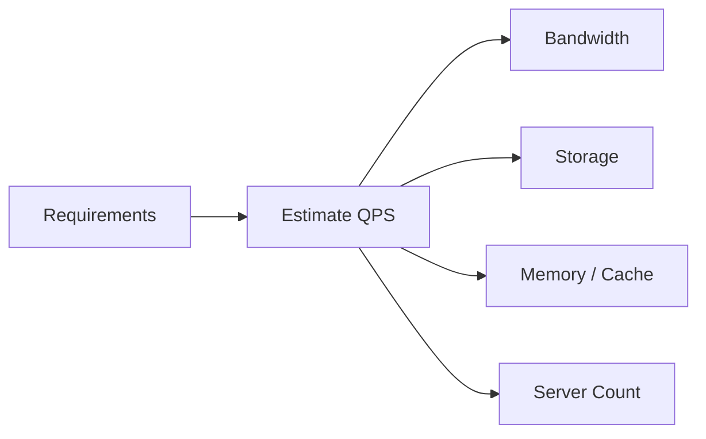
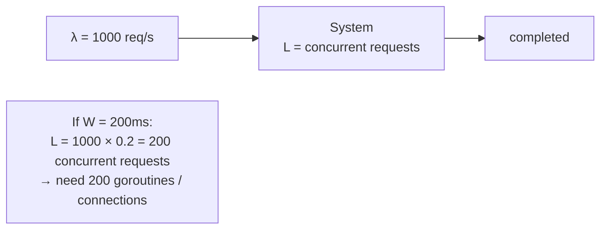

# Capacity Planning

Back-of-envelope calculations, Little's Law, QPS estimation, and storage sizing for system design interviews and production planning.

---

## The Framework



---

## Key Numbers to Memorize

### Latency

| Operation | Time |
|-----------|------|
| L1 cache reference | 1 ns |
| L2 cache reference | 4 ns |
| Main memory reference | 100 ns |
| SSD random read | 16 μs |
| HDD random read | 2 ms |
| Round trip same datacenter | 0.5 ms |
| Round trip cross-region | 50-150 ms |

### Throughput

| Resource | Capacity |
|----------|----------|
| Single Go HTTP server | 10K-50K req/s (simple handlers) |
| PostgreSQL (single node) | 5K-20K queries/s |
| Redis (single node) | 100K-200K ops/s |
| Kafka (single broker) | 200K-2M msgs/s |
| SSD sequential write | 500 MB/s |
| 1 Gbps network | 125 MB/s |

### Storage

| Unit | Size |
|------|------|
| 1 ASCII char | 1 byte |
| UUID | 36 bytes (string) / 16 bytes (binary) |
| Timestamp | 8 bytes |
| Average tweet | ~300 bytes |
| Average JSON API response | 1-5 KB |
| 1 million users × 1 KB each | 1 GB |

---

## QPS Estimation

```
Daily Active Users (DAU) → Requests per second

Formula:
  QPS = DAU × actions_per_user_per_day / 86,400

Peak QPS ≈ 2-3× average QPS
```

### Example: Twitter-like Service

```
DAU: 300 million
Tweets per user per day: 2 (write)
Timeline reads per user per day: 50 (read)

Write QPS = 300M × 2 / 86400 ≈ 7,000 writes/s
Read QPS  = 300M × 50 / 86400 ≈ 170,000 reads/s
Peak Read = 170K × 3 ≈ 500K reads/s
```

---

## Little's Law

```
L = λ × W

L = average number of items in system (concurrency)
λ = arrival rate (requests/second)
W = average time in system (latency)
```



### Practical Applications

```go
// How many DB connections do we need?
// QPS = 5000, avg query time = 10ms
// L = 5000 × 0.01 = 50 concurrent connections
db.SetMaxOpenConns(50)

// How many goroutines for a worker pool?
// Incoming rate = 2000 jobs/s, processing time = 50ms
// L = 2000 × 0.05 = 100 workers needed
pool := make(chan struct{}, 100)
```

---

## Storage Estimation

### Example: URL Shortener

```
Requirements:
- 100M new URLs/month
- Store for 5 years
- Average URL: 100 bytes
- Short code: 7 bytes
- Metadata (timestamps, user): 50 bytes

Total records = 100M × 12 × 5 = 6 billion
Storage per record = 100 + 7 + 50 = 157 bytes
Total storage = 6B × 157 bytes ≈ 942 GB ≈ 1 TB

QPS:
- Write: 100M / (30 × 86400) ≈ 40 writes/s
- Read (100:1 ratio): 4000 reads/s
```

### Example: Chat System

```
Requirements:
- 50M DAU
- 40 messages/user/day
- Average message: 200 bytes
- Store for 2 years

Daily messages = 50M × 40 = 2 billion/day
Daily storage = 2B × 200 bytes = 400 GB/day
2-year storage = 400 GB × 730 = 292 TB

Write QPS = 2B / 86400 ≈ 23,000 writes/s
→ Need sharding (single DB can't handle this)
```

---

## Bandwidth Estimation

```
Bandwidth = QPS × average_response_size

Example:
- 50K reads/s × 5 KB response = 250 MB/s outbound
- Need: 2 Gbps network capacity (with headroom)
```

---

## Server Count Estimation

```
Servers needed = Peak QPS / QPS_per_server

Example:
- Peak QPS: 500K reads/s
- Single Go server: 20K req/s (with DB calls)
- Servers needed: 500K / 20K = 25 servers

Add 50% headroom: 38 servers
Round to: 40 servers (nice number for K8s)
```

---

## Cache Sizing (80/20 Rule)

```
Cache size = 20% of daily data × replication factor

Example (URL shortener):
- Daily reads: 4000/s × 86400 = 345M reads/day
- Unique URLs accessed daily: ~50M (power law)
- Cache 20% of daily unique: 10M entries
- Entry size: 157 bytes
- Cache size: 10M × 157 = 1.57 GB
- With replication (3x): ~5 GB Redis
```

---

## Quick Reference Template

```markdown
## System: ___________

### Traffic
- DAU: ___
- Actions/user/day: ___
- Read:Write ratio: ___
- Average QPS: ___
- Peak QPS: ___

### Storage
- Record size: ___ bytes
- New records/day: ___
- Retention: ___ years
- Total storage: ___ TB

### Bandwidth
- Inbound: ___ MB/s
- Outbound: ___ MB/s

### Infrastructure
- App servers: ___
- DB type: ___ (sharded? replicated?)
- Cache: ___ GB Redis
- Message queue: ___ (throughput requirement)
```
